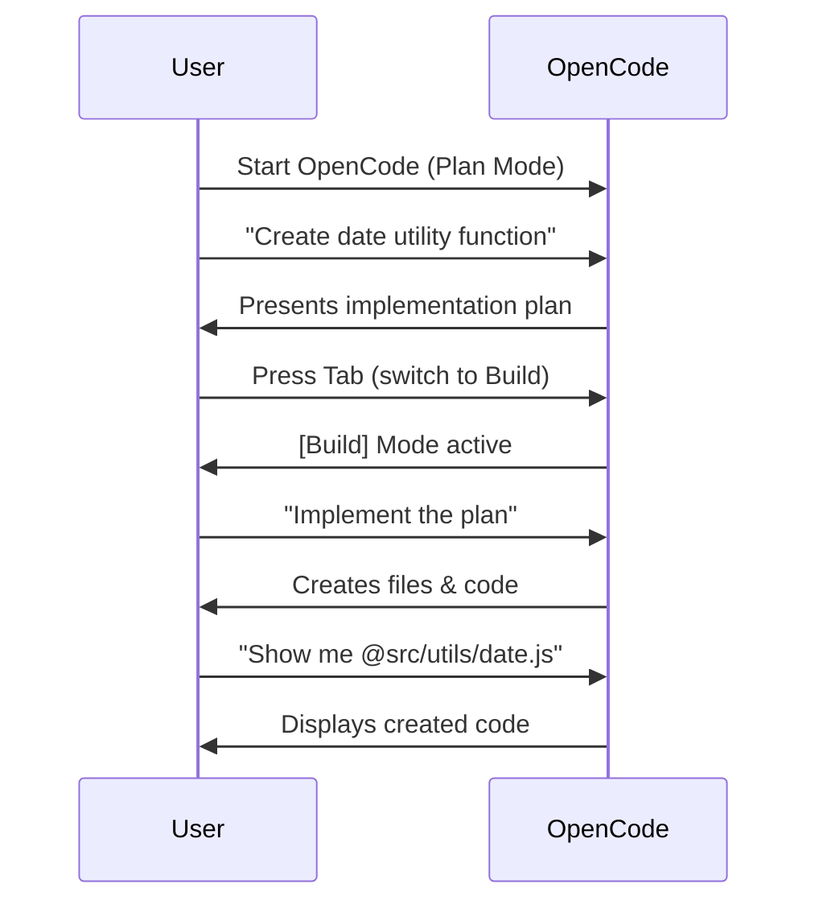
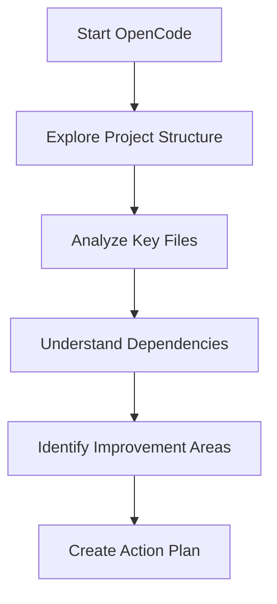
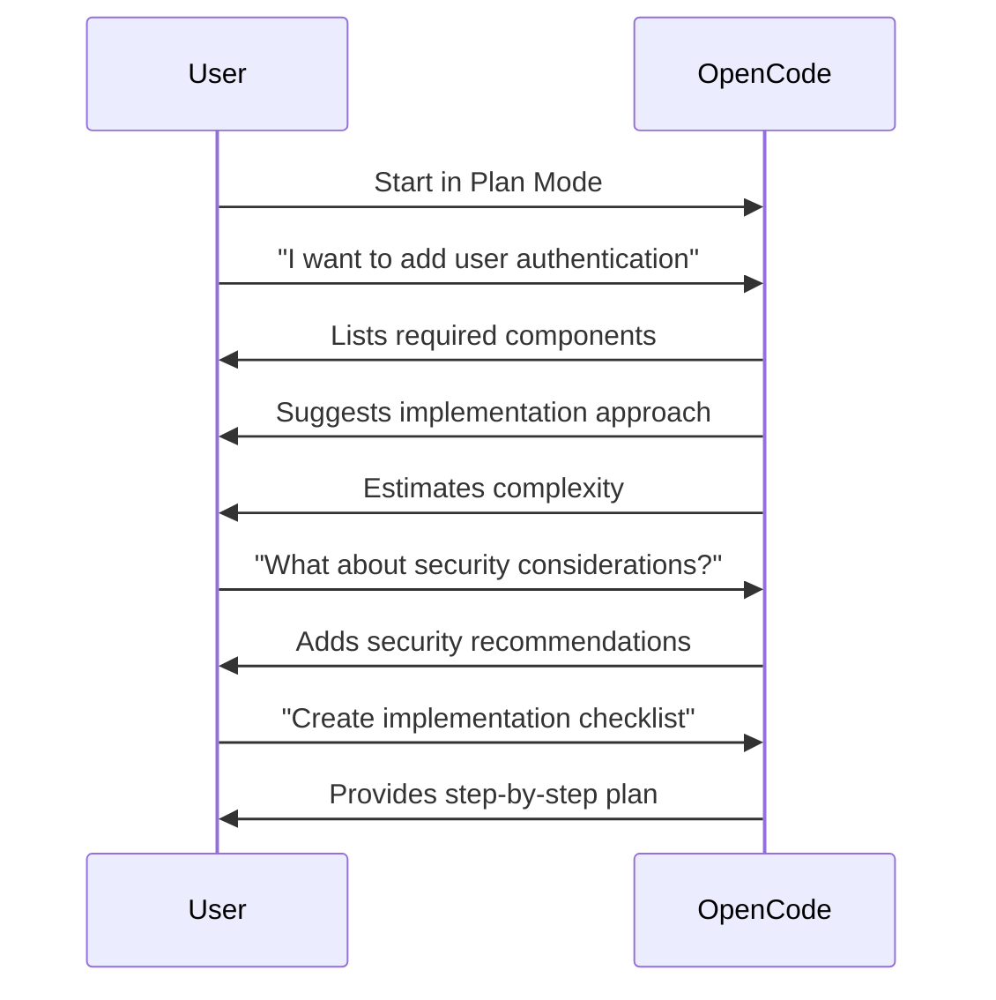

<div align="center">

# 🚀 01. Basic Commands & TUI

**Master OpenCode's terminal interface and core interaction patterns**

[]()
[]()
[]()
[]()

[🏠 Main Menu](../README.md) • [Next Module ➡️](../02-file-operations/)

</div>

---

## 📋 Table of Contents

<details>
<summary>Click to expand/collapse</summary>

- [🎯 Overview](#-overview)
- [✅ Prerequisites](#-prerequisites)
- [⚡ Quick Start](#-quick-start)
- [📚 Core Concepts](#-core-concepts)
- [🔧 Examples & Patterns](#-examples--patterns)
- [🏗️ Real-World Workflows](#️-real-world-workflows)
- [🧪 Practice Exercises](#-practice-exercises)
- [❓ Common Questions](#-common-questions)
- [🐛 Troubleshooting](#-troubleshooting)
- [📈 What You've Learned](#-what-youve-learned)
- [🚶 Next Steps](#-next-steps)

</details>

---

---


<details>
<summary>Click to expand/collapse</summary>

- [🎯 Overview](#-overview)
- [✅ Prerequisites](#-prerequisites)
- [⚡ Quick Start](#-quick-start)
- [📚 Core Concepts](#-core-concepts)
- [🔧 Examples & Patterns](#-examples--patterns)
- [🏗️ Real-World Workflows](#️-real-world-workflows)
- [🧪 Practice Exercises](#-practice-exercises)
- [❓ Common Questions](#-common-questions)
- [🐛 Troubleshooting](#-troubleshooting)
- [📈 What You've Learned](#-what-youve-learned)
- [🚶 Next Steps](#-next-steps)

</details>

---

---


<details>
<summary>Click to expand/collapse</summary>

- [🎯 Overview](#-overview)
- [✅ Prerequisites](#-prerequisites)
- [⚡ Quick Start](#-quick-start)
- [📚 Core Concepts](#-core-concepts)
- [🔧 Examples & Patterns](#-examples--patterns)
- [🏗️ Real-World Workflows](#️-real-world-workflows)
- [🧪 Practice Exercises](#-practice-exercises)
- [❓ Common Questions](#-common-questions)
- [🐛 Troubleshooting](#-troubleshooting)
- [📈 What You've Learned](#-what-youve-learned)
- [🚶 Next Steps](#-next-steps)

</details>

---

## 🎯 Overview


### 📝 What This Module Covers

| Topic | Description | Why It Matters |
|-------|-------------|----------------|
| **TUI Navigation** | Terminal User Interface basics | Foundation for all opencode interactions |
| **Slash Commands** | `/help`, `/undo`, `/redo`, `/share` | Essential productivity shortcuts |
| **File References** | `@filename` syntax | Context management for AI assistance |
| **Plan/Build Modes** | Tab key toggle | Different thinking vs execution modes |
| **Conversation Flow** | Effective AI dialogue patterns | Maximize coding assistance value |

### 🎓 Learning Objectives

By the end of this module, you'll be able to:

- ✅ **Start and navigate** the opencode TUI confidently
- ✅ **Use essential slash commands** for productivity
- ✅ **Reference files** with `@` symbol for context
- ✅ **Toggle between Plan and Build modes** effectively
- ✅ **Manage conversation flow** for optimal AI assistance

## ✅ Prerequisites

### 🔍 Check Your Setup

```bash
# Verify OpenCode installation
which opencode
# Should output: /path/to/opencode

# Check version
opencode --version
# Should output: opencode 1.0+

# Test basic functionality
echo "Hello, OpenCode!" > test.txt
opencode read test.txt
rm test.txt
```

### 📚 Required Knowledge

- [ ] Basic terminal/command line familiarity
- [ ] Understanding of file system navigation
- [ ] No previous opencode experience required

### 🛠️ Required Tools

- [ ] OpenCode 1.0+ installed
- [ ] Terminal/Command Line access
- [ ] A project directory to work in
- [ ] Example files from `/examples/` folder

---

## ⚡ Quick Start


### 🚀 Your First OpenCode Session

```bash tab="Start OpenCode"
# Navigate to a project directory
cd ~/your-project

# Start opencode
opencode
```

```bash tab="Start with Prompt"
# Start with a specific request
opencode "Explain this project's structure"
```

### 🖥️ TUI Interface Overview

Once opencode starts, you'll see:

```
┌─────────────────────────────────────────────────────────────┐
│                                                             │
│  💬 Conversation History                                    │
│  You: Explain this project                                  │
│  OpenCode: This project contains...                        │
│                                                             │
│  ────────────────────────────────────────────────────────  │
│                                                             │
│  📍 Status: [Plan] Mode • Context: 3 files                 │
│                                                             │
│  > Type your request...                                     │
│                                                             │
└─────────────────────────────────────────────────────────────┘
```

**Key Areas:**
- **💬 Conversation History** - Your dialogue with AI
- **📍 Status Bar** - Current mode and context
- **> Prompt Input** - Where you type commands

### ✅ Verification

```bash
# Start opencode and test basic functionality
opencode "Say hello"

# You should see:
# OpenCode: Hello! How can I help you today?

# Test slash command
# Type: /help
# Should show help menu
```

---

# Share conversation (creates shareable link)
/share

# Initialize project analysis
/init
```

### File References

Reference files in your conversation using `@`:

```
Look at the authentication code in @src/auth.js
Explain how this function works in @utils/helpers.ts
```

## 📚 Core Concepts

### 🧠 Concept 1: The TUI Interface

**What it is:**
OpenCode's Terminal User Interface (TUI) provides a conversational interface for working with an AI coding agent in your terminal.

**How it works:**
```bash
# Start the TUI
opencode

# You'll see:
# ┌─────────────────────────────────────────────────────────────┐
# │ 💬 Conversation History                                     │
# │ 📍 Status: [Plan] Mode • Context: 0 files                   │
# │ > Type your request...                                      │
# └─────────────────────────────────────────────────────────────┘
```

**Key Features:**
- **Natural Language Prompts** - Type requests in plain English
- **Context Awareness** - OpenCode understands your project structure
- **Visual Feedback** - See when OpenCode is thinking or using tools
- **Multi-turn Dialogues** - Continue conversations across multiple exchanges

**When to use it:**
- Starting any OpenCode session
- Complex tasks requiring back-and-forth discussion
- When you need to review plans before execution

### 🧠 Concept 2: Slash Commands

**What they are:**
Quick keyboard shortcuts for common functions, starting with `/`.

**How they work:**
```bash
# Type in the TUI prompt:
/help    # Shows available commands
/undo    # Reverts last change
/redo    # Restores undone change
/share   # Creates shareable conversation link
```

**Complete Slash Command Reference:**

| Command | Purpose | When to Use |
|---------|---------|-------------|
| `/help` | Show help menu | When learning or forgetting commands |
| `/undo` | Undo last change | Made a mistake or want to revert |
| `/redo` | Redo undone change | Changed your mind about undo |
| `/share` | Create shareable link | Sharing work with team or community |
| `/init` | Analyze project | Starting work on a new project |
| `/connect` | Configure LLM | Setting up different AI providers |
| `/compact` | Reduce context | Long conversations getting slow |

**When to use them:**
- Quick actions without typing full prompts
- Navigation and control within the TUI
- Session management and sharing

### 🧠 Concept 3: File References with `@`

**What it is:**
The `@` symbol allows you to reference specific files or code sections in your prompts.

**How it works:**
```bash
# Single file reference
@package.json

# Multiple files
@src/index.js @src/utils.js

# Specific lines
@src/components/Button.js:10-25

# Line range
@file.py:45      # Line 45 only
@file.py:10-30   # Lines 10 through 30
@file.py:30-     # From line 30 to end
@file.py:-20     # First 20 lines
```

**Examples in Practice:**
```bash
# In TUI prompt:
"Explain the main function in @src/main.js"
"Compare @config/dev.env and @config/prod.env"
"Fix the bug at @src/auth.js:127"
```

**When to use it:**
- Providing context about specific code
- Asking about particular files or sections
- Directing OpenCode's attention precisely

### 🧠 Concept 4: Plan Mode vs Build Mode

**What it is:**
Two different interaction modes toggleable with the **Tab** key.

**How it works:**
```bash
# Default mode for complex requests
[Plan] Mode: OpenCode suggests plans without making changes

# Press Tab to switch
[Build] Mode: OpenCode can execute tools and modify files

# Press Tab again to switch back
[Plan] Mode
```

**Mode Comparison:**

| Aspect | Plan Mode | Build Mode |
|--------|-----------|------------|
| **Purpose** | Strategy & planning | Execution & implementation |
| **File Changes** | No modifications allowed | Can read/write/edit files |
| **Tool Usage** | Limited to analysis | Full tool access |
| **When to Use** | Brainstorming, planning | Implementing, testing |

**Recommended Workflow:**
1. **Start in Plan Mode** (default for complex requests)
2. **Review the plan** - OpenCode outlines approach
3. **Switch to Build Mode** (press Tab)
4. **Execute the plan** - OpenCode implements changes
5. **Review results** - Verify implementation matches plan

**When to use each:**
- **Plan Mode**: Brainstorming, architectural decisions, complex refactors
- **Build Mode**: Implementation, testing, file operations, automation

### 🧠 Concept 5: Conversation Management

**What it is:**
How OpenCode maintains and manages conversation context over time.

**How it works:**
```bash
# Conversation continues naturally
You: "Create a function to calculate factorial"
OpenCode: "Here's the factorial function..."

You: "Now add error handling for negative numbers"
OpenCode: "Updated with error handling..."

# Context persists across requests
You: "What else could we improve?"
OpenCode: "Based on the factorial function, we could..."
```

**Key Features:**
- **Context Window** - Remembers previous exchanges (limited by token count)
- **Auto-compaction** - Long conversations automatically summarized
- **Manual Control** - Use `/compact` to reduce context size manually
- **Session Persistence** - Conversations saved between sessions

**Best Practices:**
1. **Be specific early** - Provide context in initial request
2. **Reference previous points** - "Based on what you said about X..."
3. **Use @ references** - Keep context focused on relevant files
4. **Compact when needed** - Use `/compact` if conversation gets slow
5. **Start fresh if stuck** - Sometimes new session is better than long one

**When to manage context:**
- Long, complex conversations slowing down
- Changing topics significantly
- Wanting to focus on specific aspect
- Sharing specific conversation segment

---

## 🔧 Examples & Patterns

### 📖 Example 1: Basic TUI Navigation

<details>
<summary><strong>View full example with explanation</strong></summary>

**Goal:** Master basic TUI navigation and commands
**Time:** ~10 minutes
**Tools:** OpenCode TUI

```bash
#!/bin/bash
# Basic TUI Navigation Example

echo "🚀 Starting OpenCode TUI navigation exercise..."

# Create a test project directory
mkdir -p ~/opencode-test
cd ~/opencode-test

# Create sample files
echo '{"name": "test-project", "version": "1.0.0"}' > package.json
mkdir -p src
echo 'console.log("Hello, OpenCode!");' > src/index.js

echo "📁 Test project created at: $(pwd)"
echo ""
echo "📋 Exercise Steps:"
echo "1. Start OpenCode: opencode"
echo "2. Type: /help"
echo "3. Ask: 'What is in this project?'"
echo "4. Reference file: 'Show me @package.json'"
echo "5. Exit: Press Ctrl+C"
echo ""
echo "✅ Ready to begin? Start OpenCode now!"
```

**Key Takeaways:**
- ✅ How to start and navigate the TUI
- ✅ Using `/help` to discover commands
- ✅ Basic file references with `@`
- ✅ Safe project exploration

</details>

### 📖 Example 2: Plan & Build Workflow

<details>
<summary><strong>View full example with explanation</strong></summary>

**Goal:** Practice the Plan → Build workflow pattern
**Time:** ~15 minutes
**Tools:** OpenCode TUI, Tab key

```bash
#!/bin/bash
# Plan & Build Workflow Example

echo "🔄 Starting Plan & Build workflow exercise..."

cd ~/opencode-test

echo "📋 Exercise Steps:"
echo ""
echo "1. START: OpenCode in Plan Mode (default)"
echo "   Command: opencode"
echo ""
echo "2. PLAN: Ask for a new feature"
echo "   Prompt: 'Create a utility function to format dates'"
echo "   - OpenCode will create a PLAN without making changes"
echo "   - Review the suggested approach"
echo ""
echo "3. SWITCH: Press Tab key"
echo "   - Watch status change from [Plan] to [Build]"
echo ""
echo "4. BUILD: Execute the plan"
echo "   Prompt: 'Go ahead and implement the date utility'"
echo "   - OpenCode will create the files"
echo ""
echo "5. VERIFY: Check results"
echo "   Prompt: 'Show me what you created @src/utils/date.js'"
echo ""
echo "🎯 Learning Points:"
echo "- Plan Mode: Safe brainstorming and design"
echo "- Build Mode: Actual implementation"
echo "- Tab Key: Quick mode switching"
echo "- File Review: Verify created work"
```

**Workflow Visualization:**


</details>

---

## 🏗️ Real-World Workflows

### 🔄 Workflow 1: Code Exploration Session

<details>
<summary><strong>View complete workflow</strong></summary>



**Implementation:**
```bash
#!/bin/bash
# Code Exploration Workflow

echo "🔍 Starting code exploration session..."

# Typical exploration prompts:
echo ""
echo "📝 Exploration Prompts:"
echo "1. 'What's the overall architecture of this project?'"
echo "2. 'Show me the main entry point @src/index.js'"
echo "3. 'What dependencies are in @package.json?'"
echo "4. 'How is error handling implemented? Look at @src/utils/'"
echo "5. 'What tests exist? Show me @test/ or @__tests__/'"
echo "6. 'Create a summary of key components'"
echo ""
echo "🎯 Benefits:"
echo "- Quickly understand unfamiliar codebases"
echo "- Identify architectural patterns"
echo "- Discover potential issues"
echo "- Create documentation on the fly"
```

**When to use this workflow:**
- 🔄 Starting work on a new codebase
- 🔄 Reviewing legacy systems
- 🔄 Onboarding new team members
- 🔄 Preparing for refactoring

</details>

### 🔄 Workflow 2: Feature Planning Session

<details>
<summary><strong>View complete workflow</strong></summary>



**Implementation Steps:**
1. **Start in Plan Mode** - `opencode` (default for complex requests)
2. **Describe Feature** - "Add user authentication with email/password"
3. **Review Components** - OpenCode lists: auth routes, middleware, models, tests
4. **Discuss Alternatives** - "What about OAuth options?"
5. **Security Review** - "What security considerations are needed?"
6. **Create Checklist** - "Give me an implementation checklist"
7. **Switch to Build** - Press Tab when ready to implement

**Key Questions to Ask:**
- "What files need to be created/modified?"
- "What dependencies will we need?"
- "How should we structure this?"
- "What testing approach is recommended?"
- "What are potential pitfalls?"

</details>

---

## 🧪 Practice Exercises

### 🎯 Exercise 1: TUI Navigation Challenge

**Challenge:** Navigate a codebase and create a project map

**Requirements:**
- Use at least 3 different slash commands
- Reference 5 different files with `@`
- Create a summary document of findings

**Starter Template:**
```bash
#!/bin/bash
# Project Exploration Challenge

echo "Starting project exploration..."

# Your exploration commands:
# 1. Start OpenCode
# 2. Use /help to see commands
# 3. Explore the project structure
# 4. Create a summary

echo "Challenge complete!"
```

### 🎯 Exercise 2: Plan/Build Mode Mastery

**Challenge:** Plan and implement a small feature using both modes

**Requirements:**
- Start in Plan mode for design
- Switch to Build mode for implementation
- Use file references for context
- Implement and test the feature

**Feature Ideas:**
- Add a configuration manager
- Create a logging utility
- Implement data validation functions
- Build a simple API endpoint

<details>
<summary><strong>Solution Template</strong> (Try yourself first!)</summary>

```bash
#!/bin/bash
# Plan/Build Challenge Solution

echo "1. STARTING PLAN MODE"
echo "Prompt: 'Design a configuration manager for environment variables'"
echo ""
echo "2. REVIEW PLAN"
echo "- OpenCode suggests: config.js, .env.example, documentation"
echo "- Discuss approach: 'What about validation?'"
echo "- Refine: 'Add type checking for numeric values'"
echo ""
echo "3. SWITCH TO BUILD"
echo "Press Tab key"
echo ""
echo "4. IMPLEMENT"
echo "Prompt: 'Implement the configuration manager as planned'"
echo ""
echo "5. VERIFY"
echo "Prompt: 'Show me what you created @src/config.js'"
echo "Prompt: 'Test the implementation: how do I use it?'"
```

**Explanation:**
This demonstrates the full Plan → Build workflow for safe, thoughtful implementation of features.

</details>

---

## ❓ Common Questions

<details>
<summary><strong>FAQ for Basic Commands & TUI</strong></summary>

### 🤔 What's the difference between CLI and TUI?
**CLI (Command Line Interface):** You run commands like `opencode read file.js` directly in terminal.  
**TUI (Terminal User Interface):** Interactive session started with just `opencode`, allowing conversational interaction.  
**Use CLI for:** Quick one-off commands, scripts, automation.  
**Use TUI for:** Complex tasks, planning, multi-step workflows.

### 🤔 When should I use Plan mode vs Build mode?
**Plan Mode:** For brainstorming, design discussions, complex planning. OpenCode won't make changes.  
**Build Mode:** For implementation, testing, file operations. OpenCode can execute tools.  
**Rule of thumb:** Start in Plan for anything complex, switch to Build when ready to implement.

### 🤔 How do file references with @ actually work?
OpenCode reads the referenced files and includes them in the context for the AI. This helps it understand specific code you're asking about. The AI can see the file contents but won't modify them unless you're in Build mode and explicitly ask for changes.

### 🤔 Can I use OpenCode without internet?
**Partial functionality:** Basic file operations and already-downloaded models work offline.  
**Full AI features:** Require internet connection for cloud-based AI models.  
**Check:** `opencode --version` shows if you're using local or cloud models.

### 🤔 How do I exit OpenCode TUI?
- **Ctrl+C** - Most common method
- **/exit** or **/quit** - If supported by your version
- **Close terminal** - Last resort
Your conversation is automatically saved and can be resumed.

</details>

---

## 🐛 Troubleshooting

<details>
<summary><strong>Common issues and solutions</strong></summary>

### 🚫 Error: "OpenCode not found" or "command not found"
**Cause:** OpenCode not in PATH or not installed properly.
**Solution:**
```bash
# Check installation
which opencode

# If not found, add to PATH
echo 'export PATH=$PATH:/path/to/opencode' >> ~/.bashrc
source ~/.bashrc

# Or reinstall
# Follow installation instructions from opencode.ai
```

### 🚫 Error: TUI won't start or freezes
**Cause:** Terminal compatibility issues, network problems, or configuration errors.
**Solution:**
```bash
# 1. Check terminal compatibility
echo $TERM  # Should be xterm-256color or similar

# 2. Try different terminal
# Use iTerm2, Kitty, or Alacritty instead of basic terminal

# 3. Check network
curl -s https://opencode.ai > /dev/null && echo "Network OK"

# 4. Reset configuration
rm -rf ~/.config/opencode/sessions
```

### 🚫 Error: "@file.js not found" or file references not working
**Cause:** Wrong file path, permissions, or relative path confusion.
**Solution:**
```bash
# 1. Verify file exists
ls -la @src/file.js

# 2. Check working directory
pwd  # Should be project root

# 3. Use absolute path for testing
opencode "Show me @$(pwd)/src/file.js"

# 4. Check permissions
ls -la src/file.js
```

### 🚫 Error: Slash commands not working
**Cause:** Typing too fast, not in TUI mode, or version mismatch.
**Solution:**
- **Slow down typing** - Some terminals buffer input
- **Verify TUI mode** - You should see `>` prompt
- **Check version** - `opencode --version`
- **Use /help** - To see available commands

### 🔧 General Debugging Tips
1. **Start simple** - Test with `opencode "Say hello"` first
2. **Check logs** - Look for error messages in terminal
3. **Update regularly** - `opencode --update` if available
4. **Clear cache** - `rm -rf ~/.cache/opencode`
5. **Try fresh session** - New terminal, new OpenCode session

</details>

---

## 📈 What You've Learned

### 🎓 Knowledge Check

Test your understanding:

1. **What key do you press to toggle between Plan and Build modes?**
   - [ ] Ctrl+P
   - [ ] Spacebar
   - [x] Tab ✓
   - [ ] Enter

2. **How do you reference a specific file in a prompt?**
   - [ ] #filename
   - [x] @filename ✓
   - [ ] $filename
   - [ ] %filename

3. **Which mode allows OpenCode to make file changes?**
   - [ ] Plan Mode
   - [x] Build Mode ✓
   - [ ] Both modes
   - [ ] Neither mode

4. **What does `/undo` do?**
   - [ ] Undoes your last typed command
   - [x] Undoes OpenCode's last change ✓
   - [ ] Clears the conversation
   - [ ] Exits OpenCode

### ✅ Skills Acquired

| Skill | Proficiency | Evidence |
|-------|-------------|----------|
| **TUI Navigation** | ✅ Beginner<br>□ Intermediate<br>□ Advanced | Can start, navigate, and exit TUI |
| **Slash Commands** | ✅ Beginner<br>□ Intermediate<br>□ Advanced | Can use /help, /undo, /redo effectively |
| **File References** | ✅ Beginner<br>□ Intermediate<br>□ Advanced | Can reference files with @ symbol |
| **Mode Management** | ✅ Beginner<br>□ Intermediate<br>□ Advanced | Can toggle between Plan and Build modes |
| **Conversation Flow** | ✅ Beginner<br>□ Intermediate<br>□ Advanced | Can maintain effective AI dialogue |

### 🏆 Module Completion

Mark your progress! Copy this when you complete the module:

```bash
echo "✅ Completed Module 01: Basic Commands & TUI on $(date)"
echo "🎯 Skills gained: TUI navigation, slash commands, file references, mode switching"
echo "📚 Next: Module 02 - File Operations"
```

Or use this badge in your README:
```markdown
```

---

## 🚶 Next Steps

### 📚 Continue Learning

- **Next Module:** [02 - File Operations](../02-file-operations/) - Learn how OpenCode reads, edits, and writes files
- **Related Topic:** [TUI Advanced Features](https://opencode.ai/docs/tui) - Official documentation
- **Advanced Reading:** [AI-Assisted Development Patterns](https://opencode.ai/blog) - Best practices blog

### 🔧 Apply to Your Projects

**Beginner Project:** Explore your current project with OpenCode. Document key files and architecture.  
**Intermediate Project:** Plan a small feature using Plan mode, then implement with Build mode.  
**Advanced Project:** Create a complete project exploration workflow combining all TUI features.

### 🤝 Share Your Progress

```markdown
# My OpenCode Learning Journey
- ✅ Module 01: Basic Commands & TUI
- □ Module 02: File Operations
- □ Module 03: Search Tools
- □ Module 04: Bash Integration
- □ Module 05: Question & Todo Tools
- □ Module 06: Web Tools
- □ Module 07: Skills & Agents
- □ Module 08: MCP Servers
- □ Module 09: Advanced Features
- □ Module 10: OpenWork Integration
```

---


---

## 📄 License & Attribution

This module is part of the [OpenCode Primer](../README.md).

**License:** MIT - See [LICENSE](../LICENSE) for details.

**Last Updated:** April 2026  
**OpenCode Version:** 1.0+ compatible

---

