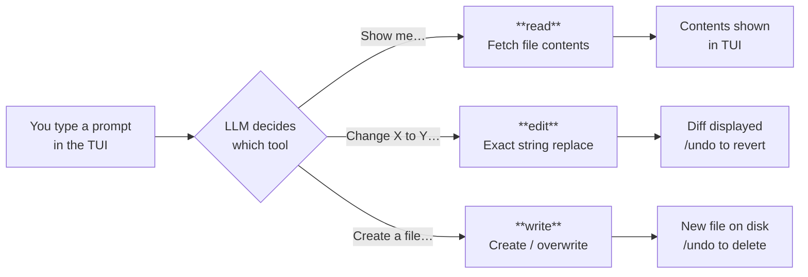
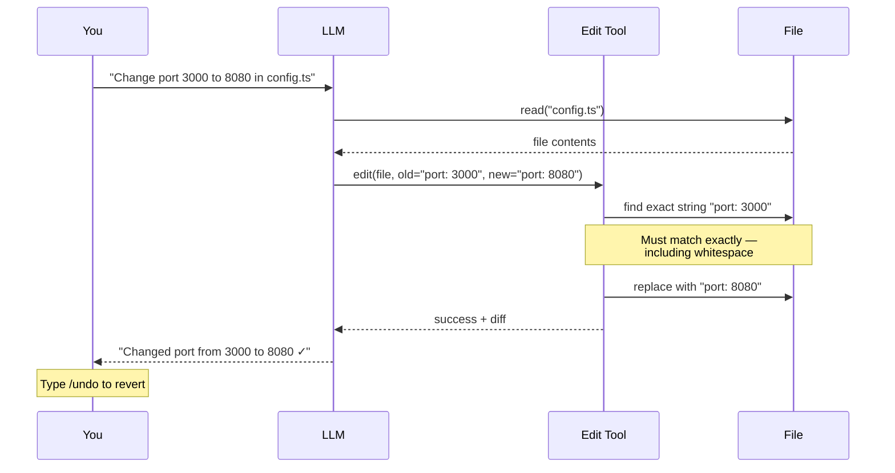
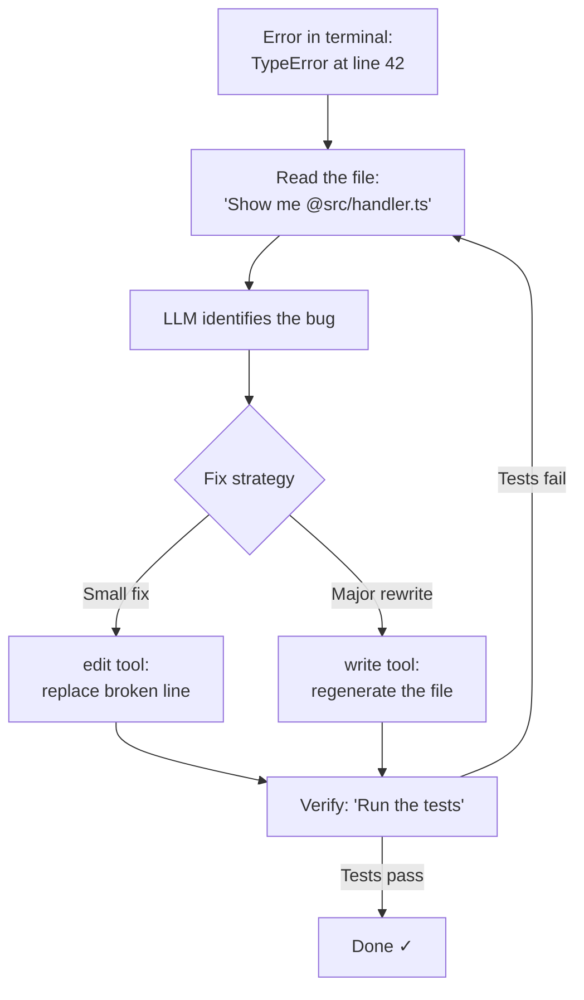

<div align="center">

# 📁 02. File Operations

**Read, edit, and write files with OpenCode's file tools**

[]()
[]()
[]()
[]()

[⬅️ Previous Module](../01-basic-commands/) • [🏠 Main Menu](../README.md) • [Next Module ➡️](../03-search-tools/)

</div>

---

## 📋 Table of Contents

<details>
<summary>Click to expand/collapse</summary>

- [📖 Learning Objectives](#-learning-objectives)
- [🎯 Overview](#-overview)
- [✅ Prerequisites](#-prerequisites)
- [⚡ Quick Start](#-quick-start)
- [📚 Core Concepts](#-core-concepts)
- [🔧 Examples & Patterns](#-examples--patterns)
- [🏗️ Real-World Workflows](#️-real-world-workflows)
- [🧪 Practice Exercises](#-practice-exercises)
- [❓ Common Questions](#-common-questions)
- [🐛 Troubleshooting](#-troubleshooting)
- [📈 What You've Learned](#-what-youve-learned)
- [🚶 Next Steps](#-next-steps)

</details>

---

## 📖 Learning Objectives

By the end of this module, you will be able to:

- Use the `read` tool to view files and directory listings
- Apply the `edit` and `multiedit` tools to modify existing code
- Create new files with the `write` tool
- Apply unified diffs with `apply_patch` for complex multi-hunk edits
- Use `@file` references to feed specific files into the LLM context
- Combine file tools in multi-step refactoring workflows

---

## 🎯 Overview

### 📝 What This Module Covers

| Topic                  | Description                     | Why It Matters                          |
| ---------------------- | ------------------------------- | --------------------------------------- |
| **`read` tool**        | Reading files and directories   | Understand codebases quickly            |
| **`edit` tool**        | Modifying existing files        | Make precise code changes               |
| **`multiedit` tool**   | Editing multiple files at once  | Batch changes across a codebase         |
| **`write` tool**       | Creating new files              | Generate boilerplate and new components |
| **`apply_patch` tool** | Applying unified diffs          | Multi-region edits in one operation     |
| **File references**    | Using `@file` syntax in prompts | Give the LLM direct file context        |

### 🎓 Learning Objectives

By the end of this module, you'll be able to:

- ✅ **Ask OpenCode to read files** and explain code
- ✅ **Request file edits** through natural language prompts
- ✅ **Create new files** by describing what you need
- ✅ **Use `@` file references** to give the LLM context

> **Important**: The `read`, `edit`, and `write` tools are used **internally by the LLM** (Large Language Model — the AI agent) — they are NOT CLI commands. You interact with them by typing natural language requests in the TUI or using `opencode run`.

---

## ✅ Prerequisites

```bash
# Verify OpenCode is installed
opencode --version

# Navigate to a project
cd ~/your-project

# Start the TUI
opencode
```

- [x] Completed [Module 01](../01-basic-commands/)
- [x] Understand the TUI, slash commands, and `@` file references

---

## ⚡ Quick Start

### 🚀 Reading Files

In the OpenCode TUI, type a natural language request:

```
Show me the contents of package.json
```

The LLM will use its internal `read` tool to fetch and display the file contents.

You can also use `@` file references to include file content directly:

```
Explain what @src/index.ts does
```

### 🚀 Editing Files

Ask the LLM to make changes in natural language:

```
Change the port from 3000 to 8080 in @config.json
```

The LLM uses its `edit` tool to find the exact text and replace it. You'll see the change in your terminal and can undo with `/undo`.

### 🚀 Creating Files

Ask the LLM to create new files:

```
Create a new file called src/utils/logger.ts with a basic Winston logger setup
```

The LLM uses its `write` tool to create the file with the specified content.

### ✅ Verification

```bash
# After any file operation, verify with standard shell commands:
cat config.json          # Check contents
git diff                 # See what changed
ls src/utils/            # Confirm new files exist
```

---

## 📚 Core Concepts

### How File Tools Work

OpenCode's file tools are **LLM-internal tools**, meaning the AI agent uses them behind the scenes when you make requests. You never type `opencode read` or `opencode edit` on the command line.



| Tool        | What It Does                                              | How to Trigger It                                |
| ----------- | --------------------------------------------------------- | ------------------------------------------------ |
| **`read`**  | Reads file contents, specific line ranges, or directories | "Show me...", "Read...", "What's in..."          |
| **`edit`**  | Replaces exact text in a file                             | "Change X to Y in...", "Replace...", "Update..." |
| **`write`** | Creates or overwrites files                               | "Create a file...", "Write a new..."             |

### The `read` Tool

The LLM uses `read` when you ask it to examine files:

```
# These prompts all trigger the read tool:
Show me the first 20 lines of @src/app.ts
What's in the config directory?
Read the test file and explain the test cases
```

**What `read` actually does under the hood:**

1. Resolves the file path relative to your project root
2. Returns the file contents (or a line range if specified) to the LLM's context
3. For directories, returns a listing of child files and folders

The LLM can read binary files too, but only text files are useful for code understanding.

### The `edit` Tool — How Exact String Matching Works

The LLM uses `edit` for precise string replacements in existing files:

```
# These prompts trigger the edit tool:
Replace 'localhost' with 'production.example.com' in @src/config.ts
Add a new import for lodash at the top of @src/utils.ts
Remove the console.log statements from @src/handlers.ts
```

**Key behavior:**

- The `edit` tool does **exact string matching** — the old text must appear verbatim in the file
- The LLM finds the old text, then produces new text to replace it
- You can `/undo` any edit



**Why "exact string matching" matters:**

The edit tool doesn't use line numbers or regex — it searches for the **literal old text** in the file. This means:

- **Whitespace matters**: `"  const x = 1"` (2 spaces) ≠ `"    const x = 1"` (4 spaces)
- **Context helps**: When you give the LLM `@file` references, it can see the exact characters and produce accurate edits
- **Multiple matches fail**: If the old string appears more than once, the edit tool may replace the wrong one. The LLM uses surrounding context lines to disambiguate.

**The `apply_patch` alternative:**

For larger multi-region edits, the LLM may use `apply_patch` instead of `edit`. This tool applies unified-diff patches to make several changes in a single operation. Both are covered by the `"edit"` permission.

**The `multiedit` tool:**

For editing multiple files in a single operation, the LLM uses `multiedit`. This is more efficient than calling `edit` on each file separately — it batches all changes and applies them atomically. Also covered by the `"edit"` permission.

### The `write` Tool

The LLM uses `write` to create new files or completely overwrite existing ones:

```
# These prompts trigger the write tool:
Create a new React component in src/components/Button.tsx
Write a Dockerfile for this Node.js project
Generate a .gitignore for a Python project
```

**Important distinction**: `edit` does find-and-replace in an existing file. `write` replaces the **entire file contents** (or creates a new file). If you want a small change, guide the LLM toward `edit`; if you want a file rewritten from scratch, guide toward `write`.

### File References with `@`

Use the `@` symbol to include file content directly in your prompt context:

```
# Reference a single file
Explain @src/auth/middleware.ts

# Reference multiple files
Compare @src/old-api.ts and @src/new-api.ts

# Reference with context
Given @package.json, what dependencies could we remove?
```

**How `@` references work under the hood:**

When you type `@src/index.ts`, OpenCode reads that file and injects its contents into the prompt **before** sending it to the LLM. This means:

- The LLM sees the **exact current contents** of the file
- It costs tokens — large files use more of the context window
- You can reference multiple files: `@a.ts @b.ts @c.ts`
- Directories work too: `@src/` includes a listing of files in that directory

### Configuring File Permissions

Control which file operations the LLM can perform in `opencode.json`:

```json
{
  "$schema": "https://opencode.ai/config.json",
  "permission": {
    "read": "allow",
    "edit": {
      "*": "allow",
      "*.env": "deny",
      "*.env.*": "deny"
    }
  }
}
```

The `"edit"` permission covers `edit`, `write`, and `apply_patch`. Use glob patterns for fine-grained control — the **last matching rule wins**:

```
LLM wants to edit src/config.ts
  Rule "*": "allow"        ← matches → ALLOWED

LLM wants to edit .env.local
  Rule "*": "allow"        ← matches (keep checking)
  Rule "*.env.*": "deny"   ← matches (last match) → DENIED
```

---

## 🔧 Examples & Patterns

### Pattern 1: Explore, Then Edit

```
# Step 1: Understand the code
Show me @src/config.ts

# Step 2: Make a targeted change
Change the database host from localhost to db.internal in @src/config.ts
```

### Pattern 2: Batch Editing

```
# Ask for changes across multiple files
Replace all instances of 'var' with 'const' across the src/ directory
```

The LLM will use `grep` to find occurrences, then `edit` each file.

### Pattern 3: Generate from Context

```
# Give context, then ask for new file creation
Looking at @src/models/User.ts, create a similar model file for Product
```

### Pattern 4: Non-Interactive Mode

```bash
# Use opencode run for scripting/automation
opencode run 'Show me the contents of README.md'
opencode run 'Add a license header to all .ts files in src/'
```

---

## 🏗️ Real-World Workflows

### Workflow 1: Code Review Preparation

In the TUI:

```
1. "Show me all files changed in the last commit"
2. "Read @src/auth.ts and explain the authentication flow"
3. "Are there any security issues in @src/auth.ts?"
```

### Workflow 2: Refactoring

```
1. "Find all files that import from @src/old-utils.ts"
2. "Rename the function 'getData' to 'fetchUserData' everywhere it appears"
3. "Update the import paths to use the new module name"
```

### Workflow 3: Adding a Feature

```
1. "Look at @src/routes/users.ts and create a similar route file for products"
2. "Add the product routes to the main router in @src/app.ts"
3. "Create a test file for the new product routes"
```

### Workflow 4: Debugging with File Context



**Example conversation:**

```
You: "I'm getting TypeError: Cannot read property 'id' of undefined
      at src/handler.ts:42. Show me that file and fix the bug."

LLM: [reads src/handler.ts]
     "The issue is on line 42 — req.user is undefined when the auth
      middleware hasn't run. I'll add a null check."
     [edits src/handler.ts: adds `if (!req.user) return res.status(401)...`]
     "Fixed. Want me to run the tests to verify?"
```

---

## 🧪 Practice Exercises

> **Use the practice project** from [Module 01](../01-basic-commands/#-set-up-a-practice-project). If you haven't created it yet, run:
>
> ```bash
> mkdir -p ~/opencode-practice/src && cd ~/opencode-practice
> echo '{"name": "practice-app", "version": "1.0.0"}' > package.json
> echo 'export function add(a, b) { return a + b; }' > src/utils.js
> ```

### Exercise 1: Reading and Understanding

Start OpenCode in the practice project and try:

```
1. "Show me the project structure"
2. "Read @package.json and list all dependencies"
3. "Explain what @src/utils.js does"
```

**Expected results:**

- Step 1: Lists `package.json`, `README.md`, and `src/` directory contents
- Step 2: Shows the JSON and notes there are no dependencies
- Step 3: Explains the `add` function

### Exercise 2: Making Edits

```
1. "Add a comment at the top of @README.md saying 'This is a demo project'"
2. "Change the version in @package.json to 2.0.0"
```

**Expected results:**

- Step 1: OpenCode edits README.md (verify with `cat README.md`)
- Step 2: Version changes from "1.0.0" to "2.0.0" (verify with `cat package.json`)
- Type `/undo` after each edit to revert, then `/redo` to reapply

### Exercise 3: Creating Files

```
1. "Create a new file called CHANGELOG.md with an initial entry for version 1.0.0"
2. "Create a new file src/multiply.js that exports a multiply function"
```

**Expected results:**

- Step 1: New file `CHANGELOG.md` appears in project root
- Step 2: New file `src/multiply.js` with an exported function
- Verify: `ls` to see new files, `cat CHANGELOG.md` to see contents

### Exercise 4: Combined Workflow

```
1. "Show me all files in src/"
2. "Read @src/utils.js"
3. "Add a subtract function to @src/utils.js"
4. "Create a test file src/utils.test.js with tests for add and subtract"
```

**Expected results:**

- Step 3: `src/utils.js` now has both `add` and `subtract` functions
- Step 4: New test file with at least 2 test cases

---

## ❓ Common Questions

**Q: Are `read`, `edit`, and `write` CLI commands?**
No. They are internal tools the LLM uses. You interact via natural language in the TUI or `opencode run "prompt"`.

**Q: How do I undo a file change?**
Type `/undo` in the TUI, or press `Ctrl+X u`.

**Q: Can I edit multiple files at once?**
Yes — describe the change you want and the LLM will edit multiple files as needed.

**Q: What's the difference between `edit` and `write`?**
`edit` does precise find-and-replace in existing files. `write` creates or fully overwrites a file.

**Q: Can I restrict which files the LLM can modify?**
Yes — configure permissions in `opencode.json` under the `"permission"` key.

---

## 🐛 Troubleshooting

### Edit Didn't Work as Expected

- Use `/undo` to revert
- Try being more specific about the exact text to change
- Use `@file` references so the LLM has current file context

### Permission Denied

Check your `opencode.json` permission settings:

```json
{
  "permission": {
    "edit": "allow",
    "write": "ask"
  }
}
```

### File Not Found

- Verify the file path: `ls path/to/file`
- Use relative paths from your project root
- Reference the file directly: `@exact/path/to/file.ts`

---

## 📈 What You've Learned

- ✅ The `read`, `edit`, and `write` tools are **LLM-internal**, not CLI commands
- ✅ Use **natural language prompts** to trigger file operations
- ✅ Use **`@` file references** to give the LLM direct context
- ✅ Use **`/undo`** to revert any change
- ✅ Use **`opencode run`** for non-interactive file operations

### 🎓 Knowledge Check

**1. Which tool should the LLM use to make a small, targeted change to an existing file?**

- A) `write`
- B) `edit`
- C) `read`
- D) `bash`

<details>
<summary>Show answer</summary>

**B) `edit`** — The `edit` tool modifies specific sections of an existing file. `write` creates or overwrites an entire file.

</details>

**2. What happens if you ask the LLM to edit a file without providing file context?**

- A) It fails immediately
- B) It uses `read` or `glob` first to find the file
- C) It creates a new file
- D) It asks you to provide the file path

<details>
<summary>Show answer</summary>

**B)** — The LLM reads the file first (using `read` or search tools) to understand its contents, then applies the edit.

</details>

**3. How do you undo a file change made by OpenCode?**

- A) `Ctrl+Z`
- B) `/undo`
- C) `git checkout`
- D) You can’t

<details>
<summary>Show answer</summary>

**B) `/undo`** — The `/undo` slash command reverts OpenCode’s last file modification.

</details>
---

## 🚶 Next Steps

Continue to **[Module 03: Search Tools](../03-search-tools/)** to learn how OpenCode finds files and searches content across your codebase.

---

## 📄 License & Attribution

This module is part of the [OpenCode Primer](../README.md).

**License:** MIT - See [LICENSE](../LICENSE) for details.

[⬆ Back to top](#-02-file-operations)

**Last Updated:** April 2026
**OpenCode Version:** 1.0+ compatible

---
