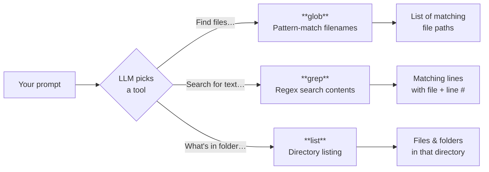
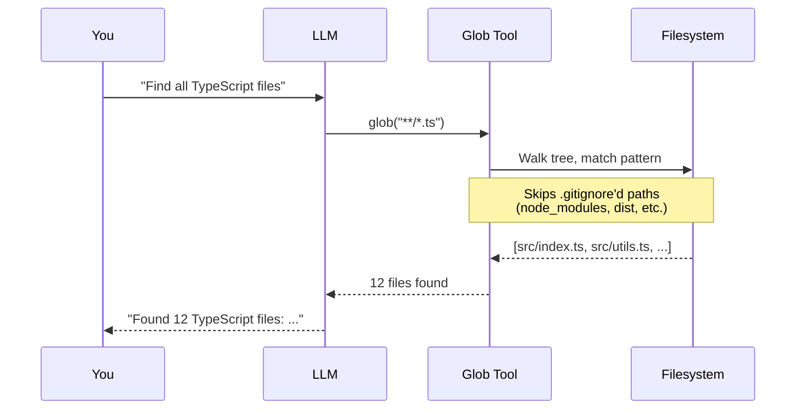
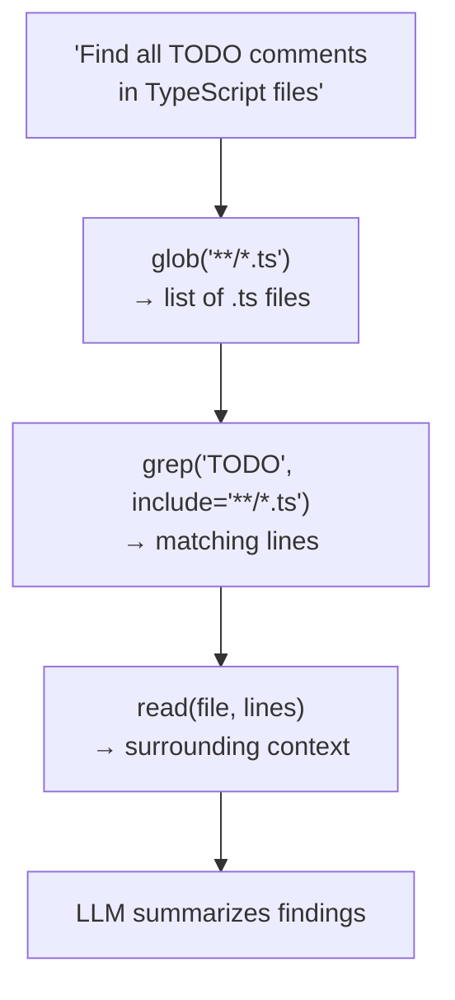
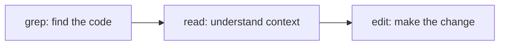

<div align="center">

# 🔍 03. Search Tools

**Find files and content in codebases with OpenCode's search tools**

[]()
[]()
[]()
[]()

[⬅️ Previous Module](../02-file-operations/) • [🏠 Main Menu](../README.md) • [Next Module ➡️](../04-bash-integration/)

</div>

---

## 📋 Table of Contents

<details>
<summary>Click to expand/collapse</summary>

- [🎯 Overview](#-overview)
- [✅ Prerequisites](#-prerequisites)
- [⚡ Quick Start](#-quick-start)
- [📚 Core Concepts](#-core-concepts)
- [🔧 Examples & Patterns](#-examples--patterns)
- [🧪 Practice Exercises](#-practice-exercises)
- [❓ Common Questions](#-common-questions)
- [🐛 Troubleshooting](#-troubleshooting)
- [📈 What You've Learned](#-what-youve-learned)
- [🚶 Next Steps](#-next-steps)

</details>

---

## 🎯 Overview

### 📝 What This Module Covers

| Tool             | Description                             | Why It Matters                          |
| ---------------- | --------------------------------------- | --------------------------------------- |
| **`glob`**       | Find files by pattern (e.g., `**/*.js`) | Navigate large codebases efficiently    |
| **`grep`**       | Search file contents using regex        | Find specific code, functions, patterns |
| **`codesearch`** | Semantic code search across codebase    | Find code by meaning, not just text     |
| **`list`**       | List directory contents                 | Understand project structure            |

### 🎓 Learning Objectives

- ✅ **Understand** how `glob`, `grep`, `codesearch`, and `list` work as LLM-internal tools
- ✅ **Ask OpenCode** to find files and search content via natural language
- ✅ **Use shell equivalents** when you need direct command-line searching
- ✅ **Combine search operations** for complex code analysis

> **Important**: `glob`, `grep`, `codesearch`, and `list` are internal tools the LLM uses — **not** CLI commands. There is no `opencode glob` or `opencode grep` command. You trigger these by asking the LLM in the TUI.

---

## ✅ Prerequisites

```bash
opencode --version   # Verify installation
cd ~/your-project    # Navigate to a project
opencode             # Start the TUI
```

- [x] Completed [Module 02: File Operations](../02-file-operations/)

---

## ⚡ Quick Start

### Finding Files (glob)

In the TUI, ask the LLM:

```
Find all JavaScript files in this project
```

The LLM internally runs its `glob` tool with a pattern like `**/*.js` and returns the results.

### Searching Content (grep)

```
Search for all TODO and FIXME comments in the codebase
```

The LLM internally uses its `grep` tool with a regex like `TODO|FIXME`.

### Listing Directories (list)

```
Show me the contents of the src/ directory
```

The LLM uses its `list` tool to show directory contents.

### Shell Equivalents

You can always use standard shell commands directly:

```bash
# Find files by pattern
find . -name '*.js' -not -path './node_modules/*'

# Search file contents
grep -rn 'TODO\|FIXME' --include='*.js' .

# List directory contents
ls -la src/
```

---

## 📚 Core Concepts

### How Search Tools Work

These are **LLM-internal tools**. When you ask OpenCode to find or search for something, the LLM decides which tool to use:



| Your Prompt                            | LLM Tool Used | What Happens                                 |
| -------------------------------------- | ------------- | -------------------------------------------- |
| "Find all .ts files"                   | `glob`        | Pattern-matches filenames across the project |
| "Search for 'useState' in React files" | `grep`        | Regex search across file contents            |
| "What's in the tests/ folder?"         | `list`        | Lists directory contents                     |

### The `glob` Tool

Pattern-based file finding. The LLM supplies a glob pattern and gets back a list of matching file paths.

**Common patterns the LLM uses:**

| Pattern                 | Matches                |
| ----------------------- | ---------------------- |
| `**/*.js`               | All JS files anywhere  |
| `src/**/*.ts`           | TS files under src/    |
| `**/*.{js,ts,jsx,tsx}`  | All JS/TS files        |
| `**/package.json`       | All package.json files |
| `test/*.{test,spec}.js` | Test files in test/    |

**How glob actually works:**

1. The LLM decides it needs to find files and calls `glob` with a pattern
2. OpenCode walks the project tree, respecting `.gitignore` rules
3. Matching paths are returned to the LLM context
4. The LLM can then read, edit, or grep those files



### The `grep` Tool

Content search with regex support. The LLM can search with:

- **Simple text**: `TODO`, `console.log`
- **Regex**: `function.*\(`, `import.*from`
- **Alternation**: `TODO|FIXME|HACK`
- **Case-insensitive matching**
- **File type filtering** via an include pattern

**How grep works internally:**

1. The LLM calls `grep` with a regex pattern (and optionally a file glob to narrow scope)
2. OpenCode scans file contents, returning matching lines with file paths and line numbers
3. Results go back to the LLM context for analysis

**Example of what the LLM sees when it runs grep:**

```
src/auth.ts:15: // TODO: add rate limiting
src/api.ts:42: // FIXME: handle edge case
src/utils.ts:8: // HACK: temporary workaround
```

### The `list` Tool

Directory listing with optional filtering. Shows file and folder names in a given path. Unlike `glob`, it doesn't recurse — it lists one level.

### The `codesearch` Tool

Semantic code search that finds code by meaning rather than exact text. While `grep` matches literal strings and regex patterns, `codesearch` understands code semantics:

```
# grep: exact text match
Search for "handleAuth" in the codebase

# codesearch: semantic match — finds code related to the concept
Find the code that handles user authentication and session management
```

`codesearch` is especially useful when:

- You don't know the exact function/variable names
- You want to find code related to a concept (e.g., "error handling", "database connection pooling")
- You're exploring an unfamiliar codebase and need to understand where functionality lives

The Explore subagent has access to `codesearch`, making it ideal for semantic code discovery.

### Tool Chaining — How the LLM Combines Search Tools

The real power comes from chaining tools together. When you ask a complex question, the LLM orchestrates multiple tools:



**Example: "Find all files that use deprecated APIs and suggest replacements"**

The LLM will:

1. `grep` for `@deprecated` or known deprecated function names
2. `read` each matching file to understand the context
3. Use its knowledge to suggest modern replacements
4. Optionally `edit` each file to apply the fix

---

## 🔧 Examples & Patterns

### Pattern 1: Code Exploration

In the TUI:

```
Find all TypeScript files in this project and show me how many there are
```

**Expected interaction:**

```
LLM uses glob("**/*.ts") → finds 23 files
LLM: "Found 23 TypeScript files across these directories:
      src/ (15 files), tests/ (6 files), scripts/ (2 files)"
```

### Pattern 2: Finding TODOs and Issues

```
Search the entire codebase for TODO, FIXME, and HACK comments.
Show me each one with the file name and line number.
```

**Expected interaction:**

```
LLM uses grep("TODO|FIXME|HACK") → finds 8 matches
LLM: "Found 8 items:
      src/auth.ts:15     TODO: add rate limiting
      src/api.ts:42      FIXME: handle timeout edge case
      src/utils.ts:8     HACK: workaround for upstream bug
      ..."
```

### Pattern 3: Dependency Analysis

```
Find all files that import from the 'lodash' package
```

**Expected interaction:**

```
LLM uses grep("from 'lodash'|require.*lodash") → finds imports
LLM: "4 files import lodash:
      src/utils.ts:1     import { debounce } from 'lodash'
      src/format.ts:2    import { capitalize } from 'lodash'
      ..."
```

### Pattern 4: Architecture Discovery

```
List all top-level directories and describe what each one contains
```

### Pattern 5: Security Scanning

```
Search for any hardcoded passwords, API keys, or secrets in the source code
```

### Pattern 6: Search → Read → Edit Pipeline

The most common compound workflow:



**Example:**

```
Find all console.log statements in the codebase,
show me each one, then replace them with proper logger calls
```

The LLM will:

1. `grep("console\\.log")` — find all occurrences
2. `read` each file around the match to understand context
3. `edit` each file to replace `console.log(...)` with `logger.info(...)`

### Shell-Based Search Scripts

For searches outside of OpenCode, use standard tools:

```bash
#!/bin/bash
# find-todos.sh - Find all TODO items in source code

echo "=== TODO Items ==="
grep -rn 'TODO\|FIXME' --include='*.js' --include='*.ts' .

echo ""
echo "=== Console.log Statements ==="
grep -rn 'console\.log' --include='*.js' --include='*.ts' src/

echo ""
echo "=== Potential Secrets ==="
grep -rni 'password\|secret\|api.key\|token' \
  --include='*.js' --include='*.ts' --include='*.json' \
  --exclude-dir=node_modules .
```

### Non-Interactive Search

```bash
# Use opencode run for scripted searches
opencode run 'Find all JavaScript files that contain async functions'
opencode run 'Search for deprecated API calls in the src/ directory'
```

### Built-in Tools vs Shell: When to Use Each

| Scenario                                    | Use Built-in Tools               | Use Shell Commands               |
| ------------------------------------------- | -------------------------------- | -------------------------------- |
| Quick exploration                           | ✅ Ask in natural language        | ❌ Slower to type                 |
| Complex regex                               | ✅ LLM builds the regex for you   | ✅ If you know regex well         |
| Piping results to other tools               | ❌ Not supported directly         | ✅ `grep … \| sort \| uniq -c`    |
| Searching ignored files (node_modules, etc) | ❌ Built-in tools skip .gitignore | ✅ Shell grep searches everything |
| Follow-up actions (read/edit found files)   | ✅ LLM chains tools automatically | ❌ Manual multi-step              |
| Scripting / CI pipelines                    | ❌ Not available outside the TUI  | ✅ Standard Unix tools            |

---

## 🧪 Practice Exercises

> **Use the practice project** from [Module 01](../01-basic-commands/#-set-up-a-practice-project), or any real project you have.

### Exercise 1: Project Exploration

Start OpenCode in a project and try these prompts:

```
1. "Find all source files (JS, TS, JSX, TSX) in this project"
2. "Find all configuration files (JSON, YAML, TOML)"
3. "Find all test files"
4. "List the top-level directory structure"
```

**Expected results:**

- Step 1: LLM uses `glob("**/*.{js,ts,jsx,tsx}")` — returns a file list
- Step 2: LLM uses `glob("**/*.{json,yaml,yml,toml}")` — returns config files
- Step 3: LLM uses `glob("**/*.{test,spec}.{js,ts}")` — returns test files
- Step 4: LLM uses `list(".")` — returns top-level files and folders

### Exercise 2: Code Analysis

```
1. "Search for all TODO comments in source files"
2. "Find all function definitions in the JavaScript files"
3. "Find all import statements in TypeScript files"
4. "Search for error handling patterns (try/catch blocks)"
```

**Expected results:**

- Step 1: LLM uses `grep("TODO")` — returns matching lines with file:line format
- Step 2: LLM uses `grep("function\\s+\\w+")` — finds named functions
- Step 3: LLM uses `grep("^import")` — finds import statements
- Step 4: LLM uses `grep("try\\s*{")` — finds try/catch blocks

### Exercise 3: Shell Equivalents

Practice the same searches with standard shell commands:

```bash
# Find JavaScript files
find . -name '*.js' -not -path './node_modules/*'

# Search for TODOs
grep -rn 'TODO' --include='*.js' --include='*.ts' .

# Find function definitions
grep -rn 'function ' --include='*.js' .

# List directory
ls -la src/
```

**Expected:** Your shell results should closely match what the LLM returned (minus `.gitignore`'d files that the built-in tools skip).

### Exercise 4: Combined Workflows

In the TUI:

```
1. "Find all TypeScript files that contain the word 'deprecated'"
2. "For each file found, show me the deprecated code"
3. "Suggest replacements for the deprecated patterns"
```

**Expected results:**

- Step 1: LLM chains `grep("deprecated", include="**/*.ts")` — finds affected files
- Step 2: LLM reads surrounding context for each match
- Step 3: LLM suggests modern alternatives based on its knowledge

### Exercise 5: Search-Driven Refactoring

```
"Find all files that use console.log, show me each one,
 then replace them all with a proper logger"
```

**Expected results:**

1. `grep("console\\.log")` → finds all occurrences
2. LLM reads each file for context
3. LLM creates a `logger.ts` utility if one doesn't exist
4. LLM edits each file to replace `console.log(...)` with `logger.info(...)`

---

## ❓ Common Questions

**Q: Can I type `opencode grep "pattern"` on the command line?**
No. `grep` is an internal LLM tool. Use `grep -rn "pattern" .` for shell searching, or ask in the TUI.

**Q: What's the difference between OpenCode's grep and regular grep?**
OpenCode's grep tool is used by the LLM and understands project context (respects .gitignore, etc.). Regular `grep` is a standard Unix tool you run directly.

**Q: How do I search in specific file types only?**
Ask the LLM: "Search for X only in TypeScript files." It will use glob to filter, then grep to search.

**Q: Can I combine multiple search operations?**
Yes — describe what you want in one prompt and the LLM will chain glob + grep + read as needed.

---

## 🐛 Troubleshooting

### No Results Found

- Check if files are ignored by `.gitignore` — OpenCode respects ignore patterns
- Try broader search terms
- Verify the directory you're searching in

### Search Too Slow

- Be more specific about which directories to search
- Limit file types: "Search only in .ts files under src/"
- Use shell `grep` directly for very large codebases

### Different Results from Shell grep

OpenCode's grep tool may filter differently than shell grep (e.g., respecting .gitignore by default). For exact parity, use shell commands directly.

---

## 📈 What You've Learned

- ✅ `glob`, `grep`, and `list` are **LLM-internal tools**, not CLI commands
- ✅ Trigger them via **natural language prompts** in the TUI
- ✅ Use **shell equivalents** (`find`, `grep`, `ls`) for direct command-line searches
- ✅ Combine search operations for powerful code analysis

---

## 🚶 Next Steps

Continue to **[Module 04: Bash Integration](../04-bash-integration/)** to learn how OpenCode executes shell commands.

---

## 📄 License & Attribution

This module is part of the [OpenCode Primer](../README.md).

**License:** MIT - See [LICENSE](../LICENSE) for details.

[⬆ Back to top](#-03-search-tools)

**Last Updated:** April 2026
**OpenCode Version:** 1.0+ compatible

---
