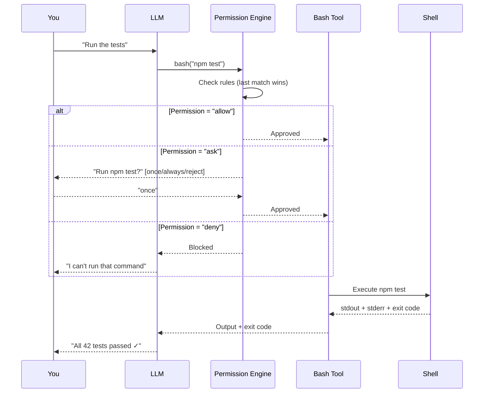
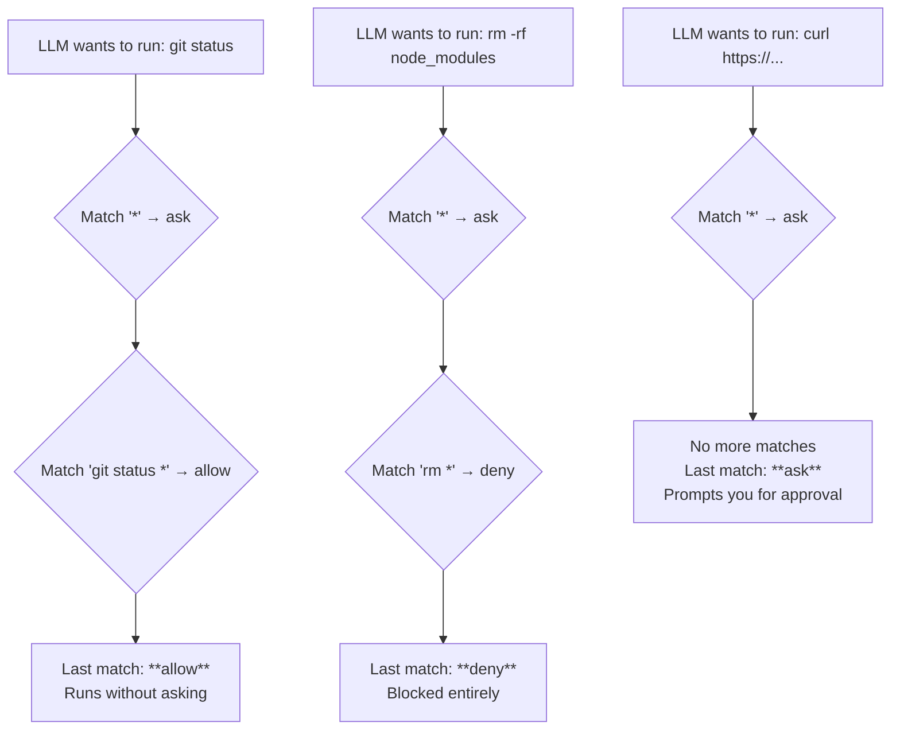
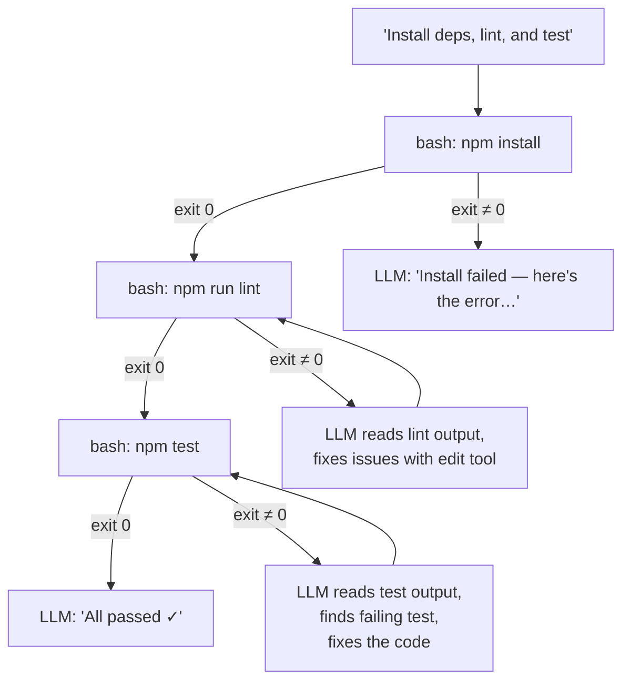

<div align="center">

# 💻 04. Bash Integration

**Execute shell commands through OpenCode's bash tool**

[]()
[]()
[]()
[]()

[⬅️ Previous Module](../03-search-tools/) • [🏠 Main Menu](../README.md) • [Next Module ➡️](../05-question-todo/)

</div>

---

## 📋 Table of Contents

<details>
<summary>Click to expand/collapse</summary>

- [🎯 Overview](#-overview)
- [✅ Prerequisites](#-prerequisites)
- [⚡ Quick Start](#-quick-start)
- [📚 Core Concepts](#-core-concepts)
- [🔧 Examples & Patterns](#-examples--patterns)
- [🧪 Practice Exercises](#-practice-exercises)
- [❓ Common Questions](#-common-questions)
- [🐛 Troubleshooting](#-troubleshooting)
- [📈 What You've Learned](#-what-youve-learned)
- [🚶 Next Steps](#-next-steps)

</details>

---

## 🎯 Overview

### 📝 What This Module Covers

| Topic                 | Description                                 | Why It Matters                           |
| --------------------- | ------------------------------------------- | ---------------------------------------- |
| **`bash` tool**       | LLM executes shell commands in your project | Run builds, tests, installs, deployments |
| **Permission config** | Control what commands the LLM can run       | Security and safety                      |
| **Command workflows** | Combining bash with other tools             | End-to-end development automation        |

### 🎓 Learning Objectives

- ✅ **Understand** how the `bash` tool works as an LLM-internal tool
- ✅ **Ask OpenCode** to run shell commands via natural language
- ✅ **Configure permissions** for bash operations in `opencode.json`
- ✅ **Combine** bash with file and search tools for complete workflows

> **Important**: There is no `opencode bash "command"` CLI syntax. The `bash` tool is used **internally by the LLM** when you ask it to run commands. You can also prefix commands with `!` in the TUI for direct execution (bypasses the LLM — runs the command immediately without AI interpretation).

---

## ✅ Prerequisites

```bash
opencode --version   # Verify installation
cd ~/your-project    # Navigate to a project
opencode             # Start the TUI
```

- [x] Completed [Module 03: Search Tools](../03-search-tools/)

---

## ⚡ Quick Start

### Running Commands via the TUI

In the OpenCode TUI, type:

```
Run npm install
```

The LLM will use its internal `bash` tool to execute `npm install` and show you the output.

### More Examples

```
Check the git status
Run the test suite
Show me the Node.js and npm versions
Start docker compose in detached mode
```

### The `!` Prefix

You can prefix a command with `!` in the TUI to run it directly without the LLM interpreting it:

```
!npm install
!git status
!docker-compose up -d
```

### Non-Interactive Mode

```bash
# Run commands via opencode run
opencode run 'Run npm install and show the output'
opencode run 'Run the tests and tell me if any failed'
```

---

## 📚 Core Concepts

### How the Bash Tool Works

When you ask OpenCode to run a command, the LLM uses its internal `bash` tool:



1. You type a request like "Run the tests"
2. The LLM decides to use the `bash` tool
3. The permission engine checks your `opencode.json` rules
4. If approved, it executes the command in your project directory
5. Output is shown in the TUI
6. The LLM can interpret results and take follow-up actions

### The `!` Prefix — Direct Execution

The `!` prefix bypasses the LLM entirely and runs the command directly:

```
!npm install        ← Runs immediately, no LLM involved
!git status         ← Same as running in your terminal
!docker ps          ← Quick system check
```

**When to use `!` vs natural language:**

| Approach         | When to Use                                      | Example                      |
| ---------------- | ------------------------------------------------ | ---------------------------- |
| Natural language | When you want the LLM to interpret results       | "Run tests and fix failures" |
| `!` prefix       | Quick commands where you don't need LLM analysis | `!git status`                |
| `opencode run`   | Non-interactive scripting from outside the TUI   | CI/CD pipelines              |

### Permission Configuration

Control bash permissions in `opencode.json`:

```json
{
  "$schema": "https://opencode.ai/config.json",
  "permission": {
    "bash": "ask"
  }
}
```

**Permission Levels:**

| Level     | Behavior                                           |
| --------- | -------------------------------------------------- |
| `"allow"` | LLM can run commands without asking                |
| `"ask"`   | LLM must ask for approval before running (default) |
| `"deny"`  | LLM cannot run any shell commands                  |

### Granular Bash Permissions

For fine-grained control, use an object with command patterns. The **last matching rule wins**:

```json
{
  "permission": {
    "bash": {
      "*": "ask",
      "git status *": "allow",
      "git log *": "allow",
      "git diff *": "allow",
      "npm test *": "allow",
      "npm run lint *": "allow",
      "rm *": "deny",
      "git push *": "ask",
      "git reset --hard *": "deny"
    }
  }
}
```

This lets safe read-only commands run freely while blocking destructive commands and requiring approval for everything else.

**How precedence works (last matching rule wins):**



Wildcards:

- `*` matches zero or more characters
- `?` matches exactly one character

### Per-Agent Bash Permissions

Different agents can have different bash access:

```json
{
  "agent": {
    "build": {
      "permission": {
        "bash": {
          "*": "ask",
          "git *": "allow",
          "npm *": "allow"
        }
      }
    },
    "explore": {
      "permission": {
        "bash": "deny"
      }
    }
  }
}
```

### Command Safety

With `"ask"` permission, the LLM will show you the command before running it. You get three choices:

| Choice     | Behavior                                          |
| ---------- | ------------------------------------------------- |
| **once**   | Approve just this one command                     |
| **always** | Approve all future commands matching this pattern |
| **reject** | Deny the command                                  |

This is especially important for:

- Destructive commands (`rm -rf`, `git reset --hard`)
- Commands that modify system state (`sudo`, `docker system prune`)
- Commands with side effects (`git push`, `npm publish`)

---

## 🔧 Examples & Patterns

### Pattern 1: Development Setup

In the TUI:

```
Install all dependencies, then run the linter and tests
```

The LLM will chain: `npm install` → `npm run lint` → `npm test`

**How the LLM chains commands:**



The LLM inspects **exit codes** and **output text** to decide what to do next. A non-zero exit code triggers diagnostic behavior.

### Pattern 2: Diagnosis and Fix

```
Run the tests. If any fail, look at the failing test and the source code it tests, then fix the bug.
```

The LLM uses `bash` to run tests, `read` to examine test/source files, then `edit` to fix the code. This is one of the most powerful compound workflows — the LLM:

1. Runs tests and parses the failure output
2. Identifies the file and line where the assertion failed
3. Reads the test file to understand what's expected
4. Reads the source code to find the bug
5. Edits the source to fix it
6. Re-runs tests to verify

### Pattern 3: Build and Deploy

```
Build the project, run the tests, and if everything passes, create a production build
```

### Pattern 4: System Information

```
Show me the system info: OS version, Node version, npm version, and disk space
```

### Pattern 5: Database Operations

```
Run the database migrations and seed the test data
```

### Pattern 6: Complex Multi-Tool Workflow

```
Check git status. If there are uncommitted changes, show me a diff.
Then run the tests. If they pass, commit with a descriptive message
and show the commit hash.
```

**Expected interaction:**

```
LLM: [runs git status --porcelain]
     "You have 3 modified files."
     [runs git diff]
     "Changes:
       - src/auth.ts: added rate limiting middleware
       - src/api.ts: fixed timeout handling
       - tests/auth.test.ts: added new test cases"
     [runs npm test]
     "All 47 tests passed."
     [runs git add -A && git commit -m "feat(auth): add rate limiting and fix timeout handling"]
     "Committed as abc1234."
```

---

## 🧪 Practice Exercises

### Exercise 1: Basic Commands

In the TUI, try:

```
1. "Show me the current directory and its contents"
2. "Check the git log for the last 5 commits"
3. "Show me the disk usage of this project"
```

**Expected results:**

- Step 1: LLM runs `pwd && ls -la` — shows path and file listing
- Step 2: LLM runs `git log --oneline -5` — shows recent commits
- Step 3: LLM runs `du -sh .` or `du -sh */ | sort -rh` — shows directory sizes

### Exercise 2: Development Workflow

```
1. "Install dependencies (npm install)"
2. "Run the linter"
3. "Run the test suite"
4. "Show me the test coverage"
```

**Expected results:**

- Each step: LLM runs the command, shows output, interprets results
- If the linter finds issues, the LLM may offer to fix them
- If tests fail, the LLM may read the failing test and suggest fixes

### Exercise 3: Permission Configuration

Create or edit `opencode.json`:

```json
{
  "permission": {
    "bash": "ask"
  }
}
```

Then in the TUI, ask for a command:

```
"Run npm install"
```

**Expected:** OpenCode shows you the command and asks for approval:

```
LLM wants to run: npm install
[once] [always] [reject]
```

Choose "once" to approve a single run. Choose "always" to auto-approve matching commands for the rest of the session.

### Exercise 4: Combined Workflow

```
1. "Check if there are any uncommitted changes"
2. "Run the tests and show me the results"
3. "If tests pass, create a git commit with a descriptive message"
```

**Expected results:**

- Step 1: LLM runs `git status` — reports clean or dirty working tree
- Step 2: LLM runs `npm test` — shows pass/fail results
- Step 3: If tests pass, LLM runs `git add -A && git commit -m "..."` with a descriptive message based on the changes

### Exercise 5: The `!` Prefix

Try direct execution:

```
!echo "Hello from direct execution"
!node --version
!git branch --list
```

**Expected:** Commands run immediately without the LLM interpreting them. Output appears directly — no AI analysis or follow-up.

---

## ❓ Common Questions

**Q: Can I type `opencode bash "npm install"` on the command line?**
No. `bash` is an internal LLM tool. Just run `npm install` directly, or ask in the TUI.

**Q: How do I run a command without the LLM interpreting it?**
Use the `!` prefix in the TUI: `!npm install`.

**Q: Can the LLM chain multiple commands?**
Yes — ask for a workflow and the LLM will run commands sequentially, checking results between each step.

**Q: How do I prevent dangerous commands?**
Set `"bash": "ask"` in `opencode.json`. The LLM will show you each command before running it.

**Q: Do commands run in my project directory?**
Yes — commands run in the working directory where you started `opencode`.

---

## 🐛 Troubleshooting

### Command Failed

- Check if the command works when run directly in your terminal
- Verify environment variables are set
- Check that required tools are installed

### Permission Denied

Update `opencode.json`:

```json
{
  "permission": {
    "bash": "ask"
  }
}
```

### Long-Running Commands

The LLM handles long-running commands. For servers that run indefinitely, the LLM will typically run them in the background or suggest using `&`.

### Environment Differences

Commands run in the same shell environment where you started OpenCode. If environment variables are missing, set them before starting:

```bash
export NODE_ENV=development
opencode
```

---

## 📈 What You've Learned

- ✅ The `bash` tool is an **LLM-internal tool**, not a CLI command
- ✅ Ask the LLM to run commands via **natural language**
- ✅ Use the **`!` prefix** in the TUI for direct command execution
- ✅ Configure **permissions** in `opencode.json` for safety
- ✅ The LLM can **chain commands** and interpret results

---

## 🚶 Next Steps

Continue to **[Module 05: Question & Todo Tools](../05-question-todo/)** to learn about interactive workflows and task management.

---

## 📄 License & Attribution

This module is part of the [OpenCode Primer](../README.md).

**License:** MIT - See [LICENSE](../LICENSE) for details.

[⬆ Back to top](#-04-bash-integration)

**Last Updated:** April 2026
**OpenCode Version:** 1.0+ compatible

---
