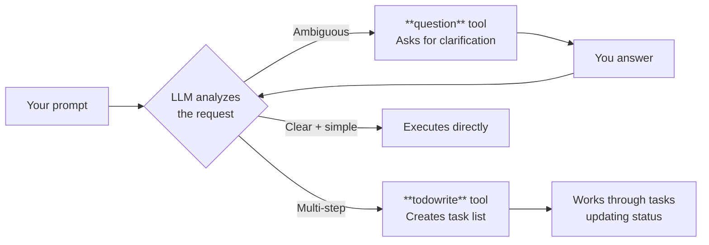
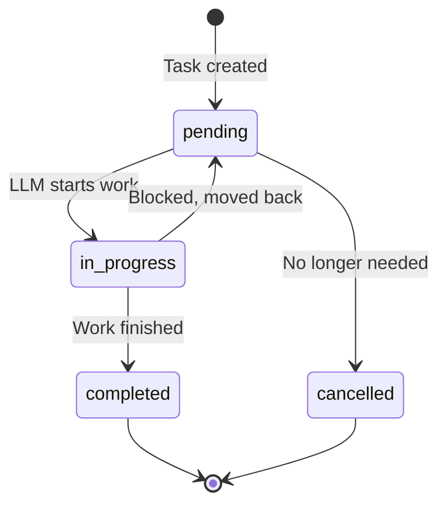
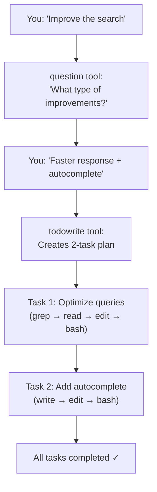

<div align="center">

# ❓ 05. Question & Todo Tools

**Interactive workflows and task management with OpenCode**

[]()
[]()
[]()
[]()

[⬅️ Previous Module](../04-bash-integration/) • [🏠 Main Menu](../README.md) • [Next Module ➡️](../06-web-tools/)

</div>

---

## 📋 Table of Contents

<details>
<summary>Click to expand/collapse</summary>

- [🎯 Overview](#-overview)
- [⚡ Quick Start](#-quick-start)
- [📚 The Question Tool](#-the-question-tool)
- [📋 The Todowrite Tool](#-the-todowrite-tool)
- [🔧 Integration Patterns](#-integration-patterns)
- [🧪 Practice Exercises](#-practice-exercises)
- [❓ Common Questions](#-common-questions)
- [🚶 Next Steps](#-next-steps)

</details>

---

## 🎯 Overview

The `question` and `todowrite` tools enable interactive workflows and task management within OpenCode sessions. Both are **LLM-internal tools** — the AI agent uses them automatically when needed.

| Tool            | Purpose                             | When It's Used                               |
| --------------- | ----------------------------------- | -------------------------------------------- |
| **`question`**  | Ask the user for input or decisions | When the LLM needs clarification or a choice |
| **`todowrite`** | Track tasks and progress            | During complex multi-step work               |

> These tools are NOT CLI commands. The LLM uses them automatically during conversations.



---

## ⚡ Quick Start

### Question Tool in Action

When you give an ambiguous request, the LLM will ask:

```
You: "Add authentication to the project"
LLM: "Which authentication method would you like?
      - JWT tokens
      - OAuth 2.0 (Google/GitHub)
      - Session-based authentication
      Please choose one."
```

### Todo Tool in Action

For complex requests, the LLM creates a structured task list:

```
You: "Fix the login bug, add dark mode, and optimize images"
LLM creates todo list:
  - [ ] Fix login bug
  - [ ] Add dark mode support
  - [ ] Optimize images
```

The LLM updates status as it works through each task.

---

## 📚 The Question Tool

The `question` tool lets the LLM ask you for input when it needs decisions or clarification.

### When the LLM Uses It

1. **Decision Making**: "Should we use REST or GraphQL?"
2. **Requirement Gathering**: "Which user roles should the system support?"
3. **Clarification**: "Did you mean to update all files or just the main one?"
4. **Missing Information**: "What should the API endpoint be named?"

### Full Conversation Example

Here's what a real `question` tool interaction looks like:

```
You: "Add authentication to the project"

LLM: I need to understand your requirements before implementing.
     ┌─────────────────────────────────────────────────┐
     │ Which authentication method would you like?       │
     │                                                   │
     │  1. JWT tokens (stateless, API-friendly)          │
     │  2. OAuth 2.0 (Google/GitHub login)               │
     │  3. Session-based (traditional cookies)           │
     │                                                   │
     │ Type a number or describe what you need:          │
     └─────────────────────────────────────────────────┘

You: "1"

LLM: Got it — JWT authentication. One more question:
     ┌─────────────────────────────────────────────────┐
     │ Should I include refresh token rotation?          │
     │                                                   │
     │  - Yes (more secure, recommended for production)  │
     │  - No (simpler, fine for development)             │
     └─────────────────────────────────────────────────┘

You: "Yes"

LLM: [creates todowrite list]
     [implements JWT auth with refresh token rotation]
```

### Question Format

The LLM can present questions as:

- **Free-text input** for open-ended questions
- **Multiple choice options** for decisions
- **Yes/no** for confirmations

### How to Control the Question Tool

| You Want                   | What to Say                                |
| -------------------------- | ------------------------------------------ |
| Fewer questions            | "Use your best judgment for the details"   |
| More questions             | "Ask me before making any major decisions" |
| Override a previous answer | "Actually, go with option B instead"       |
| Skip question entirely     | Be very specific in your initial prompt    |

### Best Practices

- **Be specific** in your initial prompt to reduce unnecessary questions
- If the LLM asks too many questions, say "Use your best judgment for the details"
- You can always override: "Actually, go with option B instead"

---

## 📋 The Todowrite Tool

The `todowrite` tool creates and manages structured task lists for tracking progress during complex sessions.

### When the LLM Uses It

The LLM creates todo lists for:

- **Complex multi-step tasks** (3+ distinct steps)
- **Multiple user requests** in one prompt
- **Non-trivial operations** like refactoring or feature implementation

### Task States



| Status        | Meaning                                   |
| ------------- | ----------------------------------------- |
| `pending`     | Not yet started                           |
| `in_progress` | Currently working on (only one at a time) |
| `completed`   | Finished successfully                     |
| `cancelled`   | No longer needed                          |

### Full Workflow Example

Here's a complete interaction showing the todowrite tool in action:

```
You: "Fix the signup form validation, add a password strength
      indicator, and implement email verification"

LLM: I'll break this into tasks and work through them:

  ┌────────────────────────────────────────────────────┐
  │ Task List                                           │
  │                                                     │
  │  ○ Fix signup form validation                       │
  │  ○ Add password strength indicator                  │
  │  ○ Implement email verification                     │
  └────────────────────────────────────────────────────┘

LLM: Starting with the first task.

  ┌────────────────────────────────────────────────────┐
  │  ● Fix signup form validation         [in_progress] │
  │  ○ Add password strength indicator       [pending]  │
  │  ○ Implement email verification          [pending]  │
  └────────────────────────────────────────────────────┘

  [reads @src/components/SignupForm.tsx]
  [edits: adds email format check, min password length]
  [runs: npm test -- --filter signup]
  Tests pass ✓

  ┌────────────────────────────────────────────────────┐
  │  ✓ Fix signup form validation         [completed]   │
  │  ● Add password strength indicator   [in_progress]  │
  │  ○ Implement email verification          [pending]  │
  └────────────────────────────────────────────────────┘

  [creates @src/components/PasswordStrength.tsx]
  [edits @src/components/SignupForm.tsx to import it]
  Component renders a strength bar ✓

  ┌────────────────────────────────────────────────────┐
  │  ✓ Fix signup form validation         [completed]   │
  │  ✓ Add password strength indicator    [completed]   │
  │  ● Implement email verification      [in_progress]  │
  └────────────────────────────────────────────────────┘

  [creates @src/services/email.ts]
  [creates @src/routes/verify.ts]
  [edits @src/routes/auth.ts to trigger verification]
  All tasks complete ✓
```

### How the TUI Displays Todos

The task list appears in the TUI sidebar and updates in real-time as the LLM works. You can:

- **Watch progress** — see which task the LLM is currently on
- **Interrupt** — type a message to redirect the LLM mid-task
- **Modify** — say "Skip the documentation task" or "Add a task for writing migrations"
- **Check status** — say "Show me the current task list"

### Tips for Todo Management

| Tip                                          | Explanation                                               |
| -------------------------------------------- | --------------------------------------------------------- |
| Only **one** `in_progress` task at a time    | The LLM focuses on one task before moving to the next     |
| Tasks are marked `completed` immediately     | No batching — each task is confirmed as soon as it's done |
| You can reorder: "Do the tests first"        | The LLM will re-prioritize the remaining tasks            |
| You can cancel: "Skip the docs task"         | Task moves to `cancelled` state                           |
| You can add: "Also write a migration script" | New task appended to the list                             |

---

## 🔧 Integration Patterns

The question and todowrite tools become powerful when combined with other tools. Here's how they fit into larger workflows:

### Pattern 1: Question → Todo → Execute Pipeline



**Full conversation:**

```
You: "Improve the search functionality"

LLM: "What type of improvements are needed?"
  - Faster response time
  - Better relevance scoring
  - Advanced filtering
  - Autocomplete

You: "Faster response time and autocomplete"

LLM creates todo list:
  ○ Optimize search query performance
  ○ Add autocomplete functionality

LLM: [works through each task using bash, read, edit tools]
```

### Pattern 2: Progressive Elaboration

When the LLM needs multiple rounds of clarification:

```
You: "Create a dashboard"

LLM: "What metrics should the dashboard show?"
You: "User signups, active users, revenue"

LLM: "What visualization types?"
You: "Line charts and summary cards"

LLM: "Which charting library? (Recharts, Chart.js, D3)"
You: "Recharts"

LLM creates todo list:
  ○ Set up Recharts and dashboard layout
  ○ Create SignupChart component
  ○ Create ActiveUsersChart component
  ○ Create RevenueChart component
  ○ Create SummaryCards component
  ○ Wire up data fetching

[LLM works through each task]
```

### Pattern 3: Autonomous with Check-ins

The LLM works independently but pauses when uncertain:

```
You: "Refactor the authentication module. Ask me if you're unsure about anything."

LLM creates todo list:
  ○ Audit current auth implementation
  ○ Extract JWT logic into auth service
  ○ Add refresh token rotation
  ○ Update route middleware
  ○ Run tests

[Works through tasks 1-2 without asking]

LLM: "I found two approaches for refresh tokens:
      1. Store in HttpOnly cookies (more secure)
      2. Store in localStorage (simpler)
      Which do you prefer?"

You: "Cookies"

[Continues with remaining tasks]
```

### Pattern 4: Question Tool as a Decision Gate

Sometimes the question tool acts as a safety gate before destructive operations:

```
You: "Clean up the database and remove old records"

LLM: "This will permanently delete data. Please confirm:
      - Delete records older than 30 days?
      - Which tables? (users, logs, sessions, all)
      - Should I create a backup first?"

You: "All tables older than 90 days, and yes create a backup first"

LLM creates todo list:
  ○ Create database backup
  ○ Delete old user records (>90 days)
  ○ Delete old log records (>90 days)
  ○ Delete old session records (>90 days)
  ○ Verify deletion counts
```

---

## 🧪 Practice Exercises

> **Use the practice project** from [Module 01](../01-basic-commands/#-set-up-a-practice-project), or any real project you have.

### Exercise 1: Triggering the Question Tool

Try these ambiguous prompts and observe how the LLM asks for clarification:

```
"Set up a database for this project"
```

**Expected:** LLM asks which database (PostgreSQL, MySQL, SQLite, MongoDB).

```
"Deploy the application"
```

**Expected:** LLM asks which environment (development, staging, production) and what deployment method.

```
"Add testing to the project"
```

**Expected:** LLM asks which framework (Jest, Vitest, Mocha) and what types of tests (unit, integration, e2e).

### Exercise 2: Triggering the Todo Tool

Try complex, multi-part requests:

```
"Fix the signup form validation, add a password strength indicator,
 and implement email verification"
```

**Expected:** LLM creates a 3+ item todo list and works through each task, updating status as it goes.

```
"Refactor the API routes: add error handling, implement rate limiting,
 and add request logging"
```

**Expected:** LLM creates a structured plan, works through each task, runs tests after each change.

### Exercise 3: Combined Workflow

```
"I want to add a shopping cart to the e-commerce site.
 Ask me about requirements first, then create a plan."
```

**Expected:**

1. LLM asks 2-3 clarifying questions (storage method, features, payment)
2. You answer each one
3. LLM creates a detailed todo list
4. LLM works through tasks, potentially asking more questions along the way

### Exercise 4: Controlling the Flow

Practice these steering techniques:

```
"Add user profiles to the app. Use your best judgment — don't ask me any questions."
```

**Expected:** LLM creates a todo list and implements everything without asking, making reasonable defaults.

```
"Refactor the auth module. Show me the plan first before making any changes."
```

**Expected:** LLM creates a todo list but presents it for your approval before starting work.

---

## ❓ Common Questions

**Q: Can I force the LLM to create a todo list?**
Say: "Create a task list for this work" or "Break this down into steps and track progress."

**Q: Can I modify the todo list?**
Say: "Skip the documentation task" or "Add a task for writing migrations."

**Q: How do I stop too many questions?**
Say: "Make reasonable assumptions for the details" or provide more specifics in your initial prompt.

**Q: Are these CLI commands?**
No. `question` and `todowrite` are internal LLM tools used automatically.

---

## 🚶 Next Steps

Continue to **[Module 06: Web Tools](../06-web-tools/)** to learn about web research and content fetching.

---

## 📄 License & Attribution

This module is part of the [OpenCode Primer](../README.md).

**License:** MIT - See [LICENSE](../LICENSE) for details.

[⬆ Back to top](#-05-question--todo-tools)

**Last Updated:** April 2026
**OpenCode Version:** 1.0+ compatible

---
