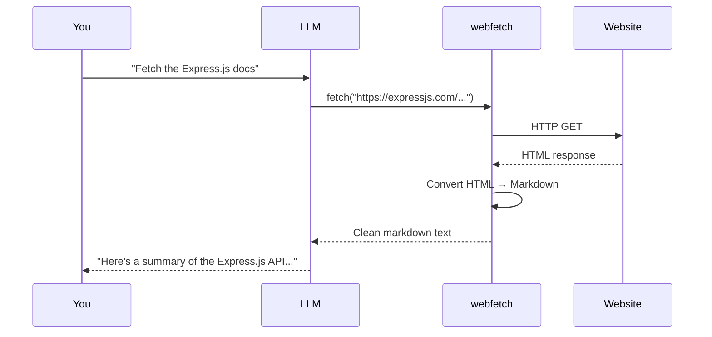
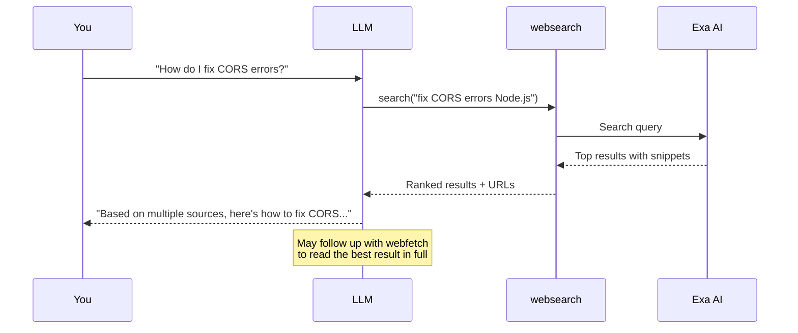
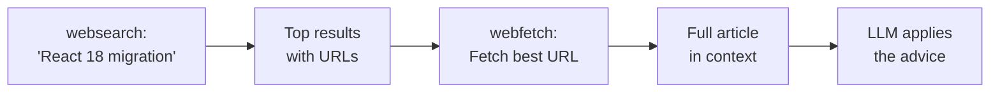
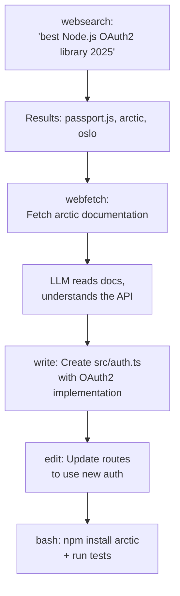
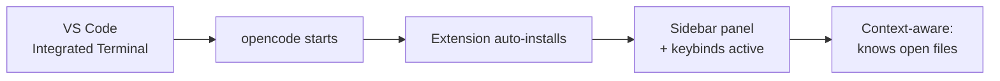

<div align="center">

# 🌐 06. Web Tools

**Web fetching, searching, sharing, web UI, and IDE integration**

[]()
[]()
[]()
[]()

[⬅️ Previous Module](../05-question-todo/) • [🏠 Main Menu](../README.md) • [Next Module ➡️](../07-skills-agents/)

</div>

---

## 📋 Table of Contents

<details>
<summary>Click to expand/collapse</summary>

- [🎯 Overview](#-overview)
- [⚡ Quick Start](#-quick-start)
- [📚 Core Concepts](#-core-concepts)
- [🔧 Examples & Patterns](#-examples--patterns)
- [🔗 Session Sharing](#-session-sharing)
- [🖥️ Web Interface](#️-web-interface)
- [💻 IDE Integration](#-ide-integration)
- [🧪 Practice Exercises](#-practice-exercises)
- [❓ Common Questions](#-common-questions)
- [🚶 Next Steps](#-next-steps)

</details>

---

## 🎯 Overview

| Tool            | Description                 | Permission Required             |
| --------------- | --------------------------- | ------------------------------- |
| **`webfetch`**  | Fetch content from a URL    | `webfetch` permission           |
| **`websearch`** | Search the web (via Exa AI) | `OPENCODE_ENABLE_EXA=1` env var |

Both are **LLM-internal tools** — the AI agent uses them when you ask for web-based research. They are NOT CLI commands.

---

## ⚡ Quick Start

### Fetching Web Content

In the TUI:

```
Fetch the OpenCode documentation from https://opencode.ai/docs
```

The LLM uses its `webfetch` tool to download and convert the page to markdown.

### Searching the Web

```
Search for best practices for React state management in 2025
```

The LLM uses its `websearch` tool (if enabled) to find relevant results.

### Permission Setup

Web tools require explicit permission. In `opencode.json`:

```json
{
  "permission": {
    "webfetch": "ask",
    "websearch": "ask"
  }
}
```

To enable websearch, set the environment variable before starting OpenCode:

```bash
# Environment variables are settings you pass to a program.
# This one tells OpenCode to enable web search.
# Set it in your terminal before running opencode:
OPENCODE_ENABLE_EXA=1 opencode

# Or add it permanently to your shell config:
echo 'export OPENCODE_ENABLE_EXA=1' >> ~/.bashrc  # or ~/.zshrc
source ~/.bashrc
```

---

## 📚 Core Concepts

### The `webfetch` Tool

Fetches content from a URL and converts it to readable format:

- **Markdown** (default): Best for docs, articles, blogs
- **Text**: Raw text extraction
- **HTML**: Original source



**What webfetch does with the HTML:**

1. Strips navigation, ads, and boilerplate
2. Converts to clean Markdown (headings, code blocks, tables preserved)
3. Returns the text to the LLM's context window

### The `websearch` Tool

Searches the web using Exa AI to find relevant information:

- Technical documentation
- Error solutions (Stack Overflow, GitHub Issues)
- Best practices and tutorials
- Library comparisons



### How to Trigger Them

| Your Prompt                        | Tool Used   |
| ---------------------------------- | ----------- |
| "Fetch the docs at https://..."    | `webfetch`  |
| "Read this article: https://..."   | `webfetch`  |
| "Search for how to fix error X"    | `websearch` |
| "Look up React 18 migration guide" | `websearch` |

### websearch → webfetch Pipeline

Often the LLM chains both tools: search for a topic, then fetch the most relevant result:



---

## 🔧 Examples & Patterns

### Pattern 1: Documentation Research

```
Fetch the Express.js API documentation and show me how to set up middleware
```

**Expected interaction:**

```
LLM: [uses webfetch to download https://expressjs.com/en/guide/using-middleware.html]
     "Here's how Express middleware works:
      1. Application-level: app.use(myMiddleware)
      2. Router-level: router.use(authMiddleware)
      3. Error-handling: app.use((err, req, res, next) => {...})
      ..."
```

### Pattern 2: Error Resolution

```
I'm getting "TypeError: Cannot read property of undefined" in my React app.
Search for common causes and solutions.
```

**Expected interaction:**

```
LLM: [uses websearch to find solutions]
     "Based on multiple sources, the most common causes are:
      1. Accessing state before it's initialized
      2. Missing null checks on API responses
      3. Incorrect prop passing to child components
      Let me check your code for these patterns..."
```

### Pattern 3: Technology Comparison

```
Search for a comparison of MongoDB vs PostgreSQL for web applications
```

### Pattern 4: Fetch + Apply

The most powerful pattern — research, then implement:

```
Fetch the official TypeScript migration guide from
https://www.typescriptlang.org/docs/handbook/migrating-from-javascript.html
then apply the recommended changes to our project
```

**What happens:**

1. `webfetch` downloads and converts the guide to Markdown
2. LLM reads and understands the migration steps
3. LLM applies the steps to your project using `edit`, `write`, and `bash` tools

### Pattern 5: Research-Driven Development

```
I want to add OAuth2 authentication. Search for the best library for Node.js,
fetch its documentation, then implement it in @src/auth.ts
```



### Pattern 6: Staying Updated

```
Search for "what's new in Node.js 22" and tell me which features
I should adopt in this project
```

---

## 🔗 Session Sharing

Share your OpenCode sessions as read-only web pages.

### Sharing Modes

Configure in `opencode.json`:

```json
{ "share": "manual" }
```

| Mode         | Description                                |
| ------------ | ------------------------------------------ |
| `"manual"`   | Share only when you run `/share` (default) |
| `"auto"`     | Automatically share every session          |
| `"disabled"` | Disable sharing entirely                   |

### Using Share

In the TUI:

```
/share       # Share current session — returns a URL
/unshare     # Remove shared session
```

Shared sessions are viewable at `opncd.ai/s/<id>`.

> **Privacy**: Shared sessions are read-only but publicly accessible via the URL. Don't share sessions containing secrets or sensitive information.

---

## 🖥️ Web Interface

OpenCode includes a browser-based UI as an alternative to the TUI.

### Starting the Web UI

```bash
opencode web
```

Options:

```bash
# Custom port and hostname
opencode web --port 8080 --hostname 0.0.0.0

# Disable authentication
opencode web --no-auth
```

### Web UI Features

- Full session management (create, resume, delete)
- Same capabilities as the TUI
- Server status monitoring
- Accessible from any browser on the network

### Authentication

The web interface requires a password by default. Set it via:

```bash
export OPENCODE_SERVER_PASSWORD='your-password'
opencode web
```

### Terminal Attachment

Attach to a running OpenCode instance from another terminal:

```bash
opencode attach
```

---

## 💻 IDE Integration

OpenCode has a VS Code extension that works with VS Code, Cursor, Windsurf, and VSCodium.

### Installation

The extension auto-installs when you run `opencode` in the IDE's integrated terminal. No manual setup required.

### How It Works



When the extension is active:

1. OpenCode knows which files you have open in the editor
2. You can add file references with a keystroke
3. Session management lives in the sidebar
4. Inline suggestions appear as you work

### Keybinds

| Keybind                            | Action              |
| ---------------------------------- | ------------------- |
| `Cmd+Esc` / `Ctrl+Esc`             | Open OpenCode panel |
| `Cmd+Shift+Esc` / `Ctrl+Shift+Esc` | New session         |
| `Cmd+Option+K` / `Ctrl+Alt+K`      | Add file reference  |

### Features

| Feature                  | Description                                      |
| ------------------------ | ------------------------------------------------ |
| Context awareness        | Knows which files you have open in the editor    |
| File reference shortcuts | Add `@file` refs with `Ctrl+Alt+K`               |
| Inline suggestions       | AI suggestions appear during editing             |
| Session management       | Create, resume, and delete sessions from sidebar |
| Terminal integration     | Full TUI in the integrated terminal              |

### TUI vs Web UI vs IDE Extension

| Feature          | TUI (Terminal)        | Web UI                   | IDE Extension              |
| ---------------- | --------------------- | ------------------------ | -------------------------- |
| **Start**        | `opencode`            | `opencode web`           | `opencode` in IDE terminal |
| **Interface**    | Terminal-based        | Browser-based            | Editor sidebar             |
| **Best for**     | SSH, headless servers | Sharing, remote access   | Daily development          |
| **File context** | `@file` references    | `@file` references       | Auto-detects open files    |
| **Requirements** | Terminal only         | Browser + password setup | VS Code/Cursor/Windsurf    |

---

## 🧪 Practice Exercises

### Exercise 1: Fetching Documentation

```
1. "Fetch https://opencode.ai/docs and summarize the main features"
2. "Fetch the README from a popular GitHub repository"
```

**Expected:**

- Step 1: LLM fetches the page, converts to markdown, and gives a bullet-point summary
- Step 2: LLM fetches the raw README content and describes the project

### Exercise 2: Problem Solving

```
1. "I'm seeing CORS errors in my API. Search for solutions."
2. "Search for how to optimize Docker image size for Node.js"
```

**Expected:**

- Step 1: LLM finds Stack Overflow answers and MDN docs about CORS headers, suggests `cors` npm package or manual header setup
- Step 2: LLM returns multi-stage build strategies and `.dockerignore` best practices

### Exercise 3: Combined Workflow

```
"Search for the best CSS-in-JS library for React in 2025,
 fetch the top result's documentation,
 and create a basic setup in our project"
```

**Expected:**

1. LLM searches and finds top libraries (e.g., Panda CSS, Pigment CSS, styled-components)
2. Fetches the documentation of the recommended one
3. Creates a config file and example component using that library

### Exercise 4: Session Sharing

Try the sharing workflow:

```
1. Have a conversation about your project architecture
2. Type /share
3. Open the returned URL in a browser
```

**Expected:** You get a `opncd.ai/s/<id>` URL. Opening it shows a read-only view of your conversation that anyone with the URL can see.

---

## ❓ Common Questions

**Q: Are `webfetch` and `websearch` CLI commands?**
No. They are internal LLM tools triggered by natural language prompts.

**Q: Why won't websearch work?**
Websearch requires `OPENCODE_ENABLE_EXA=1` environment variable. Set it before starting OpenCode.

**Q: Can I restrict web access?**
Yes. Set `"webfetch": "deny"` or `"websearch": "deny"` in `opencode.json` permissions.

**Q: What's the difference between webfetch and websearch?**
`webfetch` downloads a specific URL. `websearch` searches the web for relevant results.

**Q: Are shared sessions private?**
No — anyone with the URL can view them. Don't share sessions containing secrets.

**Q: Can I use the web UI remotely?**
Yes. Run `opencode web --hostname 0.0.0.0` and set `OPENCODE_SERVER_PASSWORD` for auth. Access from any browser on the network.

---

## 🚶 Next Steps

Continue to **[Module 07: Skills & Agents](../07-skills-agents/)** to learn about custom automation and agent configuration.

---

## 📄 License & Attribution

This module is part of the [OpenCode Primer](../README.md).

**License:** MIT - See [LICENSE](../LICENSE) for details.

[⬆ Back to top](#-06-web-tools)

**Last Updated:** April 2026
**OpenCode Version:** 1.0+ compatible

---
