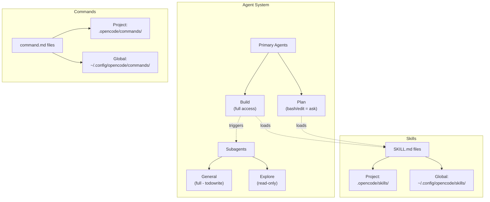
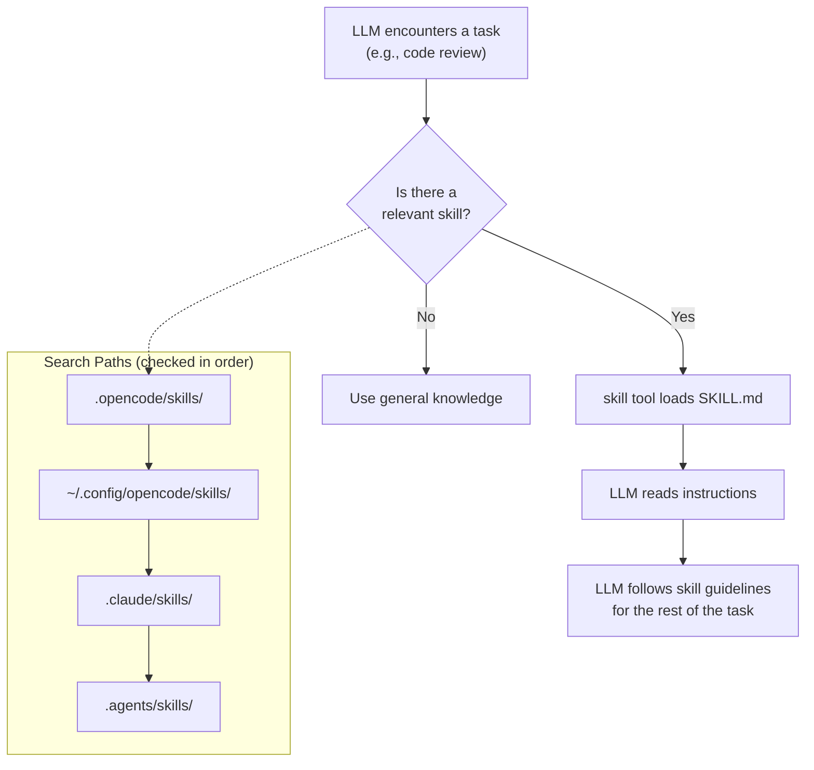
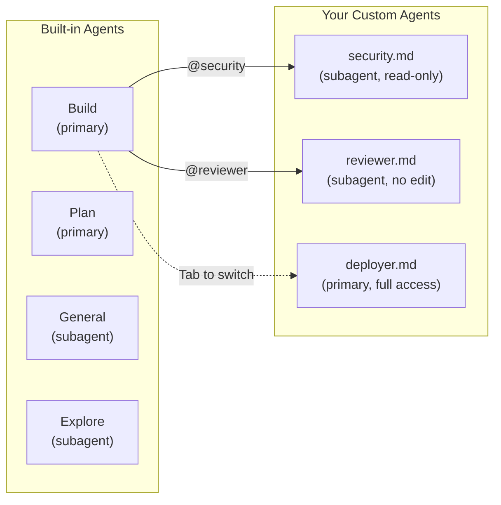

<div align="center">

# 🤖 07. Skills & Agents

**Custom automation with skills, agents, and commands**

[]()
[]()
[]()
[]()

[⬅️ Previous Module](../06-web-tools/) • [🏠 Main Menu](../README.md) • [Next Module ➡️](../08-mcp-servers/)

</div>

---

## 📋 Table of Contents

<details>
<summary>Click to expand/collapse</summary>

- [🎯 Overview](#-overview)
- [⚡ Quick Start](#-quick-start)
- [📚 Agent System](#-agent-system)
- [🔧 Skills](#-skills)
- [🛠️ Custom Agents](#️-custom-agents)
- [📝 Custom Commands](#-custom-commands)
- [🧪 Practice Exercises](#-practice-exercises)
- [❓ Common Questions](#-common-questions)
- [🚶 Next Steps](#-next-steps)

</details>

---

## 🎯 Overview

> **🌉 Complexity Bridge:** This module introduces **configuration files** — specifically Markdown files with YAML metadata. If you're new to these concepts:
>
> - **YAML** is a simple data format using `key: value` pairs with indentation. Think of it like a readable config file.
> - **Frontmatter** is a YAML block at the top of a Markdown file, wrapped in `---` lines. It provides metadata about the file.
> - **Dotfiles/directories** like `.opencode/` are hidden folders (the `.` makes them hidden). They store configuration.
> - **JSON** (`opencode.json`) is another data format using `{"key": "value"}` syntax.
>
> If you've never created a file like `.opencode/skills/SKILL.md`, don't worry — this module walks you through it step by step.

OpenCode has a built-in agent system with different roles and capabilities, a skill system for specialized knowledge, and custom commands for reusable workflows.

### Skills vs Agents vs Commands — Quick Comparison

|                  | **Skills**                                     | **Agents**                                      | **Commands**                              |
| ---------------- | ---------------------------------------------- | ----------------------------------------------- | ----------------------------------------- |
| **What**         | Instruction files the LLM loads for expertise  | Different roles/personas the LLM can operate as | Reusable slash commands (e.g., `/review`) |
| **Where**        | `.opencode/skills/SKILL.md`                    | `.opencode/agents/name.md`                      | `.opencode/commands/name.md`              |
| **Triggered by** | LLM loads automatically or on demand           | Press Tab, or @-mention                         | User types `/command-name`                |
| **Example**      | "When reviewing code, follow OWASP guidelines" | Security auditor (read-only, no edit)           | `/commit` generates a commit message      |
| **Contains**     | Instructions for the LLM                       | Role definition + permissions + model config    | Prompt template with variables            |



| Feature             | Description                                          |
| ------------------- | ---------------------------------------------------- |
| **Primary Agents**  | Build (default) and Plan — switch with `Tab`         |
| **Subagents**       | General and Explore — launched by the primary agent  |
| **Skills**          | SKILL.md files with specialized instructions         |
| **Custom Agents**   | Define via Markdown or JSON with full option control |
| **Custom Commands** | Reusable slash commands with templates and arguments |

---

## ⚡ Quick Start

### Switching Agents

In the TUI, press **Tab** to cycle between primary agents:

| Agent               | Default Behavior                    | When to Use                         |
| ------------------- | ----------------------------------- | ----------------------------------- |
| **Build** (default) | Full tool access, executes changes  | Normal development                  |
| **Plan**            | `bash` and `edit` set to "ask" mode | Planning, reviewing before changing |

Press **Shift+Tab** to cycle in reverse.

### Subagents

The primary agent can launch **subagents** for specific tasks:

| Subagent    | Access Level                       | Purpose                        |
| ----------- | ---------------------------------- | ------------------------------ |
| **General** | Full tools (except todowrite)      | Complex research and execution |
| **Explore** | Read-only (read, glob, grep, list) | Safe codebase exploration      |

You can request a specific subagent or **@-mention** one:

```
@explore map out the project architecture
@general research and implement the auth flow
```

---

## 📚 Agent System

### Built-In Agents

OpenCode ships with 7 agents:

| Agent          | Type              | Purpose                                |
| -------------- | ----------------- | -------------------------------------- |
| **Build**      | Primary (default) | Full-access development agent          |
| **Plan**       | Primary           | Review-first agent (bash/edit = "ask") |
| **General**    | Subagent          | Multi-step research and implementation |
| **Explore**    | Subagent          | Read-only codebase exploration         |
| **Compaction** | Hidden            | Auto-compacts long conversations       |
| **Title**      | Hidden            | Auto-generates session titles          |
| **Summary**    | Hidden            | Auto-generates session summaries       |

### Build Agent (Default Primary)

The Build agent has full access to all tools: `read`, `edit`, `write`, `bash`, `glob`, `grep`, `list`, `webfetch`, `websearch`, `question`, `todowrite`, `skill`.

### Plan Agent (Restricted Primary)

Same tools as Build but with `bash` and `edit` set to `"ask"`. It shows you what it wants to run/edit before doing it — useful for reviewing changes before they're applied.

### General Subagent

Launched by the primary agent for complex multi-step tasks. Has full tool access (except `todowrite`). Returns results back to the primary agent.

### Explore Subagent

A fast, read-only subagent. Can only use `read`, `glob`, `grep`, `list`. Safe for architecture discovery and code analysis.

### Session Navigation

When subagents are spawned, you can navigate between sessions:

| Action          | Description                          |
| --------------- | ------------------------------------ |
| **Leader+Down** | Jump to first child session          |
| **Right/Left**  | Cycle between sibling child sessions |
| **Up**          | Return to parent session             |

---

## 🔧 Skills

### What Are Skills?

The `skill` tool loads **SKILL.md** files that provide specialized instructions for the LLM. Skills give the agent domain-specific knowledge and workflows.

### How Skills Are Loaded



### Creating a Skill — Complete Working Example

Create a SKILL.md file with optional YAML frontmatter:

**File: `.opencode/skills/SKILL.md`**

```markdown
---
name: code-review
description: Comprehensive code review following security best practices
license: MIT
compatibility: ">=1.0.0"
metadata:
  author: your-team
---

# Code Review Skill

When reviewing code, follow these guidelines:

## Security Checks
1. Check for SQL injection (parameterized queries only)
2. Check for XSS (sanitize user input, escape output)
3. Check for CSRF (verify tokens on state-changing requests)
4. Look for hardcoded secrets (passwords, API keys, tokens)
5. Verify authentication on protected routes

## Code Quality
1. Functions should do one thing well
2. Error handling must be comprehensive (no silent catches)
3. Tests must cover happy path AND error cases
4. No dead code or commented-out blocks

## Performance
1. Check for N+1 queries in database access
2. Verify async operations use Promise.all where independent
3. Look for memory leaks (unclosed connections, listeners)

## Output Format
For each issue found, report:
- **File**: path and line number
- **Severity**: Critical / Warning / Info
- **Issue**: what's wrong
- **Fix**: how to fix it
```

### YAML Frontmatter Fields

| Field           | Description                                                                      |
| --------------- | -------------------------------------------------------------------------------- |
| `name`          | Kebab-case identifier (lowercase letters, numbers, and hyphens only; 1-64 chars) |
| `description`   | Human-readable description                                                       |
| `license`       | License for the skill                                                            |
| `compatibility` | OpenCode version range                                                           |
| `metadata`      | Arbitrary key-value pairs                                                        |

### Skill Search Paths

OpenCode searches for skills in multiple locations:

| Location                     | Scope                               |
| ---------------------------- | ----------------------------------- |
| `.opencode/skills/`          | Project-specific                    |
| `~/.config/opencode/skills/` | Global                              |
| `.claude/skills/`            | Claude Code compatibility (project) |
| `.agents/skills/`            | Alternative convention (project)    |

### Skill Permissions

Control which skills can be loaded:

```json
{
  "permission": {
    "skill": {
      "*": "allow",
      "internal-*": "deny"
    }
  }
}
```

### Loading Skills

The LLM loads skills automatically when relevant, or you can ask:

```
Load the code review skill and review @src/auth.ts
```

---

## 🛠️ Custom Agents

### How Custom Agents Fit Into the System



### Defining Agents via Markdown

Create `.md` files in `.opencode/agents/` or `~/.config/opencode/agents/`:

```markdown
---
description: Security-focused code reviewer
temperature: 0.2
mode: subagent
model: claude-sonnet-4-20250514
permission:
  bash: deny
  edit: deny
  read: allow
  grep: allow
  glob: allow
  list: allow
---

You are a security reviewer. Analyze code for:
- SQL injection, XSS, CSRF
- Hardcoded secrets
- Insecure dependencies
- Authentication/authorization flaws
```

### Defining Agents via opencode.json

Use the `"agent"` key (not `"agents"`):

```json
{
  "agent": {
    "reviewer": {
      "description": "Code review specialist",
      "prompt": "Focus on security, performance, and maintainability",
      "mode": "subagent",
      "permission": {
        "bash": "deny",
        "edit": "deny"
      }
    }
  }
}
```

### Agent Configuration Options

| Option           | Description                                                   |
| ---------------- | ------------------------------------------------------------- |
| `description`    | Human-readable description                                    |
| `prompt`         | System prompt (supports `{file:path}` substitution)           |
| `model`          | Override the default model                                    |
| `temperature`    | LLM temperature (e.g., `0.2` for focused, `0.8` for creative) |
| `top_p`          | Nucleus sampling parameter                                    |
| `steps`          | Maximum number of tool-use steps                              |
| `mode`           | `"primary"`, `"subagent"`, or `"all"`                         |
| `hidden`         | Hide from agent list (for system agents)                      |
| `disabled`       | Disable the agent                                             |
| `color`          | Display color in the TUI                                      |
| `permission`     | Per-agent permission overrides (see Module 09)                |
| `taskPermission` | Permissions for tasks this agent spawns                       |

### Creating Agents via CLI

```bash
# Interactive wizard
opencode agent create

# List available agents
opencode agent list
```

### Per-Agent Permissions

Override global permissions for specific agents:

```json
{
  "agent": {
    "build": {
      "permission": {
        "bash": {
          "*": "ask",
          "git status *": "allow",
          "npm test *": "allow",
          "rm *": "deny"
        }
      }
    }
  }
}
```

---

## 📝 Custom Commands

Custom commands are reusable slash commands (e.g., `/review`, `/deploy`) that you define as Markdown files.

### Command Locations

| Location                        | Scope                 |
| ------------------------------- | --------------------- |
| `.opencode/commands/`           | Project commands      |
| `~/.config/opencode/commands/`  | Global commands       |
| `opencode.json` `"command"` key | JSON-defined commands |

### Creating a Command (Markdown)

Create `.opencode/commands/review.md`:

```markdown
---
description: Review code for quality and security
agent: explore
model: claude-sonnet-4-20250514
---

Review the following files for code quality, security issues,
and potential bugs: $ARGUMENTS

Focus on:
1. Security vulnerabilities
2. Error handling
3. Performance
4. Test coverage
```

Usage in the TUI:

```
/review src/auth.ts src/api.ts
```

### Template Variables

| Variable         | Description                                     |
| ---------------- | ----------------------------------------------- |
| `$ARGUMENTS`     | All arguments after the command name            |
| `$1`, `$2`, `$3` | Positional arguments                            |
| `` !`command` `` | Shell output (e.g., `` !`git diff --staged` ``) |
| `@file`          | File reference (e.g., `@src/main.ts`)           |

### Example: Git Commit Command

`.opencode/commands/commit.md`:

```markdown
---
description: Generate a conventional commit message
---

Based on the staged changes below, write a conventional commit message:

!`git diff --staged`

Follow the format: type(scope): description
```

### Commands via opencode.json

```json
{
  "command": {
    "deploy": {
      "template": "Deploy $1 to $2 environment. Run all tests first.",
      "description": "Deploy a service to an environment",
      "agent": "build"
    }
  }
}
```

### Subtask Option

Run the command as a subagent instead of the current agent:

```json
{
  "command": {
    "research": {
      "template": "Research $ARGUMENTS thoroughly",
      "subtask": true
    }
  }
}
```

---

## 🧪 Practice Exercises

> **Use the practice project** from [Module 01](../01-basic-commands/#-set-up-a-practice-project).

### Exercise 1: Agent Switching

1. Start OpenCode (`cd ~/opencode-practice && opencode`)
2. You start in **Build** agent by default
3. Press **Tab** to switch to **Plan** agent
4. Type: `Add a new function to @src/utils.js`
5. **Expected:** Plan agent describes the change but asks for approval before editing
6. Press **Tab** to switch back to Build
7. Type: `Add a new function to @src/utils.js`
8. **Expected:** Build agent edits the file directly

### Exercise 2: @-Mention a Subagent

```
@explore analyze the project structure and list all files
```

**Expected:** OpenCode spawns the Explore subagent, which uses read-only tools to scan the project and returns a summary.

### Exercise 3: Create a Skill

Create a file at `.opencode/skills/SKILL.md` in your practice project:

```bash
mkdir -p ~/opencode-practice/.opencode/skills
cat > ~/opencode-practice/.opencode/skills/SKILL.md << 'EOF'
---
name: testing
description: Testing best practices for this project
---

When writing tests:
- Use describe/it blocks
- Test happy path and error cases
- Mock external dependencies
- Aim for >80% coverage
EOF
```

Then in the TUI:

```
Load the testing skill and write tests for @src/utils.js
```

**Expected:** OpenCode loads the skill and follows the testing guidelines when creating tests.

### Exercise 4: Create a Custom Command

```bash
mkdir -p ~/opencode-practice/.opencode/commands
cat > ~/opencode-practice/.opencode/commands/explain.md << 'EOF'
---
description: Explain a file in detail
agent: explore
---

Read and explain $ARGUMENTS in detail.
Cover: purpose, key functions, dependencies, and how it fits
into the overall architecture.
EOF
```

Then in the TUI:

```
/explain src/utils.js
```

**Expected:** OpenCode uses the Explore subagent to read and explain utils.js in detail.

### Exercise 5: Create a Custom Agent

```bash
mkdir -p ~/opencode-practice/.opencode/agents
cat > ~/opencode-practice/.opencode/agents/security.md << 'EOF'
---
description: Security auditor
mode: subagent
temperature: 0.1
permission:
  bash: deny
  edit: deny
---

You are a security auditor. Analyze code for vulnerabilities
following OWASP Top 10 guidelines.
EOF
```

Then in the TUI:

```
@security audit @src/utils.js for security issues
```

**Expected:** OpenCode spawns the security subagent (read-only, can't edit or run bash) to analyze the file.

### Exercise 6: AGENTS.md with /init

Run `/init` in the TUI to auto-generate an `AGENTS.md` for your project based on its structure and conventions.

---

## ❓ Common Questions

**Q: How do I switch between Build and Plan agents?**
Press **Tab** in the TUI. Press **Shift+Tab** to go back.

**Q: Can I launch subagents manually?**
Yes — @-mention them (`@explore analyze this codebase`) or ask the LLM directly.

**Q: What's AGENTS.md?**
A markdown file in your project root that gives the LLM project-specific instructions. It's the OpenCode equivalent of Claude Code's CLAUDE.md.

**Q: Are skills the same as agents?**
No. Skills are specialized instruction files (SKILL.md) loaded via the skill tool. Agents are different roles the LLM can operate in.

**Q: What's the difference between Markdown agents and JSON agents?**
Both work. Markdown files (`.opencode/agents/`) use YAML frontmatter for options and the body as the prompt. JSON (`opencode.json` `"agent"` key) uses a structured config object.

**Q: Can custom commands override built-in ones?**
Yes. If you create a command with the same name as a built-in slash command, yours takes precedence.

---

## 🚶 Next Steps

Continue to **[Module 08: MCP Servers](../08-mcp-servers/)** to learn about connecting external tools and services.

---

## 📄 License & Attribution

This module is part of the [OpenCode Primer](../README.md).

**License:** MIT - See [LICENSE](../LICENSE) for details.

[⬆ Back to top](#-07-skills--agents)

**Last Updated:** April 2026
**OpenCode Version:** 1.0+ compatible

---
