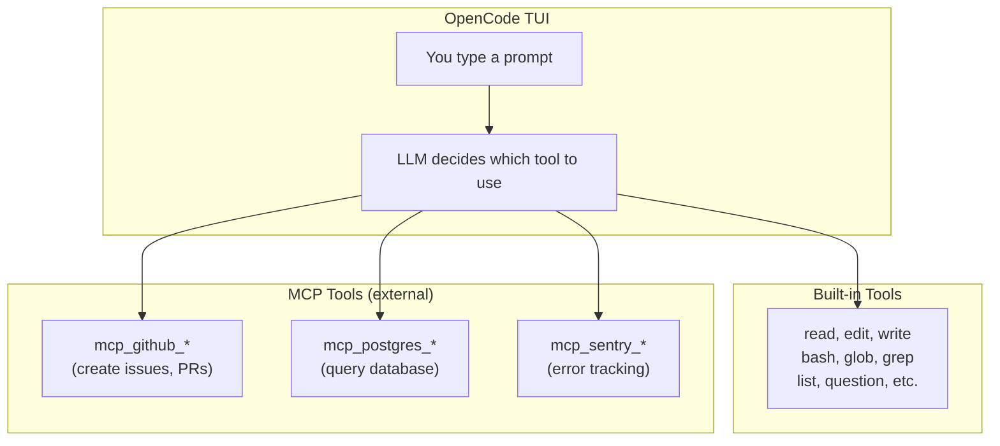
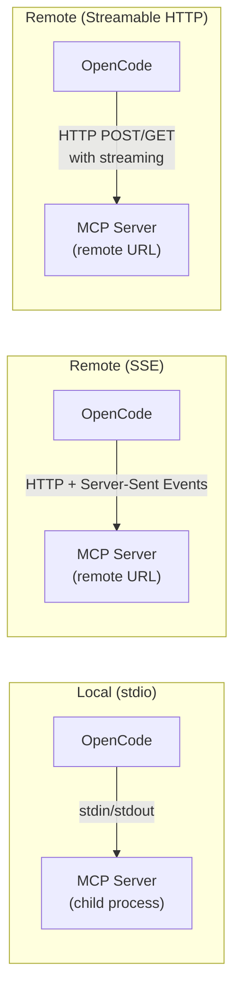
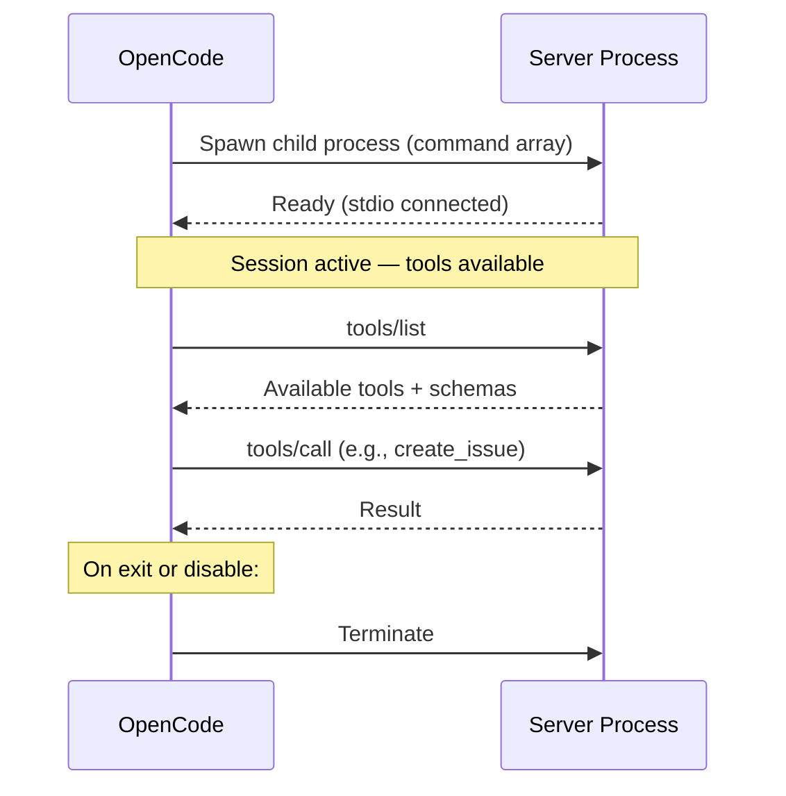

<div align="center">

# 🔌 08. MCP Servers

**Connect to external tools and services with Model Context Protocol**

[]()
[]()
[]()
[]()

[⬅️ Previous Module](../07-skills-agents/) • [🏠 Main Menu](../README.md) • [Next Module ➡️](../09-advanced-features/)

</div>

---

## 📋 Table of Contents

<details>
<summary>Click to expand/collapse</summary>

- [🎯 Overview](#-overview)
- [✅ Prerequisites](#-prerequisites)
- [⚡ Quick Start](#-quick-start)
- [📘 Hands-On Companion](#-hands-on-companion)
- [📚 Core Concepts](#-core-concepts)
- [🔧 Local MCP Servers](#-local-mcp-servers)
- [🌐 Remote MCP Servers](#-remote-mcp-servers)
- [🔑 OAuth & Authentication](#-oauth--authentication)
- [🎛️ Per-Agent MCP Management](#️-per-agent-mcp-management)
- [🛠️ Common MCP Servers](#️-common-mcp-servers)
- [🔒 MCP Tool Permissions](#-mcp-tool-permissions)
- [⚠️ Security Considerations](#️-security-considerations)
- [🧪 Practice Exercises](#-practice-exercises)
- [❓ Common Questions](#-common-questions)
- [🐛 Troubleshooting](#-troubleshooting)
- [🎓 Knowledge Check](#-knowledge-check)
- [🚶 Next Steps](#-next-steps)

</details>

---

## 🎯 Overview

MCP (Model Context Protocol) is an open protocol that lets OpenCode connect to external data sources and tools. MCP servers extend OpenCode's capabilities with:

- **External data access** (databases, APIs, filesystems)
- **Tool integration** (GitHub, Sentry, cloud services)
- **Local and remote servers** with OAuth support
- **Per-agent control** over which servers are available

---

## ✅ Prerequisites

```bash
opencode --version   # Verify installation
cd ~/opencode-practice    # Continue in your practice project
opencode             # Start the TUI
```

- [x] Completed [Module 07: Skills & Agents](../07-skills-agents/)

---

## 📘 Hands-On Companion

Work through the dedicated exercises in [examples/mcp-lab.md](examples/mcp-lab.md).

- **Canonical path:** `~/opencode-practice`
- **Transfer path:** Apply the same patterns to your own project after each exercise

---

## ⚡ Quick Start

### End-to-End Walkthrough: Your First MCP Server

Let's connect to the **Grep by Vercel** MCP server (free, no API key needed) to see MCP in action:

**Step 1: Add the config** — Edit or create `opencode.json` in your project root:

```json
{
  "$schema": "https://opencode.ai/config.json",
  "mcp": {
    "grep": {
      "type": "remote",
      "url": "https://mcp.grep.app/sse"
    }
  }
}
```

**Step 2: Restart OpenCode** — Exit and re-enter the TUI:

```bash
# Exit if running
/exit

# Start again (picks up new config)
opencode
```

**Step 3: Verify the connection:**

```
List all available MCP tools
```

**Expected:** You should see tools from the Grep server listed (e.g., search capabilities).

**Step 4: Use the MCP tool:**

```
Use the grep MCP tool to search for "useState" in popular React repos
```

**Expected:** The LLM calls the Grep MCP server and returns code search results from public repositories.

If the connection fails, check that the server command runs manually and that required environment variables are set.

### Adding an MCP Server via CLI

```bash
# Interactive setup — walks you through configuration
opencode mcp add

# List configured MCP servers
opencode mcp list
```

### Configuration in opencode.json

MCP servers are configured in `opencode.json` under the `"mcp"` key. The `command` field is an **array** containing the executable and all its arguments:

```json
{
  "$schema": "https://opencode.ai/config.json",
  "mcp": {
    "filesystem": {
      "type": "local",
      "command": ["npx", "-y", "@modelcontextprotocol/server-filesystem", "/path/to/dir"]
    }
  }
}
```

---

## 📚 Core Concepts

### What is MCP?

MCP (Model Context Protocol) is an open standard that allows AI tools to connect to external services through a unified interface. Each MCP server provides:

- **Tools**: Functions the LLM can call (e.g., query a database, create a GitHub issue)
- **Resources**: Data the LLM can read (e.g., database schemas, file listings)
- **Prompts**: Pre-built prompt templates for common tasks

### MCP Architecture



### How MCP Works in OpenCode

1. You configure MCP servers (via CLI or `opencode.json`)
2. When OpenCode starts, it connects to all configured servers
3. The LLM gains access to each server's tools and resources
4. You ask the LLM to do something, and it picks the right tool — whether built-in or MCP

> 💡 **Unified tool namespace:** From the LLM’s perspective, built-in tools and MCP tools appear in one flat list. The LLM doesn’t “know” it’s calling an MCP tool vs. a built-in tool — it just picks the best tool for the job. MCP tools are distinguished only by their `mcp_<server>_<tool>` naming prefix.

### Transport Types

MCP servers connect to OpenCode using one of three transport protocols:



| Transport           | Config `type` | How It Works                                                                 | When to Use                       |
| ------------------- | ------------- | ---------------------------------------------------------------------------- | --------------------------------- |
| **stdio**           | `"local"`     | OpenCode spawns the server as a child process; communicates via stdin/stdout | Local tools, npm packages         |
| **SSE**             | `"remote"`    | HTTP connection with Server-Sent Events for streaming responses              | Remote servers, SaaS integrations |
| **Streamable HTTP** | `"remote"`    | Newer protocol using standard HTTP POST/GET with streaming support           | Modern remote servers             |

OpenCode auto-detects whether a remote server uses SSE or Streamable HTTP — you just provide the URL.

### Environment Variable Expansion

MCP configs support `{env:VAR}` syntax to inject environment variables at runtime:

```json
{
  "mcp": {
    "github": {
      "type": "local",
      "command": ["npx", "-y", "@modelcontextprotocol/server-github"],
      "environment": {
        "GITHUB_TOKEN": "{env:GITHUB_TOKEN}"
      }
    }
  }
}
```

**How `{env:VAR}` works:**

1. OpenCode reads the value of `GITHUB_TOKEN` from your shell environment
2. Substitutes it into the config before passing to the MCP server
3. If the variable is unset, the value is an empty string

This means your secrets stay in your environment (e.g., `.bashrc`, `.zshrc`) and never get committed to `opencode.json`.

**Common pattern — set env vars before starting OpenCode:**

```bash
export GITHUB_TOKEN='ghp_...'
export SENTRY_AUTH_TOKEN='sntrys_...'
opencode
```

### MCP Tool Naming Convention

MCP tools follow a consistent naming pattern: `mcp_<servername>_<toolname>`. This matters for permissions and per-agent tool control:

```
Server: "github"    → Tools: mcp_github_create_issue, mcp_github_list_repos, ...
Server: "postgres"  → Tools: mcp_postgres_query, mcp_postgres_list_tables, ...
Server: "sentry"    → Tools: mcp_sentry_list_issues, mcp_sentry_get_event, ...
```

### MCP CLI Commands

```bash
# Add a new MCP server (interactive)
opencode mcp add

# List all configured servers
opencode mcp list
```

OAuth and debugging are handled through the MCP server configuration in `opencode.json` — set environment variables for authentication tokens, and test server connectivity by verifying the server command runs manually.

### Connecting in the TUI

You can also connect to MCP servers from within the TUI:

```
/connect
```

---

## 🔧 Local MCP Servers

Local servers run as child processes on your machine. Set `"type": "local"` and provide the `command` as an array:

```json
{
  "mcp": {
    "github": {
      "type": "local",
      "command": ["npx", "-y", "@modelcontextprotocol/server-github"],
      "environment": {
        "GITHUB_TOKEN": "{env:GITHUB_TOKEN}"
      }
    },
    "postgres": {
      "type": "local",
      "command": ["npx", "-y", "@modelcontextprotocol/server-postgres"],
      "environment": {
        "PGHOST": "localhost",
        "PGPORT": "5432",
        "PGDATABASE": "mydb"
      }
    }
  }
}
```

### Local Server Lifecycle



### Local Server Options

| Option        | Description                                             |
| ------------- | ------------------------------------------------------- |
| `type`        | `"local"`                                               |
| `command`     | Array: executable + arguments                           |
| `environment` | Key-value env vars passed to the server process         |
| `enabled`     | `true` (default) or `false` to disable without removing |
| `timeout`     | Startup timeout in milliseconds                         |

### Disabling Without Removing

```json
{
  "mcp": {
    "heavy-server": {
      "type": "local",
      "command": ["heavy-mcp-server"],
      "enabled": false
    }
  }
}
```

### Config Scopes — Project vs Global

MCP servers can be configured at two levels:

| Scope   | File Location                      | Applies To                       |
| ------- | ---------------------------------- | -------------------------------- |
| Project | `opencode.json` in project root    | Only this project                |
| Global  | `~/.config/opencode/opencode.json` | All projects (unless overridden) |

Project config takes precedence over global config. You can define a server globally (e.g., GitHub) and override or disable it per-project.

---

## 🌐 Remote MCP Servers

Remote servers connect over HTTP. Set `"type": "remote"` and provide the URL:

```json
{
  "mcp": {
    "sentry": {
      "type": "remote",
      "url": "https://mcp.sentry.dev/sse"
    },
    "internal-api": {
      "type": "remote",
      "url": "https://mcp.internal.example.com/sse",
      "headers": {
        "Authorization": "Bearer {env:INTERNAL_API_TOKEN}"
      }
    }
  }
}
```

### Remote Server Options

| Option    | Description                                      |
| --------- | ------------------------------------------------ |
| `type`    | `"remote"`                                       |
| `url`     | Full URL to the remote MCP server                |
| `headers` | HTTP headers (supports `{env:VAR}` substitution) |

---

## 🔑 OAuth & Authentication

OpenCode supports OAuth for MCP servers that require it. OAuth flows are handled automatically when possible.

### Automatic OAuth

Many remote MCP servers trigger an OAuth flow automatically on first connection. OpenCode opens the browser and stores the token.

### Pre-Registered OAuth

For servers requiring pre-registered credentials:

```json
{
  "mcp": {
    "my-service": {
      "type": "remote",
      "url": "https://mcp.example.com/sse",
      "clientId": "your-client-id",
      "clientSecret": "{env:MY_SERVICE_CLIENT_SECRET}",
      "scope": "read write"
    }
  }
}
```

### Managing OAuth

OAuth-based MCP servers authenticate automatically when configured with `"type": "remote"` and a URL. For token-based auth, set environment variables in the server's `"env"` config:

```json
{
  "mcp": {
    "github": {
      "type": "local",
      "command": "npx",
      "args": ["-y", "@modelcontextprotocol/server-github"],
      "env": {
        "GITHUB_TOKEN": "your-token-here"
      }
    }
  }
}
```

---

## 🎛️ Per-Agent MCP Management

Control which MCP servers are available to each agent using glob patterns in the agent config:

```json
{
  "agent": {
    "build": {
      "tools": {
        "mcp_sentry_*": true,
        "mcp_github_*": true,
        "mcp_postgres_*": false
      }
    },
    "explore": {
      "tools": {
        "mcp_*": false
      }
    }
  }
}
```

This lets you restrict database access to specific agents while giving all agents access to GitHub tools.

---

## 🛠️ Common MCP Servers

### Featured Examples (from Docs)

**Sentry** — Error tracking:

```json
{
  "mcp": {
    "sentry": {
      "type": "remote",
      "url": "https://mcp.sentry.dev/sse"
    }
  }
}
```

**Context7** — Library documentation:

```json
{
  "mcp": {
    "context7": {
      "type": "local",
      "command": ["npx", "-y", "@upstash/context7-mcp@latest"]
    }
  }
}
```

**Grep by Vercel** — Code context:

```json
{
  "mcp": {
    "grep": {
      "type": "remote",
      "url": "https://mcp.grep.app/sse"
    }
  }
}
```

### Official MCP Servers

| Server         | Package                                   | Purpose                 |
| -------------- | ----------------------------------------- | ----------------------- |
| **Filesystem** | `@modelcontextprotocol/server-filesystem` | Browse and manage files |
| **GitHub**     | `@modelcontextprotocol/server-github`     | Repos, issues, PRs      |
| **PostgreSQL** | `@modelcontextprotocol/server-postgres`   | Database queries        |
| **SQLite**     | `@modelcontextprotocol/server-sqlite`     | SQLite database         |

### Example: GitHub Server

```json
{
  "mcp": {
    "github": {
      "type": "local",
      "command": ["npx", "-y", "@modelcontextprotocol/server-github"],
      "environment": {
        "GITHUB_TOKEN": "{env:GITHUB_TOKEN}"
      }
    }
  }
}
```

Once connected, you can ask the LLM:

```
List open issues in the repository
Create a pull request for the current branch
Show me the CI status for the latest commit
```

### Creating Custom MCP Servers

> **Advanced topic** — This requires JavaScript/TypeScript knowledge. If you're just getting started with MCP, skip to [Practice Exercises](#-practice-exercises) and come back later.

You can create your own MCP server using the MCP SDK. Here's a complete, minimal server:

**File: `my-mcp-server/index.js`**

```javascript
import { Server } from '@modelcontextprotocol/sdk/server/index.js';
import { StdioServerTransport } from '@modelcontextprotocol/sdk/server/stdio.js';

const server = new Server({
  name: 'my-server',
  version: '1.0.0',
}, {
  capabilities: { tools: {} }
});

// List available tools
server.setRequestHandler('tools/list', async () => ({
  tools: [{
    name: 'greet',
    description: 'Greet a user by name',
    inputSchema: {
      type: 'object',
      properties: {
        name: { type: 'string', description: 'Name to greet' }
      },
      required: ['name']
    }
  }, {
    name: 'timestamp',
    description: 'Get the current timestamp',
    inputSchema: { type: 'object', properties: {} }
  }]
}));

// Handle tool calls
server.setRequestHandler('tools/call', async (request) => {
  const { name, arguments: args } = request.params;
  switch (name) {
    case 'greet':
      return {
        content: [{ type: 'text', text: `Hello, ${args.name}!` }]
      };
    case 'timestamp':
      return {
        content: [{ type: 'text', text: new Date().toISOString() }]
      };
    default:
      throw new Error(`Unknown tool: ${name}`);
  }
});

const transport = new StdioServerTransport();
await server.connect(transport);
```

**File: `my-mcp-server/package.json`**

```json
{
  "name": "my-mcp-server",
  "version": "1.0.0",
  "type": "module",
  "dependencies": {
    "@modelcontextprotocol/sdk": "^1.0.0"
  }
}
```

**Connect it in `opencode.json`:**

```json
{
  "mcp": {
    "my-server": {
      "type": "local",
      "command": ["node", "my-mcp-server/index.js"]
    }
  }
}
```

**Then in the TUI:**

```
Use the greet tool to say hello to Alice
```

**Expected:** The LLM calls `mcp_my-server_greet` with `{"name": "Alice"}` and returns "Hello, Alice!"

### MCP Output Limits

MCP tool responses are subject to the LLM's context window. Large responses (e.g., a full database dump) will be truncated. Best practices:

- **Paginate**: Return limited results with a "next page" parameter
- **Filter**: Let the LLM specify what it needs (e.g., `WHERE` clauses)
- **Summarize**: Return counts and summaries instead of full data sets

---

## 🔒 MCP Tool Permissions

Control access to MCP-provided tools using glob patterns in permissions:

```json
{
  "permission": {
    "mcp_github_*": "allow",
    "mcp_postgres_*": "ask",
    "mcp_dangerous_*": "deny"
  }
}
```

MCP tool names follow the pattern `mcp_<servername>_<toolname>`.

---

## ⚠️ Security Considerations

MCP servers extend the LLM’s capabilities, but they also expand the attack surface. Understand the risks:

| Risk                                     | Details                                                                                                                                                                           |
| ---------------------------------------- | --------------------------------------------------------------------------------------------------------------------------------------------------------------------------------- |
| **Local servers execute arbitrary code** | A `stdio` MCP server runs as a child process on your machine with the same permissions as OpenCode. A malicious server can read any file, exfiltrate code, or modify your system. |
| **Remote servers receive your data**     | When the LLM calls a remote MCP tool, it sends your code/prompts over the network to that server.                                                                                 |
| **Supply chain risk**                    | MCP servers installed via `npx` or `pip` can be compromised upstream.                                                                                                             |
| **Secret exposure**                      | Env vars like API keys configured in `"environment"` are passed to the server process.                                                                                            |

**Mitigation checklist:**

- ✅ Only install MCP servers from **trusted sources** (official packages, verified publishers)
- ✅ **Audit npm/pip packages** before installing — check download counts, maintainers, last update
- ✅ Use **read-only permissions** for servers you’re evaluating: `"mcp_<server>_*": "ask"`
- ✅ Store secrets in **environment variables**, not directly in `opencode.json`
- ✅ Apply **permission glob patterns** to limit what MCP tools can do:

```json
{
  "permission": {
    "mcp_untrusted_*": "ask",
    "mcp_trusted_*": "allow"
  }
}
```

---

## 🧪 Practice Exercises

### Exercise 1: Add a Local MCP Server

Configure a local filesystem server in `opencode.json`:

```json
{
  "mcp": {
    "filesystem": {
      "type": "local",
      "command": ["npx", "-y", "@modelcontextprotocol/server-filesystem", "/home/user/projects"]
    }
  }
}
```

### Exercise 2: Add a Remote MCP Server

Connect to a remote server like Sentry or Grep:

```json
{
  "mcp": {
    "grep": {
      "type": "remote",
      "url": "https://mcp.grep.app/sse"
    }
  }
}
```

### Exercise 3: Per-Agent MCP Control

Restrict MCP tools so only the build agent can access GitHub:

```json
{
  "agent": {
    "build": {
      "tools": { "mcp_github_*": true }
    },
    "explore": {
      "tools": { "mcp_github_*": false }
    }
  }
}
```

### Exercise 4: Debug a Connection

If an MCP server isn't connecting, test it manually:

```bash
# Test that the server command works outside OpenCode
npx -y @modelcontextprotocol/server-github --help

# Check that required environment variables are set
echo $GITHUB_TOKEN

# Verify the server appears in your config
opencode mcp list
```

---

## ❓ Common Questions

**Q: What's the difference between MCP servers and built-in tools?**
Built-in tools (read, edit, bash, etc.) come with OpenCode. MCP servers add external capabilities (databases, APIs, etc.).

**Q: Can MCP servers be remote?**
Yes. Use `"type": "remote"` with a URL. OpenCode supports remote servers with optional OAuth authentication.

**Q: Where are MCP servers configured?**
In `opencode.json` under `"mcp"`, or via `opencode mcp add` on the CLI.

**Q: Can I use multiple MCP servers at once?**
Yes. Configure as many as needed — each gets its own key.

**Q: How do I temporarily disable a server?**
Set `"enabled": false` in the server's config instead of removing it.

---

## 🐛 Troubleshooting

### Server Not Connecting

```bash
# Verify the server package is installed and runs
npx -y @modelcontextprotocol/server-github --help

# Check environment variables
echo $GITHUB_TOKEN

# List configured servers
opencode mcp list
```

If the server is configured but not responding, try running the server command manually in your terminal to see error output.

### Authentication Issues

Most MCP servers use environment variables for auth tokens. Set them in the server's `"env"` config in `opencode.json`, or export them before starting OpenCode:

```bash
export GITHUB_TOKEN='your_token'
opencode
```

### Server Crashes

- Check that the server package is up to date
- Verify environment variables are correctly set
- Run the server command manually to see error output

---

## 🎓 Knowledge Check

**1. What transport protocol do local MCP servers typically use?**

- A) HTTP
- B) WebSocket
- C) stdio (standard input/output)
- D) gRPC

<details>
<summary>Show answer</summary>

**C) stdio** — Local MCP servers communicate via stdin/stdout. Remote servers use SSE (Server-Sent Events) over HTTP.

</details>

**2. Where do you configure MCP servers for a project?**

- A) `~/.opencode/mcp.json`
- B) The `"mcp"` section in `opencode.json`
- C) `.mcp/config.yaml`
- D) Environment variables only

<details>
<summary>Show answer</summary>

**B)** — MCP servers are configured in the `"mcp"` section of your project’s `opencode.json` (or `opencode.jsonc`).

</details>

**3. How do you restrict an MCP server so only the Build agent can use it?**

- A) Set `"permission": "build-only"` on the MCP server
- B) Configure the agent’s `"tools"` map to disable MCP tools for other agents
- C) Use the `"agent"` field in the MCP server config
- D) You can’t — all agents share all MCP servers

<details>
<summary>Show answer</summary>

**B)** — Use the `"tools"` boolean map in each agent’s definition to control which MCP tools are available per agent.

</details>

---

## 🚶 Next Steps

Continue to **[Module 09: Advanced Features](../09-advanced-features/)** to learn about plugins, custom tools, permissions, and advanced configuration.

---

## 📄 License & Attribution

This module is part of the [OpenCode Primer](../README.md).

**License:** MIT - See [LICENSE](../LICENSE) for details.

[⬆ Back to top](#-08-mcp-servers)

**Last Updated:** April 2026
**OpenCode Version:** 1.0+ compatible

---
