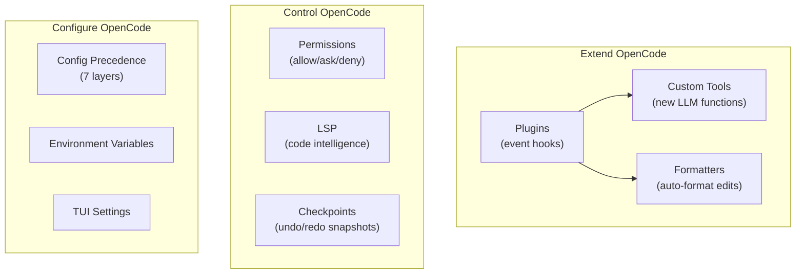
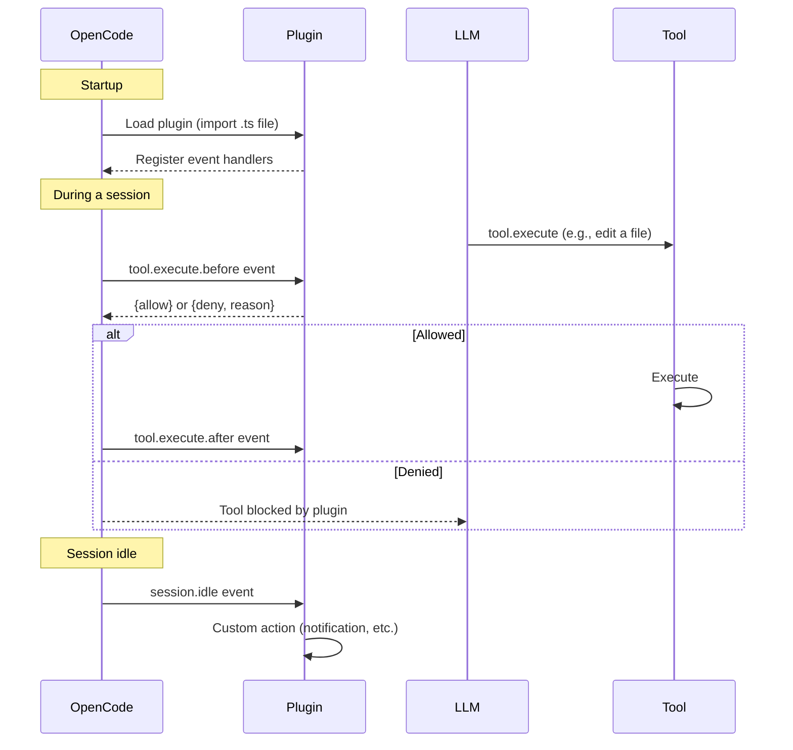
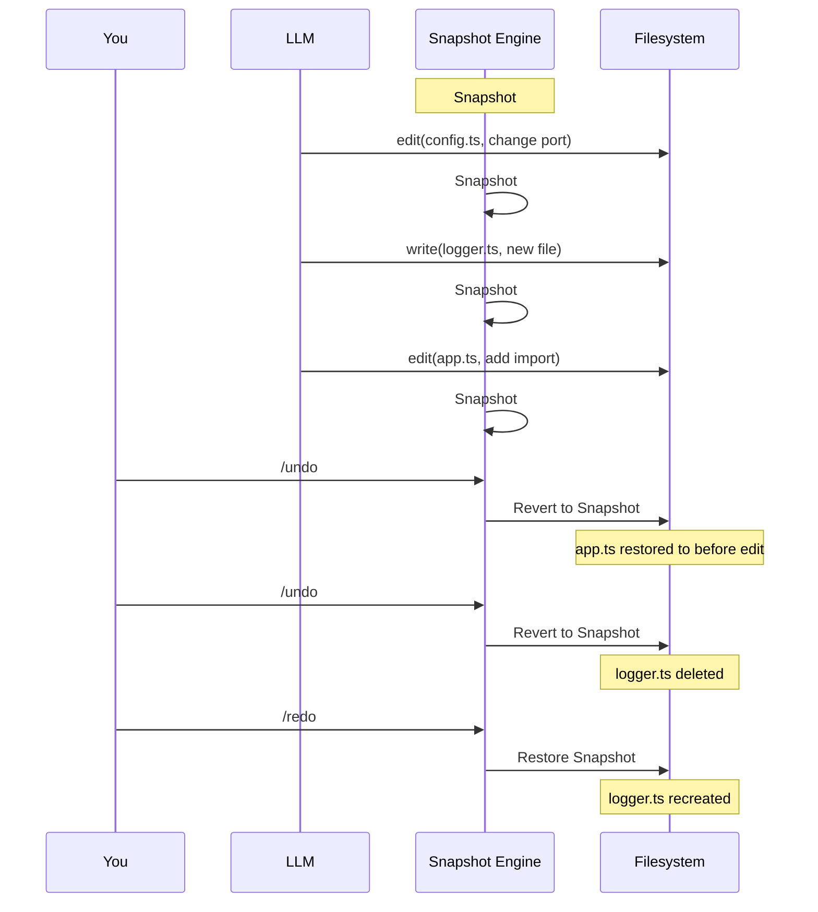
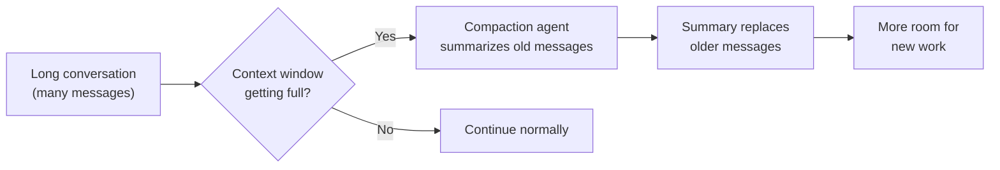
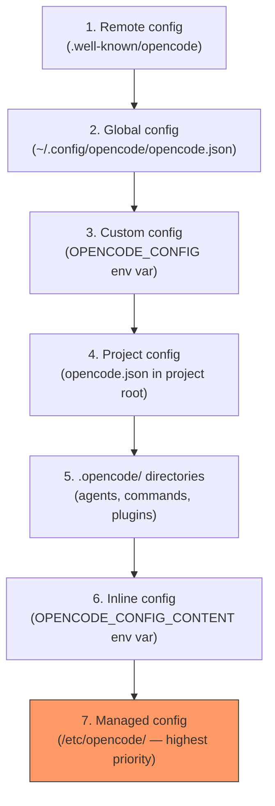

<div align="center">

# ⚙️ 09. Advanced Features

**Plugins, custom tools, permissions, formatters, LSP, and advanced configuration**

[]()
[]()
[]()
[]()

[⬅️ Previous Module](../08-mcp-servers/) • [🏠 Main Menu](../README.md) • [Next Module ➡️](../10-openwork/)

</div>

---

## 📋 Table of Contents

<details>
<summary>Click to expand/collapse</summary>

- [🎯 Overview](#-overview)
- [🔌 Plugin System](#-plugin-system)
- [🛠️ Custom Tools](#️-custom-tools)
- [🔒 Permission Configuration](#-permission-configuration)
- [🎨 Code Formatters](#-code-formatters)
- [🧠 LSP Integration](#-lsp-integration)
- [⏪ Checkpoints & Undo/Redo](#-checkpoints--undoredo)
- [📝 Advanced Configuration](#-advanced-configuration)
- [🌐 Environment Variables](#-environment-variables)
- [🧪 Practice Exercises](#-practice-exercises)
- [❓ Common Questions](#-common-questions)
- [🚶 Next Steps](#-next-steps)

</details>

---

## 🎯 Overview

This module covers OpenCode's advanced customization features for power users.

| Feature           | Description                                              |
| ----------------- | -------------------------------------------------------- |
| **Plugins**       | Extend OpenCode with event hooks, custom tools, and more |
| **Custom Tools**  | Define your own tools the LLM can call                   |
| **Permissions**   | Granular control over what the LLM can do                |
| **Formatters**    | Auto-format code after edits                             |
| **LSP**           | Language Server Protocol integration                     |
| **Checkpoints**   | File snapshots, undo/redo, and conversation compaction   |
| **Configuration** | Advanced config: variables, precedence, snapshots        |



---

## 🔌 Plugin System

> **Development environment:** Plugins are written in TypeScript. You'll need:
>
> - [Bun](https://bun.sh/) installed (OpenCode uses Bun to run plugins; install with `curl -fsSL https://bun.sh/install | bash`)
> - npm plugins are auto-installed by Bun at startup; local plugins in `.opencode/plugins/` are loaded directly
> - [Zod](https://zod.dev/) is used for schema validation in custom tools (installed automatically as a dependency of `@opencode-ai/plugin`)
>
> If you're not a TypeScript developer, you can still **use** community plugins by listing them in `opencode.json` — writing your own is optional.

OpenCode has an extensive plugin ecosystem. Plugins can hook into events, define custom tools, modify behavior, and integrate with external services.

### How Plugins Work



### Plugin Locations

| Location                         | Scope                         |
| -------------------------------- | ----------------------------- |
| `.opencode/plugins/`             | Project-specific plugins      |
| `~/.config/opencode/plugins/`    | Global plugins (all projects) |
| `opencode.json` `"plugin"` array | npm plugins (auto-installed)  |

### Installing npm Plugins

Add plugins to `opencode.json`:

```json
{
  "$schema": "https://opencode.ai/config.json",
  "plugin": [
    "opencode-supermemory",
    "opencode-vibeguard",
    "@my-org/custom-plugin"
  ]
}
```

npm plugins are auto-installed via Bun at startup and cached in `~/.cache/opencode/node_modules/`.

### Writing a Local Plugin

Create a TypeScript file in `.opencode/plugins/`:

```typescript
// .opencode/plugins/my-plugin.ts
import type { Plugin } from "@opencode-ai/plugin"

export default function(ctx: Plugin.Context): Plugin.Handler {
  return {
    "tool.execute.before": async (input) => {
      console.log(`Tool called: ${input.tool}`)
    },
    "session.idle": async () => {
      console.log("Session is idle")
    },
  }
}
```

### Event Hooks

Plugins can listen to 30+ events:

| Category       | Events                                                                                                        |
| -------------- | ------------------------------------------------------------------------------------------------------------- |
| **Tool**       | `tool.execute.before`, `tool.execute.after`                                                                   |
| **Session**    | `session.created`, `session.idle`, `session.compacted`, `session.deleted`, `session.error`, `session.updated` |
| **File**       | `file.edited`, `file.watcher.updated`                                                                         |
| **Permission** | `permission.asked`, `permission.replied`                                                                      |
| **Message**    | `message.updated`, `message.removed`, `message.part.updated`                                                  |
| **TUI**        | `tui.prompt.append`, `tui.command.execute`, `tui.toast.show`                                                  |
| **Shell**      | `shell.env`                                                                                                   |
| **LSP**        | `lsp.client.diagnostics`, `lsp.updated`                                                                       |
| **Other**      | `command.executed`, `todo.updated`, `server.connected`                                                        |

### Plugin Context

Plugins receive a context object:

```typescript
ctx.project   // Current project info
ctx.client    // OpenCode SDK client
ctx.$          // Bun shell for running commands
ctx.directory  // Project directory
ctx.worktree   // Git worktree root
```

### Example: Protect .env Files

```typescript
// .opencode/plugins/env-guard.ts
import type { Plugin } from "@opencode-ai/plugin"

export default function(ctx: Plugin.Context): Plugin.Handler {
  return {
    "tool.execute.before": async (input) => {
      if (input.tool === "read" && input.args.filePath?.includes(".env")) {
        return { deny: true, reason: "Reading .env files is blocked" }
      }
    },
  }
}
```

### Example: Notification on Completion

```typescript
// .opencode/plugins/notify.ts
import type { Plugin } from "@opencode-ai/plugin"

export default function(ctx: Plugin.Context): Plugin.Handler {
  return {
    "session.idle": async () => {
      await ctx.$`osascript -e 'display notification "Task complete" with title "OpenCode"'`
    },
  }
}
```

### Popular Community Plugins

| Plugin                       | Description                        |
| ---------------------------- | ---------------------------------- |
| `opencode-supermemory`       | Persistent memory across sessions  |
| `opencode-vibeguard`         | Prevent accidental secret exposure |
| `opencode-background-agents` | Run agents in the background       |
| `opencode-worktree`          | Git worktree-based parallel work   |
| `opencode-firecrawl`         | Web crawling integration           |
| `oh-my-opencode`             | Collection of useful utilities     |
| `opencode-helicone-session`  | Helicone observability tracking    |
| `opencode-gitlab-plugin`     | GitLab MR, issues, and pipelines   |

Browse 30+ plugins at [opencode.ai/docs/ecosystem#plugins](https://opencode.ai/docs/ecosystem#plugins).

---

## 🛠️ Custom Tools

Define your own tools that the LLM can call. Custom tools are TypeScript/JavaScript files in `.opencode/tools/` or `~/.config/opencode/tools/`.

### Creating a Custom Tool

```typescript
// .opencode/tools/deploy.ts
import { tool } from "@opencode-ai/plugin"
import { z } from "zod"

export default tool({
  name: "deploy",
  description: "Deploy the application to a specified environment",
  schema: z.object({
    environment: z.string().describe("Target environment: staging or production"),
    version: z.string().describe("Version tag to deploy"),
  }),
  async execute(input, ctx) {
    const { environment, version } = input
    return `Deployed version ${version} to ${environment}`
  },
})
```

### Tool Features

- **Zod schemas** for argument validation with `.describe()` for LLM context
- **Multiple tools per file** — export several tools, named `<filename>_<export>`
- **Override built-in tools** by matching the name of an existing tool
- **Any language** — wrap Python or other scripts via shell execution
- **Dependencies** — add a `package.json` in `.opencode/` for npm dependencies

### Wrapping Other Languages

```typescript
// .opencode/tools/analyze.ts
import { tool } from "@opencode-ai/plugin"
import { z } from "zod"
import { $ } from "bun"

export default tool({
  name: "analyze",
  description: "Run Python analysis script",
  schema: z.object({
    file: z.string().describe("File to analyze"),
  }),
  async execute(input) {
    const result = await $`python3 scripts/analyze.py ${input.file}`.text()
    return result
  },
})
```

---

## 🔒 Permission Configuration

### Permission Levels

| Level     | Behavior                                |
| --------- | --------------------------------------- |
| `"allow"` | LLM can use the tool without asking     |
| `"ask"`   | LLM must get user approval before using |
| `"deny"`  | LLM cannot use the tool at all          |

### Basic Configuration

```json
{
  "$schema": "https://opencode.ai/config.json",
  "permission": {
    "read": "allow",
    "edit": "allow",
    "bash": "ask",
    "webfetch": "ask",
    "websearch": "deny"
  }
}
```

### Granular Rules (Object Syntax)

For fine-grained control, use an object with glob patterns. The **last matching rule wins**:

```json
{
  "permission": {
    "bash": {
      "*": "ask",
      "git *": "allow",
      "npm *": "allow",
      "rm *": "deny",
      "grep *": "allow"
    },
    "edit": {
      "*": "allow",
      "*.env": "deny",
      "*.env.*": "deny"
    }
  }
}
```

### Available Permissions

| Permission           | Matches                                                        |
| -------------------- | -------------------------------------------------------------- |
| `read`               | File path                                                      |
| `edit`               | File path (covers `edit`, `write`, `apply_patch`, `multiedit`) |
| `bash`               | Parsed command (e.g., `git status --porcelain`)                |
| `glob`               | Glob pattern                                                   |
| `grep`               | Regex pattern                                                  |
| `list`               | Directory path                                                 |
| `task`               | Subagent type                                                  |
| `skill`              | Skill name                                                     |
| `webfetch`           | URL                                                            |
| `websearch`          | Query                                                          |
| `external_directory` | Path outside project (default: `"ask"`)                        |
| `doom_loop`          | Same tool called 3x identically (default: `"ask"`)             |

### External Directory Access

Allow the LLM to access files outside your project:

```json
{
  "permission": {
    "external_directory": {
      "~/projects/shared-lib/**": "allow"
    }
  }
}
```

### Per-Agent Permission Overrides

Override permissions for specific agents:

```json
{
  "permission": {
    "bash": "ask"
  },
  "agent": {
    "build": {
      "permission": {
        "bash": {
          "*": "ask",
          "git status *": "allow",
          "git push *": "deny"
        }
      }
    }
  }
}
```

### What "Ask" Does

When the LLM triggers an "ask" permission, you see three options:

- **once** — approve just this request
- **always** — approve matching patterns for the rest of the session
- **reject** — deny the request

### Defaults

Most permissions default to `"allow"`. Exceptions:

- `doom_loop`: `"ask"`
- `external_directory`: `"ask"`
- `read` for `.env` files: `"ask"` by default

---

## 🎨 Code Formatters

### Configuration

Define formatters in `opencode.json` under the `"formatter"` key:

```json
{
  "$schema": "https://opencode.ai/config.json",
  "formatter": {
    "prettier": {
      "disabled": true
    },
    "custom-prettier": {
      "command": ["npx", "prettier", "--write", "$FILE"],
      "environment": {
        "NODE_ENV": "development"
      },
      "extensions": [".js", ".ts", ".jsx", ".tsx"]
    }
  }
}
```

### How It Works

When the LLM edits or writes a file, OpenCode automatically runs the matching formatter. This ensures all LLM-generated code follows your project's style.

### Disabling a Built-In Formatter

```json
{
  "formatter": {
    "prettier": { "disabled": true }
  }
}
```

---

## 🧠 LSP Integration

OpenCode integrates with Language Server Protocol servers to provide code intelligence to the LLM. It comes with **30+ built-in language servers** that auto-install when relevant files are detected.

### Built-In Servers (Partial List)

| Language      | Server                     | Auto-installs?                   |
| ------------- | -------------------------- | -------------------------------- |
| TypeScript/JS | typescript-language-server | Yes (if `typescript` in project) |
| Python        | pyright                    | Yes (if `pyright` in project)    |
| Go            | gopls                      | If `go` available                |
| Rust          | rust-analyzer              | If `rust-analyzer` available     |
| C/C++         | clangd                     | Yes                              |
| PHP           | intelephense               | Yes                              |
| Ruby          | ruby-lsp                   | If `ruby` available              |
| Svelte        | svelte-language-server     | Yes                              |
| Vue           | vue-language-server        | Yes                              |

### LSP Tool (Experimental)

Enable the LLM to query LSP directly:

```bash
OPENCODE_EXPERIMENTAL_LSP_TOOL=true opencode
```

Supported operations: `goToDefinition`, `findReferences`, `hover`, `documentSymbol`, `workspaceSymbol`, `goToImplementation`, `prepareCallHierarchy`, `incomingCalls`, `outgoingCalls`.

### Custom LSP Servers

```json
{
  "lsp": {
    "custom-lsp": {
      "command": ["custom-lsp-server", "--stdio"],
      "extensions": [".custom"]
    }
  }
}
```

### Disabling LSP

```json
{ "lsp": false }
```

Or disable a specific server:

```json
{
  "lsp": {
    "typescript": { "disabled": true }
  }
}
```

---

## ⏪ Checkpoints & Undo/Redo

OpenCode tracks every file change using a snapshot system, giving you full undo/redo capability.

### How Checkpoints Work



### Commands

| Command / Keybind | Action                          |
| ----------------- | ------------------------------- |
| `/undo`           | Revert the last file change     |
| `/redo`           | Re-apply the last undone change |
| `Ctrl+X u`        | Keyboard shortcut for undo      |

Each `/undo` reverts **one tool call** — if the LLM edited 3 files in one step, `/undo` reverts all 3.

### What Gets Snapshotted

- File creates (`write` tool)
- File edits (`edit`, `apply_patch` tools)
- File deletions (via `bash rm` or write tool)

**Not snapshotted:**

- Shell commands and their side effects (e.g., `npm install` modifying `node_modules`)
- Database changes
- External API calls

### Snapshot Configuration

```json
{
  "$schema": "https://opencode.ai/config.json",
  "snapshot": true
}
```

Disable snapshots for very large repos where tracking overhead is noticeable:

```json
{ "snapshot": false }
```

### Conversation Compaction

When conversations get long, the context window fills up. OpenCode handles this with **automatic compaction** — summarizing older messages to free up space.



**Compaction configuration:**

```json
{
  "compaction": {
    "auto": true,
    "prune": true,
    "reserved": 10000
  }
}
```

| Option     | Description                                                              |
| ---------- | ------------------------------------------------------------------------ |
| `auto`     | Enable automatic compaction when context is filling up (default: `true`) |
| `prune`    | Remove old messages after compaction (default: `true`)                   |
| `reserved` | Token budget reserved for compaction summary (default: `10000`)          |

**Manual compaction:** Type `/compact` in the TUI to force compaction at any time.

**What compaction preserves:**

- The current task and its context
- Active todo list
- Recent file changes
- Key decisions and answers from the question tool

**What compaction summarizes:**

- Older conversation turns
- Previous tool call details
- Historical exploration that's no longer relevant

---

## 📝 Advanced Configuration

### Config Precedence

Configuration sources are merged in this order (later overrides earlier):



Each layer merges with the previous — values in higher-priority sources override lower ones.

> **Tip:** Config files support JSONC (JSON with comments). You can use `opencode.jsonc` and include `//` comments in your config for documentation.

### Variable Substitution

Use `{env:VAR}` for environment variables and `{file:path}` for file contents:

```json
{
  "provider": {
    "anthropic": {
      "options": {
        "apiKey": "{env:ANTHROPIC_API_KEY}"
      }
    }
  },
  "instructions": ["./custom-instructions.md"]
}
```

### Snapshots

OpenCode tracks file changes using snapshots, enabling `/undo` and `/redo`. Disable for large repos:

```json
{ "snapshot": false }
```

### Compaction

Control automatic context compaction when conversations get long:

```json
{
  "compaction": {
    "auto": true,
    "prune": true,
    "reserved": 10000
  }
}
```

### File Watcher

Ignore noisy directories from file watching:

```json
{
  "watcher": {
    "ignore": ["node_modules/**", "dist/**", ".git/**"]
  }
}
```

### Sharing

Control session sharing:

```json
{ "share": "manual" }
```

Options: `"manual"` (default), `"auto"`, `"disabled"`.

### TUI Configuration

TUI settings go in a separate `tui.json` file:

```json
{
  "$schema": "https://opencode.ai/tui.json",
  "theme": "tokyonight",
  "scroll_speed": 3,
  "scroll_acceleration": { "enabled": true },
  "diff_style": "auto",
  "mouse": true
}
```

---

## 🌐 Environment Variables

### Core Variables

| Variable                      | Description                                    |
| ----------------------------- | ---------------------------------------------- |
| `OPENCODE_CONFIG`             | Path to custom config file                     |
| `OPENCODE_CONFIG_DIR`         | Path to custom config directory                |
| `OPENCODE_CONFIG_CONTENT`     | Inline JSON config content                     |
| `OPENCODE_TUI_CONFIG`         | Path to custom TUI config file                 |
| `OPENCODE_SERVER_PASSWORD`    | Password for `opencode serve`/`web`            |
| `OPENCODE_SERVER_USERNAME`    | Username for server auth (default: `opencode`) |
| `OPENCODE_PERMISSION`         | Inline JSON permissions config                 |
| `OPENCODE_DISABLE_AUTOUPDATE` | Disable automatic updates                      |

### Compatibility Variables

| Variable                              | Description                                      |
| ------------------------------------- | ------------------------------------------------ |
| `OPENCODE_DISABLE_CLAUDE_CODE`        | Disable reading from `.claude` (prompt + skills) |
| `OPENCODE_DISABLE_CLAUDE_CODE_PROMPT` | Disable reading `~/.claude/CLAUDE.md`            |
| `OPENCODE_DISABLE_CLAUDE_CODE_SKILLS` | Disable loading `.claude/skills`                 |

### Experimental Variables

| Variable                                        | Description                         |
| ----------------------------------------------- | ----------------------------------- |
| `OPENCODE_EXPERIMENTAL`                         | Enable all experimental features    |
| `OPENCODE_EXPERIMENTAL_LSP_TOOL`                | Enable experimental LSP tool        |
| `OPENCODE_ENABLE_EXA`                           | Enable Exa web search tool          |
| `OPENCODE_EXPERIMENTAL_BASH_DEFAULT_TIMEOUT_MS` | Default timeout for bash commands   |
| `OPENCODE_EXPERIMENTAL_OUTPUT_TOKEN_MAX`        | Max output tokens for LLM responses |

---

## 🧪 Practice Exercises

### Exercise 1: Plugin Setup

Install a community plugin:

```json
{
  "plugin": ["opencode-supermemory"]
}
```

Restart OpenCode and verify the plugin loaded.

### Exercise 2: Custom Tool

Create `.opencode/tools/hello.ts`:

```typescript
import { tool } from "@opencode-ai/plugin"
import { z } from "zod"

export default tool({
  name: "hello",
  description: "Say hello to someone",
  schema: z.object({ name: z.string() }),
  async execute(input) {
    return `Hello, ${input.name}!`
  },
})
```

Ask: "Use the hello tool to greet Alice"

### Exercise 3: Granular Permissions

Configure bash permissions with patterns:

```json
{
  "permission": {
    "bash": {
      "*": "ask",
      "git status *": "allow",
      "git log *": "allow",
      "rm *": "deny"
    }
  }
}
```

### Exercise 4: AGENTS.md with /init

Run `/init` in the TUI to auto-generate an `AGENTS.md` for your project.

---

## ❓ Common Questions

**Q: Does OpenCode have a plugin/hooks system?**
Yes. OpenCode has an extensive plugin system with 30+ event hooks. Plugins can be local TypeScript files in `.opencode/plugins/` or npm packages listed in `opencode.json`. See the [Plugin System](#-plugin-system) section above.

**Q: What's the equivalent of Claude Code's hooks?**
OpenCode's plugin event hooks serve the same purpose. Hooks like `tool.execute.before`, `tool.execute.after`, `session.idle`, and `file.edited` let you intercept and modify behavior at every stage.

**Q: Where do AGENTS.md rules come from?**
OpenCode reads rules from: project `AGENTS.md` > global `~/.config/opencode/AGENTS.md` > `CLAUDE.md` fallback (disable with `OPENCODE_DISABLE_CLAUDE_CODE=1`). You can also add `"instructions"` in `opencode.json` pointing to files, globs, or remote URLs.

**Q: Can I use my Claude Code CLAUDE.md?**
Yes. OpenCode reads `CLAUDE.md` and `~/.claude/CLAUDE.md` as fallbacks if no `AGENTS.md` exists.

**Q: What's the difference between plugins and custom tools?**
Plugins hook into events and modify OpenCode's behavior. Custom tools define new functions the LLM can call during conversations.

---

## 🚶 Next Steps

Continue to **[Module 10: OpenWork](../10-openwork/)** to learn about multi-agent orchestration.

---

## 📄 License & Attribution

This module is part of the [OpenCode Primer](../README.md).

**License:** MIT - See [LICENSE](../LICENSE) for details.

[⬆ Back to top](#️-09-advanced-features)

**Last Updated:** April 2026
**OpenCode Version:** 1.0+ compatible

---
