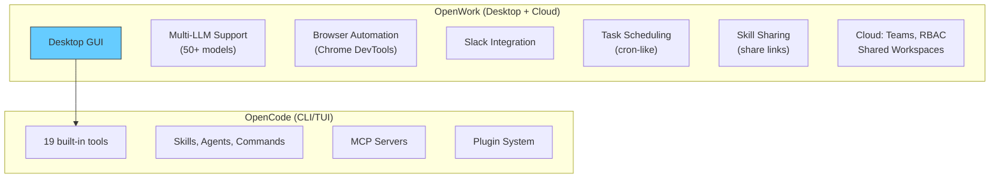
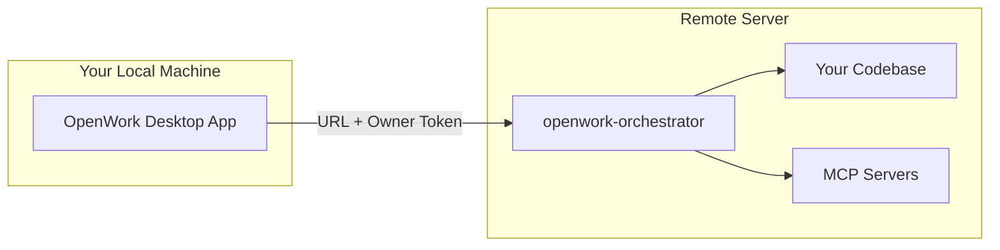
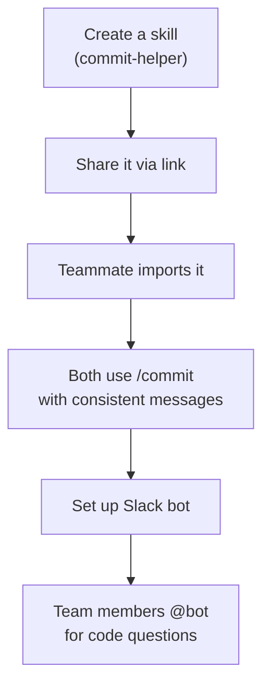

<div align="center">

# 🤝 10. OpenWork Integration

**Team collaboration with the open-source Claude Cowork alternative**

[]()
[]()
[]()
[]()

[⬅️ Previous Module](../09-advanced-features/) • [🏠 Main Menu](../README.md)

</div>

---

## 📋 Table of Contents

<details>
<summary>Click to expand/collapse</summary>

- [🎯 Overview](#-overview)
- [⚡ Quick Start](#-quick-start)
- [🖥️ Desktop App](#️-desktop-app)
- [🌐 Self-Hosted Setup](#-self-hosted-setup)
- [📦 Importing & Sharing Skills](#-importing--sharing-skills)
- [🌍 Browser Automation (Computer Use)](#-browser-automation-computer-use)
- [💬 Slack Integration](#-slack-integration)
- [⏰ Task Automation](#-task-automation)
- [🔌 MCP Servers in OpenWork](#-mcp-servers-in-openwork)
- [☁️ OpenWork Cloud](#️-openwork-cloud)
- [🧪 Practice Exercises](#-practice-exercises)
- [❓ Common Questions](#-common-questions)
- [🚶 Next Steps](#-next-steps)

</details>

---

## 🎯 Overview

[OpenWork](https://openworklabs.com/) is the **open-source alternative to Claude Cowork**, built on top of OpenCode. It provides a desktop app for using 50+ LLMs with your own keys, plus team collaboration features.



| Feature                 | Description                                                 |
| ----------------------- | ----------------------------------------------------------- |
| **Desktop App**         | GUI for OpenCode with multi-LLM support                     |
| **Bring Your Own Keys** | Use API keys from any provider (Anthropic, OpenAI, etc.)    |
| **Skill Sharing**       | Share and import skills, MCPs, and configs via links        |
| **Browser Automation**  | Chrome browser control via natural language                 |
| **Slack Integration**   | Connect a Slack bot to your workspace                       |
| **Task Automation**     | Schedule prompts to run on a cron                           |
| **Self-Hosted**         | Run on your own infrastructure with `openwork-orchestrator` |
| **Cloud (Teams)**       | Shared workspaces, skill hubs, RBAC, team templates         |

OpenWork is powered by [OpenCode](https://opencode.ai/) — everything you've learned in Modules 01–09 applies.

---

## ⚡ Quick Start

### Option 1: Desktop App (Recommended)

Most users start with the free desktop app:

1. Download from [openworklabs.com](https://openworklabs.com/)
2. Install and launch
3. Open **Settings > Connect Provider** and connect your LLM (Anthropic, OpenAI, etc.)
4. Start chatting — all OpenCode features work through the GUI

### Option 2: Self-Hosted CLI

```bash
# Install the orchestrator
npm install -g openwork-orchestrator

# Start OpenWork in your workspace
openwork start --workspace /path/to/your/project --approval auto
```

This outputs an **OpenWork URL** and **Owner Token**. Use these to connect from the desktop app.

---

## 🖥️ Desktop App

### Connecting Providers

1. Open **Settings > Connect Provider**
2. Choose your provider (Anthropic, OpenAI, Google, etc.)
3. Authenticate via OAuth or enter your API key manually
4. Select your model from the dropdown in chat

You can connect multiple providers and switch between models freely.

### ChatGPT

Connect your ChatGPT Pro/Plus subscription:

1. **Settings > Connect Provider > OpenAI > ChatGPT Pro/Plus**
2. Log in via OAuth
3. Choose from all available models in the chat dropdown

### Anthropic (Manual API Key)

Anthropic has disabled third-party OAuth. You need a manual API key:

1. Sign in at [platform.claude.com](https://platform.claude.com/)
2. Go to **API Keys > Create Key** — name it "OpenWork"
3. Copy the key (`sk-ant-...`)
4. In OpenWork: **Settings > Connect Provider > Anthropic** — paste the key

### Custom LLM Providers (Desktop)

Because OpenWork is built on OpenCode, you can add any OpenAI-compatible provider by editing the workspace config at `/path-to-your-workspace/.config/opencode/opencode.json`:

```json
{
  "provider": {
    "ollama": {
      "npm": "@ai-sdk/openai-compatible",
      "name": "Ollama",
      "options": {
        "baseURL": "http://localhost:11434/v1"
      },
      "models": {
        "qwen3:8b": {
          "name": "Qwen3 8B"
        }
      }
    }
  }
}
```

Pull the model first with `ollama pull qwen3:8b` and make sure the Ollama server is running with `ollama serve`.

### Exa Search

Enable web search via **Settings > Advanced > Enable Exa**.

---

## 🌐 Self-Hosted Setup

For running OpenWork on your own infrastructure (remote servers, VMs, etc.):

### Architecture



### Step 1: Install

```bash
npm install -g openwork-orchestrator
```

### Step 2: Start in Your Workspace

```bash
openwork start --workspace /path/to/your/workspace --approval auto
```

This outputs:

- **OpenWork URL** — the connection endpoint
- **Owner Token** — authentication token

### Step 3: Connect the Desktop App

1. Open the OpenWork desktop app
2. Click **+ Add workspace** (bottom left)
3. Click **+ Connect Remote workspace**
4. Enter the URL and Owner Token from Step 2

### What This Gives You

- Code and services stay on the remote machine
- Your local machine stays lightweight
- Hardware isolation between the AI workspace and your local machine

---

## 📦 Importing & Sharing Skills

### Sharing a Skill

1. Open **Your Workspace > Skills** in the desktop app
2. Click **Create Link** on the skill you want to share
3. This creates a URL at `share.openworklabs.com/b/:skill_id`
4. Recipients can **Copy the skill** or **Open in OpenWork**

### Sharing Your Entire Configuration

Share your complete workspace setup (skills, MCPs, agents, custom providers):

1. Click **`...`** next to your workspace name
2. Click **Share > Share a template**
3. Generate a link that packages your entire configuration

### Importing a Skill

There are three ways to import an external skill:

**1. From a share URL:**

- Click a `share.openworklabs.com/b/...` link
- Click **Open in OpenWork**
- Select the target workspace
- Reload when prompted

**2. Paste into the share site:**

- Go to [share.openworklabs.com](https://share.openworklabs.com/)
- Paste or upload your skill (must have YAML frontmatter with `name` and `description`)
- Click **Generate link**
- Follow the import steps above

**3. Use `/skill-creator` in chat:**

- Type `/skill-creator` in the chat
- Paste an external skill or describe what you want
- OpenWork generates a workspace-local skill from the input

### Skill File Format

Skills must follow this structure when importing:

```markdown
---
name: name-of-the-skill
description: one line description of what the skill does
---

Any markdown text with instructions and description of the skill
```

You can also place skills directly at `.opencode/skills/<skill-name>/SKILL.md` in your workspace.

---

## 🌍 Browser Automation (Computer Use)

OpenWork can automate Google Chrome through natural language requests. This works via Chrome DevTools MCP — it is not full desktop control.

### Requirements

- Google Chrome on the machine running the session
- Enable in **Settings > Extensions > Control Chrome**
- Follow the configuration instructions in the setup screen

> **Important**: Do not use "Use my existing Chrome profile" — it's currently not well supported.

If connected to a remote OpenWork server, that remote machine also needs Chrome installed.

### Usage

After enabling, ask the agent to perform browser tasks:

```
Open twitter.com and take a screenshot
Go to github.com/trending, list the top 5 repos, and save them to a file
```

The agent navigates the browser, performs actions, takes screenshots as proof, and returns results.

---

## 💬 Slack Integration

Connect a Slack bot to your OpenWork workspace so your team can interact with the agent directly from Slack.

> **Recommendation**: Set up the Slack bot with a remote workspace (not your local machine) for hardware isolation. For team use, host the runtime in an OpenWork Cloud [shared workspace](https://openworklabs.com/docs/cloud-shared-workspaces).

### Prerequisites

- Slack owner, admin, or sufficient permission to add apps
- A running OpenWork workspace (local or remote)

### Setup

1. **Create a Slack app** at [api.slack.com/apps](https://api.slack.com/apps?new_app=1) → **Create New App** → **From a manifest** → pick your workspace
2. **Install to Workspace**: Sidebar → **Install App** → **Install to Workspace** → authorize
3. **Copy the Bot token** (`xoxb-...`) from the Install App page
4. **Generate an App-Level Token**: Sidebar → **Basic Information** → **App-Level Tokens** → add scope `connections:write` → generate. Copy the `xapp-` token.
5. **In OpenWork**: Paste both tokens into **Settings > Messaging**

### Testing

Send a message to the bot using `@bot-name`. It creates a new session and responds.

### Manifest Template

Use this as your Slack app manifest:

```yaml
display_information:
  name: MyBot
  description: Your description
  background_color: "#000000"
features:
  bot_user:
    display_name: your-display-name
    always_online: false
oauth_config:
  scopes:
    bot:
      - assistant:write
      - app_mentions:read
      - channels:read
      - channels:history
      - chat:write
      - files:read
      - files:write
      - im:history
      - links:read
      - links:write
      - lists:read
      - lists:write
  pkce_enabled: false
settings:
  event_subscriptions:
    bot_events:
      - app_mention
      - message.im
  interactivity:
    is_enabled: true
  org_deploy_enabled: false
  socket_mode_enabled: true
  token_rotation_enabled: false
```

---

## ⏰ Task Automation

OpenWork can run prompts on a schedule, like cron jobs for your AI agent.

### Setup

1. Go to **Settings > Automations**
2. Create an automation by describing it in chat:

```
Create a scheduled job that runs every day at 9am,
checks for new GitHub issues in our repo,
and posts a summary to Slack
```

1. If the agent understands your request, it creates the automation
2. View and manage automations in **Settings > Automations**

### Examples

```
Create a schedule job that goes to facebook.com every day,
takes a screenshot, and reports back to me

Run our test suite every 6 hours and alert if anything fails
```

---

## 🔌 MCP Servers in OpenWork

### Adding MCP Servers from the Desktop

1. Go to **Extensions > Advanced Settings > Add MCP server**
2. Choose to add per-workspace or globally
3. Enter the server name and URL
4. Toggle OAuth if the server requires it (must support dynamic client registration)

> **Note**: Some MCP servers don't support dynamic client registration. These are not currently supported through the desktop UI.

All MCP servers configured in `opencode.json` also work in OpenWork. See [Module 08](../08-mcp-servers/) for JSON configuration details.

---

## ☁️ OpenWork Cloud

OpenWork Cloud is for teams that want shared workspaces, org-managed skill hubs, shared providers, and access control. It requires an active subscription at [app.openworklabs.com](https://app.openworklabs.com/).

### Sign In

1. Open **Settings > Cloud** in the desktop app
2. Click **Sign in**
3. Complete sign-in in your browser
4. If the browser doesn't return automatically, click **Paste sign-in code** and paste the `openwork://den-auth?...` link

### Organization Setup

1. Visit [app.openworklabs.com](https://app.openworklabs.com/)
2. Click **Create organization**
3. Enter your org name and complete checkout if prompted
4. In the desktop app: **Settings > Cloud > Active org** — select your org

The selected org controls which Cloud workers, Team templates, Skill hubs, and Cloud providers are available.

### Team Templates

Share your entire setup across your org:

1. Create your setup (skills, MCPs, providers)
2. Click **Share** to create a template
3. New team members pick from provisioned templates when they start OpenWork

### Skill Hubs

Distribute shared skills to teams:

1. **Create a Team**: Members → Teams → Create Team → add members
2. **Create a Skill**: Skill Hubs → All Skills → Add Skill → Manual Entry or Upload SKILL.md
3. **Create a Hub**: Skill Hubs → Hubs → Create Hub → assign teams + select skills
4. **Import to Desktop**: Settings → Cloud → Skill hubs → **Import all** → Reload

Skills are installed into `.opencode/skills` in the workspace. Use **Sync** after hub changes, **Remove** to stop managing.

### Shared Workspaces

Deploy hosted OpenWork runtimes in the cloud:

1. Org dashboard → **Shared Workspace** → **Add workspace**
2. Wait until status is **Ready**
3. Click **Connect** — choose: Open in desktop, Open in web, or copy Connection URL + tokens

From the desktop app: **Add workspace > Shared workspaces** or **Settings > Cloud > Cloud workers**.

> **Note**: Shared workspaces are currently in Alpha.

### Managed LLM Providers

Share model access across your org:

1. Cloud dashboard → **LLM Providers** → **Add Provider**
2. Choose **Catalog provider** → select provider + models → paste shared API key
3. Set **People access** and/or **Team access**
4. Desktop: **Settings > Cloud > Cloud providers > Import** → Reload

OpenWork writes the imported provider into the workspace `opencode.jsonc`.

### Custom LLM Providers (Cloud)

For providers not in the catalog, use a models.dev-style JSON definition:

```json
{
  "id": "custom-provider",
  "name": "Custom Provider",
  "npm": "@ai-sdk/openai-compatible",
  "env": ["CUSTOM_PROVIDER_API_KEY"],
  "doc": "https://example.com/docs/models",
  "api": "https://api.example.com/v1",
  "models": [
    {
      "id": "custom-provider/example-model",
      "name": "Example Model",
      "tool_call": true,
      "structured_output": true,
      "temperature": true,
      "limit": {
        "context": 128000,
        "input": 128000,
        "output": 8192
      }
    }
  ]
}
```

### Members & RBAC

| Role       | Capabilities                                         |
| ---------- | ---------------------------------------------------- |
| **Owner**  | Full org control, member roles, custom roles         |
| **Admin**  | Invite people, manage teams, manage shared resources |
| **Member** | Use resources shared with them                       |

**Invite members**: Members → Add member → enter email → choose role → Send invite.
**Create teams**: Members → Teams → Create Team → add members. Teams control access to skill hubs and providers.
**Custom roles**: Members → Roles → Create role → set permissions.

Recommended pattern: 1-2 Owners, Admins for operators, Members for everyone else, Teams for access control.

---

## 🧪 Practice Exercises

### Exercise 1: Desktop App Setup

1. Download the OpenWork desktop app from [openworklabs.com](https://openworklabs.com/)
2. Connect your preferred LLM provider
3. Start a conversation — all OpenCode features work the same way

**Expected:** The app opens, you see a chat interface. Connecting a provider gives you a model dropdown. Conversations work exactly like the TUI.

### Exercise 2: Self-Hosted Setup

```bash
npm install -g openwork-orchestrator
openwork start --workspace ~/my-project --approval auto
# Copy URL and token, connect from the desktop app
```

**Expected:** Terminal outputs an OpenWork URL (`https://...`) and an Owner Token. In the desktop app, **Add workspace > Connect Remote workspace** and paste both values. You should see your remote project's files.

### Exercise 3: Import a Skill

1. Visit [share.openworklabs.com](https://share.openworklabs.com/)
2. Paste a skill with YAML frontmatter (must have `name` and `description`)
3. Generate a link and open it in OpenWork
4. Alternatively, try `/skill-creator` in chat

**Expected:** The skill appears in **Your Workspace > Skills**. When you ask the LLM to use it, it follows the skill's instructions.

### Exercise 4: Create and Share a Skill

1. Create a skill file in your workspace:

```bash
mkdir -p .opencode/skills
cat > .opencode/skills/SKILL.md << 'EOF'
---
name: commit-helper
description: Generate conventional commit messages from staged changes
---

When asked to commit:
1. Run `git diff --staged` to see changes
2. Analyze what was changed
3. Write a commit message following Conventional Commits:
   - feat(scope): for new features
   - fix(scope): for bug fixes
   - docs(scope): for documentation
   - refactor(scope): for code restructuring
4. Keep the first line under 72 characters
EOF
```

1. Go to **Your Workspace > Skills > Create Link**
2. Share the URL with a teammate

**Expected:** Your teammate can click the link and import the skill into their workspace.

### Exercise 5: Browser Automation

1. Enable **Settings > Extensions > Control Chrome**
2. Ask: "Open github.com/trending and list the top 5 repos"

**Expected:** Chrome opens, navigates to the trending page, and the agent returns a list of 5 repositories with their descriptions and star counts.

### Exercise 6: End-to-End Team Workflow

This exercise combines multiple OpenWork features:



1. Create the commit-helper skill (Exercise 4)
2. Share it with a teammate
3. Both of you use it: `Load the commit-helper skill and commit my staged changes`
4. Verify you both get consistent conventional commit messages

---

## ❓ Common Questions

**Q: What's the relationship between OpenCode and OpenWork?**
OpenCode is the CLI/TUI coding agent. OpenWork is a desktop app built on OpenCode that adds a GUI, multi-LLM support, team collaboration, Slack integration, browser automation, and task scheduling.

**Q: Is OpenWork free?**
The desktop app is free (Solo plan). Team features via OpenWork Cloud require a subscription at [app.openworklabs.com](https://app.openworklabs.com/).

**Q: Do I need OpenWork to use OpenCode?**
No. OpenCode works independently as a CLI/TUI tool. OpenWork adds a GUI layer and team features on top.

**Q: Can I connect Slack to OpenWork?**
Yes. Create a Slack app with the right scopes, get the `xoxb-` and `xapp-` tokens, and paste them into **Settings > Messaging**. See the [Slack Integration](#-slack-integration) section.

**Q: What is Computer Use?**
Browser automation via Chrome DevTools MCP. It can perform browser actions and take screenshots, but does not control the full desktop OS.

**Q: Where are the docs?**
[openworklabs.com/docs](https://openworklabs.com/docs)

---

## 🚶 Next Steps

Congratulations! You've completed the OpenCode Primer. Here's where to go next:

- **[OpenCode Documentation](https://opencode.ai/docs)** — Official CLI/TUI reference
- **[OpenWork Documentation](https://openworklabs.com/docs)** — Desktop app and team features
- **[MCP Server Directory](https://github.com/modelcontextprotocol/servers)** — Browse available MCP servers
- **[LEARNING-ROADMAP.md](../LEARNING-ROADMAP.md)** — Structured learning path
- **[QUICK-REFERENCE.md](../QUICK-REFERENCE.md)** — Command quick reference

---

## 📄 License & Attribution

This module is part of the [OpenCode Primer](../README.md).

**License:** MIT - See [LICENSE](../LICENSE) for details.

[⬆ Back to top](#-10-openwork-integration)

**Last Updated:** April 2026
**OpenCode Version:** 1.0+ compatible

---
