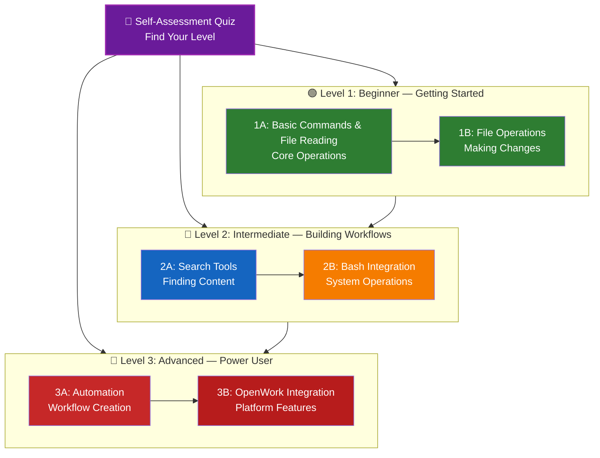

# 📚 OpenCode & OpenWork Learning Roadmap

**New to opencode?** This guide helps you master opencode features at your own pace. Whether you're a complete beginner or an experienced developer, start with the self-assessment quiz below to find the right path for you.

---

## 🧭 Find Your Level

Not everyone starts from the same place. Take this quick self-assessment to find the right entry point.

**Answer these questions honestly:**

- I can run basic opencode commands
- I have used the read tool to examine files
- I have used the edit tool to modify files
- I have used search tools (glob, grep) to find files and content
- I have used bash integration for system operations
- I have created automation workflows
- I have used openwork platform features
- I have integrated opencode into CI/CD pipelines

**Your Level:**

| Checks | Level | Start At | Time to Complete |
|--------|-------|----------|------------------|
| 0-2 | **Level 1: Beginner** — Getting Started | [Milestone 1A](#milestone-1a-basic-commands--file-reading) | ~2 hours |
| 3-5 | **Level 2: Intermediate** — Building Workflows | [Milestone 2A](#milestone-2a-file-operations--search-tools) | ~3 hours |
| 6-8 | **Level 3: Advanced** — Power User & Automation | [Milestone 3A](#milestone-3a-automation--workflows) | ~4 hours |

> **Tip**: If you're unsure, start one level lower. It's better to review familiar material quickly than to miss foundational concepts.

---

## 🎯 Learning Philosophy

The folders in this repository are numbered in **recommended learning order** based on three key principles:

1. **Dependencies** - Foundational concepts come first
2. **Complexity** - Easier features before advanced ones
3. **Frequency of Use** - Most common features taught early

This approach ensures you build a solid foundation while gaining immediate productivity benefits.

---

## 🗺️ Your Learning Path



**Color Legend:**

- 💜 Purple: Self-Assessment Quiz
- 🟢 Green: Level 1 — Beginner path
- 🔵 Blue / 🟡 Gold: Level 2 — Intermediate path
- 🔴 Red: Level 3 — Advanced path

---

## 📊 Complete Roadmap Table

| Step | Feature | Complexity | Time | Level | Dependencies | Why Learn This | Key Benefits |
|------|---------|------------|------|-------|--------------|----------------|--------------|
| **1** | [Basic Commands](01-basic-commands) | ⭐ Beginner | 30 min | Level 1 | None | Core opencode usage | Understand fundamentals |
| **2** | [File Reading](02-file-reading) | ⭐ Beginner | 45 min | Level 1 | None | Examine codebases | Read files and directories |
| **3** | [File Operations](03-file-operations) | ⭐⭐ Beginner+ | 45 min | Level 1 | File Reading | Make changes to code | Edit and write files |
| **4** | [Search Tools](04-search-tools) | ⭐⭐ Intermediate | 30 min | Level 2 | Basic Commands | Find files and content | Navigation and discovery |
| **5** | [Bash Integration](05-bash-integration) | ⭐⭐ Intermediate | 1 hour | Level 2 | Basic Commands | System operations | Execute shell commands |
| **6** | [Task Automation](06-task-automation) | ⭐⭐ Intermediate | 1 hour | Level 2 | All previous | Automate repetitive tasks | Save time on common work |
| **7** | [Automation](07-automation) | ⭐⭐⭐ Intermediate+ | 1 hour | Level 3 | Task Automation | Complex workflows | Multi-step processes |
| **8** | [Advanced Features](08-advanced-features) | ⭐⭐⭐ Intermediate+ | 1.5 hours | Level 3 | All previous | Power user tools | Expert usage patterns |
| **9** | [Workflows](09-workflows) | ⭐⭐⭐⭐ Advanced | 2-3 hours | Level 3 | Automation | Complete solutions | Real-world project templates |
| **10** | [OpenWork Integration](10-openwork) | ⭐⭐⭐⭐ Advanced | 2 hours | Level 3 | Workflows | Platform features | Team collaboration tools |

**Total Learning Time**: ~10-12 hours (or jump to your level and save time)

---

## 🟢 Level 1: Beginner — Getting Started

**For**: Users with 0-2 quiz checks  
**Time**: ~2 hours  
**Focus**: Immediate productivity, understanding fundamentals  
**Outcome**: Comfortable daily user, ready for Level 2

### Milestone 1A: Basic Commands & File Reading

**Topics**: Basic Commands + File Reading  
**Time**: 1 hour  
**Complexity**: ⭐ Beginner  
**Goal**: Understand core opencode operations and how to examine codebases

#### What You'll Achieve

✅ Run basic opencode commands  
✅ Read files and directories  
✅ Understand file paths and navigation  
✅ Examine codebase structure

#### Hands-on Exercises

```bash
# Exercise 1: Read a file
opencode read /path/to/file.js

# Exercise 2: Read a directory
opencode read /path/to/directory

# Exercise 3: Read with offset and limit
opencode read /path/to/large-file.txt --offset=100 --limit=50

# Exercise 4: Examine project structure
opencode read .  # Current directory
opencode read src/  # Source directory
```

#### Success Criteria

- Successfully read files and directories
- Understand how to navigate file paths
- Can examine codebase structure
- Know when to use read vs other tools

#### Next Steps

Once comfortable, read:
- [01-basic-commands/README.md](01-basic-commands/README.md)
- [02-file-reading/README.md](02-file-reading/README.md)

---

### Milestone 1B: File Operations

**Topics**: File Operations  
**Time**: 1 hour  
**Complexity**: ⭐⭐ Beginner+  
**Goal**: Learn to make changes to files safely and effectively

#### What You'll Achieve

✅ Edit existing files  
✅ Write new files  
✅ Understand string replacement patterns  
✅ Use replaceAll for batch operations

#### Hands-on Exercises

```bash
# Exercise 1: Edit a file (single replacement)
opencode edit /path/to/file.js \
  --old="console.log('old message')" \
  --new="console.log('new message')"

# Exercise 2: Edit a file (multiple replacements)
opencode edit /path/to/file.js \
  --old="oldFunctionName" \
  --new="newFunctionName" \
  --replaceAll

# Exercise 3: Write a new file
opencode write /path/to/new-file.md \
  --content="# New File\n\nThis is a new file created with opencode."

# Exercise 4: Create a configuration file
opencode write .opencode-config.json \
  --content='{"autoBackup": true, "maxFileSize": 1000000}'
```

#### Success Criteria

- Successfully edited existing files
- Created new files with proper content
- Used replaceAll for batch operations
- Understand when to use edit vs write

#### Next Steps

- Read: [03-file-operations/README.md](03-file-operations/README.md)
- **Ready for Level 2!** Proceed to [Milestone 2A](#milestone-2a-search-tools)

---

## 🔵 Level 2: Intermediate — Building Workflows

**For**: Users with 3-5 quiz checks  
**Time**: ~3 hours  
**Focus**: Navigation, system operations, basic automation  
**Outcome**: Efficient codebase navigation, ready for Level 3

### Prerequisites Check

Before starting Level 2, make sure you're comfortable with these Level 1 concepts:

- Can run basic opencode commands ([01-basic-commands/](01-basic-commands))
- Can read files and directories ([02-file-reading/](02-file-reading))
- Can edit and write files ([03-file-operations/](03-file-operations))

> **Gaps?** Review the linked tutorials above before continuing.

---

### Milestone 2A: Search Tools

**Topics**: Search Tools (glob, grep)  
**Time**: 1.5 hours  
**Complexity**: ⭐⭐ Intermediate  
**Goal**: Efficiently find files and content in codebases

#### What You'll Achieve

✅ Find files by pattern with glob  
✅ Search file contents with grep  
✅ Combine search patterns  
✅ Use search results for automation

#### Hands-on Exercises

```bash
# Exercise 1: Find files by pattern
opencode glob "**/*.js"  # All JavaScript files
opencode glob "src/**/*.ts"  # TypeScript files in src
opencode glob "*.{md,txt}"  # Markdown and text files

# Exercise 2: Search file contents
opencode grep "TODO|FIXME"  # Find todos and fixmes
opencode grep "function.*test" --include="*.js"  # Test functions
opencode grep "error" --include="*.{js,py}"  # Errors in JS and Python

# Exercise 3: Combine searches
# First find TypeScript files, then search for interfaces
files=$(opencode glob "**/*.ts")
for file in $files; do
  opencode grep "interface " --path="$file"
done

# Exercise 4: Search and replace workflow
# Find all occurrences of old variable name
opencode grep "oldVarName" --include="*.js"
# Then use edit with replaceAll to update
```

#### Success Criteria

- Can find files by various patterns
- Can search file contents effectively
- Understand how to combine search operations
- Can use search results in workflows

#### Next Steps

- Create custom search patterns for your projects
- Read: [04-search-tools/README.md](04-search-tools/README.md)

---

### Milestone 2B: Bash Integration

**Topics**: Bash Integration  
**Time**: 1.5 hours  
**Complexity**: ⭐⭐ Intermediate  
**Goal**: Execute system operations and combine with file operations

#### What You'll Achieve

✅ Run shell commands  
✅ Chain commands with && and ;  
✅ Use workdir parameter for directory changes  
✅ Combine bash with file operations

#### Hands-on Exercises

```bash
# Exercise 1: Basic bash commands
opencode bash "ls -la"  # List files
opencode bash "pwd"  # Print working directory
opencode bash "git status"  # Check git status

# Exercise 2: Chained commands
opencode bash "npm install && npm run build"
opencode bash "cd /tmp && pwd"

# Exercise 3: Use workdir parameter
opencode bash "ls" --workdir="/home/user/project"
opencode bash "git log --oneline -5" --workdir="."

# Exercise 4: Combine with file operations
# Read a file, then process it with bash
content=$(opencode read config.json)
opencode bash "echo '$content' | jq '.version'"

# Exercise 5: Complex workflow
# Build, test, and deploy
opencode bash "npm run build && npm test && npm run deploy"
```

#### Success Criteria

- Successfully run shell commands
- Can chain commands appropriately
- Use workdir parameter correctly
- Combine bash with other opencode operations

#### Next Steps

- Create automation scripts for your workflows
- Read: [05-bash-integration/README.md](05-bash-integration/README.md)
- **Ready for Level 3!** Proceed to [Milestone 3A](#milestone-3a-automation--workflows)

---

## 🔴 Level 3: Advanced — Power User & Automation

**For**: Users with 6-8 quiz checks  
**Time**: ~4 hours  
**Focus**: Automation, complex workflows, platform integration  
**Outcome**: Power user, can automate complex tasks and integrate with openwork

### Prerequisites Check

Before starting Level 3, make sure you're comfortable with these Level 2 concepts:

- Can use search tools effectively ([04-search-tools/](04-search-tools))
- Can execute bash commands ([05-bash-integration/](05-bash-integration))

> **Gaps?** Review the linked tutorials above before continuing.

---

### Milestone 3A: Automation & Workflows

**Topics**: Task Automation + Workflows  
**Time**: 2 hours  
**Complexity**: ⭐⭐⭐ Intermediate+  
**Goal**: Create automated workflows for common tasks

#### What You'll Achieve

✅ Automate repetitive tasks  
✅ Create reusable workflows  
✅ Handle errors and edge cases  
✅ Integrate multiple opencode features

#### Hands-on Exercises

```bash
# Exercise 1: Simple automation script
#!/bin/bash
# automate-code-review.sh
echo "Starting code review automation..."

# Find todos
echo "Searching for TODOs..."
opencode grep "TODO" --include="*.{js,ts,py}"

# Check for console.log in production code
echo "Checking for console.log in src..."
opencode grep "console\.log" --include="src/**/*.js"

# Run tests
echo "Running tests..."
opencode bash "npm test"

echo "Automation complete!"

# Exercise 2: Refactoring workflow
#!/bin/bash
# refactor-workflow.sh
OLD_NAME=$1
NEW_NAME=$2

echo "Refactoring $OLD_NAME to $NEW_NAME..."

# Find all occurrences
echo "Searching for $OLD_NAME..."
opencode grep "$OLD_NAME" --include="*.js"

# Confirm with user
read -p "Continue with refactoring? (y/n): " -n 1 -r
echo
if [[ $REPLY =~ ^[Yy]$ ]]; then
  # Perform refactoring
  for file in $(opencode glob "**/*.js"); do
    opencode edit "$file" --old="$OLD_NAME" --new="$NEW_NAME" --replaceAll
  done
  echo "Refactoring complete!"
else
  echo "Refactoring cancelled."
fi

# Exercise 3: Deployment automation
#!/bin/bash
# deploy.sh
ENVIRONMENT=$1

echo "Deploying to $ENVIRONMENT..."

# Build
opencode bash "npm run build"

# Run tests
opencode bash "npm test"

# Deploy based on environment
if [ "$ENVIRONMENT" = "production" ]; then
  opencode bash "npm run deploy:prod"
else
  opencode bash "npm run deploy:staging"
fi

# Verify deployment
opencode bash "curl -s https://your-app.com/health"
echo "Deployment complete!"
```

#### Success Criteria

- Created automation scripts for common tasks
- Handled user input and confirmation
- Integrated multiple opencode features
- Created reusable workflow templates

#### Next Steps

- Create automation for your specific workflows
- Read: [06-task-automation/README.md](06-task-automation/README.md)
- Read: [09-workflows/README.md](09-workflows/README.md)

---

### Milestone 3B: OpenWork Integration

**Topics**: OpenWork Integration  
**Time**: 2 hours  
**Complexity**: ⭐⭐⭐⭐ Advanced  
**Goal**: Integrate opencode with openwork platform features

#### What You'll Achieve

✅ Use openwork platform features  
✅ Collaborate with team workflows  
✅ Implement CI/CD integration  
✅ Create team-wide automation

#### Hands-on Exercises

```bash
# Exercise 1: Team collaboration workflow
#!/bin/bash
# team-code-review.sh
PR_URL=$1

echo "Starting team code review for $PR_URL..."

# Fetch PR details (simulated - would use openwork API)
echo "Fetching PR details..."
# opencode bash "openwork pr get $PR_URL"

# Run automated checks
echo "Running automated checks..."
./automate-code-review.sh

# Generate review report
echo "Generating review report..."
REPORT_FILE="code-review-$(date +%Y%m%d).md"
opencode write "$REPORT_FILE" --content="# Code Review Report\n\n## PR: $PR_URL\n\n## Automated Checks\n- [ ] TODO items found\n- [ ] Tests passing\n- [ ] Code style compliant"

echo "Review report saved to $REPORT_FILE"

# Exercise 2: CI/CD integration
#!/bin/bash
# ci-pipeline.sh
echo "Starting CI pipeline..."

# Checkout code
opencode bash "git fetch origin"
opencode bash "git checkout $BRANCH"

# Install dependencies
opencode bash "npm ci"

# Run linting
echo "Running linter..."
opencode bash "npm run lint"

# Run tests with coverage
echo "Running tests..."
opencode bash "npm test -- --coverage"

# Build project
echo "Building project..."
opencode bash "npm run build"

# Security scan
echo "Running security scan..."
opencode bash "npm audit"

echo "CI pipeline complete!"

# Exercise 3: Documentation generation
#!/bin/bash
# generate-docs.sh
echo "Generating documentation..."

# Find all JavaScript files
JS_FILES=$(opencode glob "src/**/*.js")

# Extract function documentation
for file in $JS_FILES; do
  echo "Processing $file..."
  # Extract function signatures
  opencode grep "function.*(" --path="$file"
  opencode grep "const.*=.*=>" --path="$file"
done > functions.txt

# Generate markdown documentation
opencode write "API-DOCUMENTATION.md" --content="# API Documentation\n\n## Functions\n\n$(cat functions.txt)"

echo "Documentation generated: API-DOCUMENTATION.md"
```

#### Success Criteria

- Created team collaboration workflows
- Implemented CI/CD integration patterns
- Generated automated documentation
- Understand openwork platform integration patterns

#### Next Steps

- Customize workflows for your team's needs
- Integrate with your existing tools
- Read: [10-openwork/README.md](10-openwork/README.md)

---

## 🧪 Test Your Knowledge

This repository includes quizzes you can use to evaluate your understanding:

| Quiz | Purpose |
|------|---------|
| **Basic Commands Quiz** | Test your understanding of core opencode operations |
| **File Operations Quiz** | Evaluate your file editing and writing skills |
| **Search Tools Quiz** | Test your ability to find files and content |
| **Automation Quiz** | Evaluate your workflow creation skills |

**Examples:**
- Take the Basic Commands Quiz after completing Level 1
- Take the Automation Quiz after completing Level 3
- Use quizzes to identify gaps in your knowledge

---

## ⚡ Quick Start Paths

### If You Only Have 15 Minutes

**Goal**: Get your first win

1. Read [01-basic-commands/examples/quick-start.md](01-basic-commands/examples/quick-start.md)
2. Try the basic commands examples
3. Read: [01-basic-commands/README.md](01-basic-commands/README.md)

**Outcome**: You'll understand core opencode operations

### If You Have 1 Hour

**Goal**: Set up essential productivity tools

1. **Basic commands** (15 min): Learn core operations
2. **File reading** (15 min): Examine codebases
3. **File operations** (15 min): Make simple changes
4. **Search tools** (15 min): Find files and content

**Outcome**: Basic productivity with file operations and search

### If You Have a Weekend

**Goal**: Become proficient with most features

**Saturday Morning** (3 hours):
- Complete Milestone 1A: Basic Commands & File Reading
- Complete Milestone 1B: File Operations

**Saturday Afternoon** (3 hours):
- Complete Milestone 2A: Search Tools
- Complete Milestone 2B: Bash Integration

**Sunday** (4 hours):
- Complete Milestone 3A: Automation & Workflows
- Complete Milestone 3B: OpenWork Integration
- Build custom workflows for your team

**Outcome**: You'll be an opencode power user ready to automate complex workflows

---

## 💡 Learning Tips

### ✅ Do

- **Take the quiz first** to find your starting point
- **Complete hands-on exercises** for each milestone
- **Start simple** and add complexity gradually
- **Test each feature** before moving to the next
- **Take notes** on what works for your workflow
- **Refer back** to earlier concepts as you learn advanced topics
- **Experiment safely** with backups
- **Share knowledge** with your team

### ❌ Don't

- **Skip the prerequisites check** when jumping to a higher level
- **Try to learn everything at once** - it's overwhelming
- **Copy configurations without understanding them** - you won't know how to debug
- **Forget to test** - always verify features work
- **Rush through milestones** - take time to understand
- **Ignore the documentation** - each README has valuable details
- **Work in isolation** - discuss with teammates

---

## 📈 Progress Tracking

Use these checklists to track your progress by level.

### 🟢 Level 1: Beginner

- [ ] Completed [01-basic-commands](01-basic-commands)
- [ ] Completed [02-file-reading](02-file-reading)
- [ ] Can run basic opencode commands
- [ ] Can read files and directories
- [ ] **Milestone 1A achieved**
- [ ] Completed [03-file-operations](03-file-operations)
- [ ] Can edit existing files
- [ ] Can write new files
- [ ] **Milestone 1B achieved**

### 🔵 Level 2: Intermediate

- [ ] Completed [04-search-tools](04-search-tools)
- [ ] Completed [05-bash-integration](05-bash-integration)
- [ ] Can find files by pattern
- [ ] Can search file contents
- [ ] **Milestone 2A achieved**
- [ ] Can run shell commands
- [ ] Can chain commands appropriately
- [ ] **Milestone 2B achieved**

### 🔴 Level 3: Advanced

- [ ] Completed [06-task-automation](06-task-automation)
- [ ] Completed [09-workflows](09-workflows)
- [ ] Created automation scripts
- [ ] Built reusable workflows
- [ ] **Milestone 3A achieved**
- [ ] Completed [10-openwork](10-openwork)
- [ ] Created team collaboration workflows
- [ ] Implemented CI/CD patterns
- [ ] **Milestone 3B achieved**

---

## 🆘 Common Learning Challenges

### Challenge 1: "Too many concepts at once"

**Solution**: Focus on one milestone at a time. Complete all exercises before moving forward.

### Challenge 2: "Don't know which feature to use when"

**Solution**: Refer to the [Feature Comparison](README.md#feature-comparison) in the main README.

### Challenge 3: "Command not working"

**Solution**: Check syntax, file paths, and permissions. Test with simpler examples first.

### Challenge 4: "Concepts seem to overlap"

**Solution**: Review the [Feature Comparison](README.md#feature-comparison) table to understand differences.

### Challenge 5: "Hard to remember everything"

**Solution**: Create your own cheat sheet. Practice with real projects.

### Challenge 6: "I'm experienced but not sure where to start"

**Solution**: Take the [Self-Assessment Quiz](#-find-your-level) above. Skip to your level and use the prerequisites check to identify any gaps.

---

## 🎯 What's Next After Completion?

Once you've completed all milestones:

1. **Create team documentation** - Document your team's opencode setup
2. **Build custom workflows** - Package your team's common tasks
3. **Integrate with existing tools** - Connect opencode with your current workflow
4. **Create training materials** - Help teammates learn
5. **Contribute examples** - Share with the community
6. **Optimize workflows** - Continuously improve based on usage
7. **Stay updated** - Follow opencode releases and new features

---

## 📚 Additional Resources

### Official Documentation

- [OpenCode Documentation](https://opencode.ai/docs)
- [OpenWork Platform Documentation](https://openwork.ai/docs)

### Community

- [OpenCode GitHub](https://github.com/anomalyco/opencode)
- [OpenWork Community](https://community.openwork.ai)

---

## 💬 Feedback & Support

- **Found an issue?** Create an issue in the repository
- **Have a suggestion?** Submit a pull request
- **Need help?** Check the documentation or ask the community

---

**Last Updated**: April 10, 2026  
**Maintained by**: OpenCode Guide Contributors  
**License**: Educational purposes, free to use and adapt

---

[← Back to Main README](README.md)