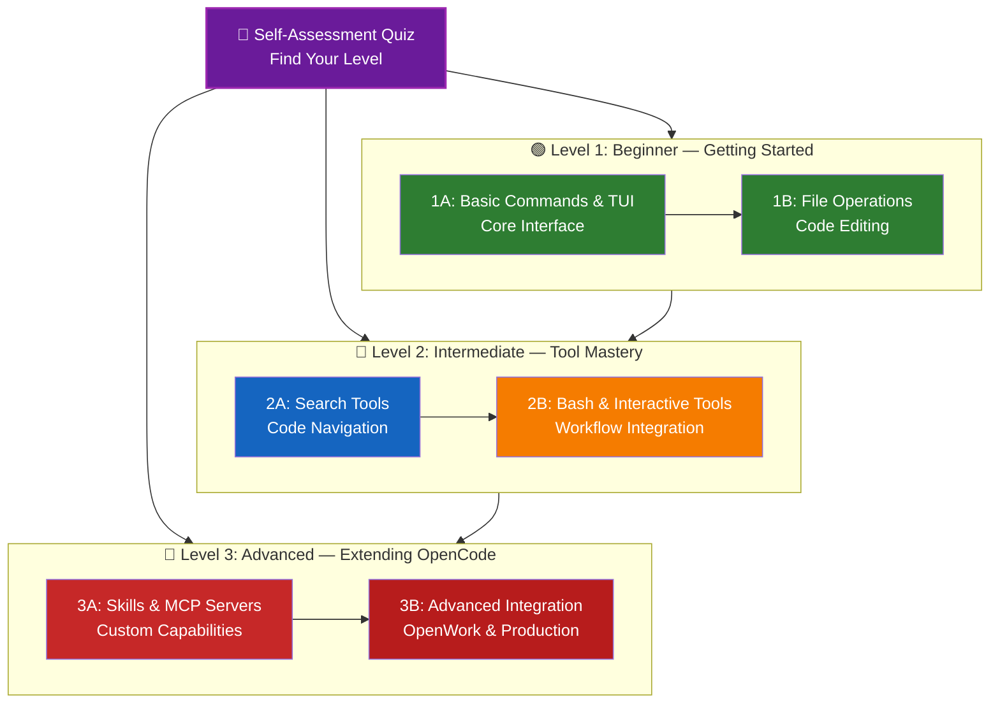

# 📚 OpenCode Primer Learning Roadmap

**New to opencode?** This guide helps you master opencode's AI coding agent capabilities at your own pace. Whether you're a complete beginner or an experienced developer, start with the self-assessment quiz below to find the right path for you.

---

## 🧭 Find Your Level

Not everyone starts from the same place. Take this quick self-assessment to find the right entry point.

**Answer these questions honestly:**

- I can run opencode and use the TUI interface
- I have used file tools (read, edit, write) to work with code
- I have used search tools (glob, grep, list) to find files and content
- I have used bash tool to execute shell commands
- I have used question and todowrite tools for interactive workflows
- I have used web tools (webfetch, websearch) for research
- I have configured skills or custom agents
- I have integrated MCP servers for external tool access

**Your Level:**

| Checks | Level                                           | Start At                                          | Time to Complete |
| ------ | ----------------------------------------------- | ------------------------------------------------- | ---------------- |
| 0-2    | **Level 1: Beginner** — Getting Started         | [Milestone 1A](#milestone-1a-basic-commands--tui) | ~2 hours         |
| 3-5    | **Level 2: Intermediate** — Building Workflows  | [Milestone 2A](#milestone-2a-search-tools)        | ~3 hours         |
| 6-8    | **Level 3: Advanced** — Power User & Automation | [Milestone 3A](#milestone-3a-skills--mcp-servers) | ~4 hours         |

> **Tip**: If you're unsure, start one level lower. It's better to review familiar material quickly than to miss foundational concepts.

---

## 🎯 Learning Philosophy

The folders in this repository are numbered in **recommended learning order** based on three key principles:

1. **Dependencies** - Foundational concepts come first
2. **Complexity** - Easier features before advanced ones
3. **Frequency of Use** - Most common features taught early

This approach ensures you build a solid foundation while gaining immediate productivity benefits.

---

## 🗺️ Your Learning Path



**Color Legend:**

- 💜 Purple: Self-Assessment Quiz
- 🟢 Green: Level 1 — Beginner path
- 🔵 Blue / 🟡 Gold: Level 2 — Intermediate path
- 🔴 Red: Level 3 — Advanced path

---

## 📊 Complete Roadmap Table

| Step   | Module                                    | Complexity        | Time      | Level   | Tools Covered               | Why Learn This        | Key Benefits                          |
| ------ | ----------------------------------------- | ----------------- | --------- | ------- | --------------------------- | --------------------- | ------------------------------------- |
| **1**  | [Basic Commands & TUI](01-basic-commands) | ⭐ Beginner        | 30 min    | Level 1 | TUI interface, `/` commands | Core opencode usage   | Understand interface fundamentals     |
| **2**  | [File Operations](02-file-operations)     | ⭐ Beginner+       | 45 min    | Level 1 | `read`, `edit`, `write`     | Work with code files  | Read, edit, and create files          |
| **3**  | [Search Tools](03-search-tools)           | ⭐⭐ Intermediate   | 45 min    | Level 2 | `glob`, `grep`, `list`      | Navigate codebases    | Find files and content efficiently    |
| **4**  | [Bash Integration](04-bash-integration)   | ⭐⭐ Intermediate   | 1 hour    | Level 2 | `bash`                      | System operations     | Execute shell commands                |
| **5**  | [Question & Todo Tools](05-question-todo) | ⭐⭐ Intermediate   | 20 min    | Level 2 | `question`, `todowrite`     | Interactive workflows | Gather input and track tasks          |
| **6**  | [Web Tools](06-web-tools)                 | ⭐⭐ Intermediate   | 45 min    | Level 2 | `webfetch`, `websearch`     | Research capabilities | Fetch web content and search online   |
| **7**  | [Skills & Agents](07-skills-agents)       | ⭐⭐⭐ Intermediate+ | 1 hour    | Level 3 | Skills, agents, commands    | Custom capabilities   | Skills, agents, commands, @-mentions  |
| **8**  | [MCP Servers](08-mcp-servers)             | ⭐⭐⭐ Intermediate+ | 1 hour    | Level 3 | Local/remote MCP, OAuth     | External tool access  | Connect to databases, APIs, services  |
| **9**  | [Advanced Features](09-advanced-features) | ⭐⭐⭐⭐ Advanced     | 1.5 hours | Level 3 | Plugins, tools, permissions | Power user config     | Plugins, custom tools, granular perms |
| **10** | [OpenWork Integration](10-openwork)       | ⭐⭐⭐⭐ Advanced     | 1 hour    | Level 3 | OpenWork platform           | Team collaboration    | Remote workspaces and shared agents   |

**Total Learning Time**: ~8-10 hours (or jump to your level and save time)

---

## 🟢 Level 1: Beginner — Getting Started

**For**: Users with 0-2 quiz checks  
**Time**: ~1.5 hours  
**Focus**: TUI interface and basic file operations  
**Outcome**: Comfortable using opencode for daily coding tasks

### Milestone 1A: Basic Commands & TUI

**Topics**: TUI Interface + Basic Commands  
**Time**: 30 min  
**Complexity**: ⭐ Beginner  
**Goal**: Understand opencode's interface and core workflow

#### What You'll Achieve

✅ Start and navigate the TUI interface  
✅ Use slash commands (`/help`, `/undo`, `/redo`)  
✅ Understand the conversation flow  
✅ Use file references with `@` symbol

#### Hands-on Exercises

```bash
# Exercise 1: Start opencode TUI
opencode

# Exercise 2: Get help
/help

# Exercise 3: Reference files in conversation
Look at the authentication code in @src/auth.js

# Exercise 4: Use undo/redo
/undo
/redo
```

#### Success Criteria

- Can start and exit opencode TUI
- Know how to get help within the interface
- Understand how to reference files with `@`
- Can undo and redo changes

#### Next Steps

Once comfortable, read:

- [01-basic-commands/README.md](01-basic-commands/README.md)

---

### Milestone 1B: File Operations

**Topics**: File Reading and Editing  
**Time**: 1 hour  
**Complexity**: ⭐ Beginner+  
**Goal**: Learn to read, edit, and create files using opencode tools

#### What You'll Achieve

✅ Read files and directories with the `read` tool  
✅ Edit existing files with exact string replacement  
✅ Create new files with the `write` tool  
✅ Understand opencode's file operation patterns

#### Hands-on Exercises

```bash
# Exercise 1: Explore files using the TUI
# Start opencode and ask it to read files
opencode
# In the TUI, type:
# "Show me the project structure"
# "Read @package.json"
# "Show the first 20 lines of @src/index.ts"

# Exercise 2: Edit a file via the TUI
# In the TUI, type:
# "Change the port from 3000 to 8080 in @config.json"

# Exercise 3: Batch edit via the TUI
# "Replace all 'var' with 'const' in the src/ directory"

# Exercise 4: Create a new file via the TUI
# "Create a new React component file called NewComponent.jsx"

# Or use non-interactive mode:
opencode run 'Show me the contents of package.json'
```

#### Success Criteria

- Can read project structure and file contents
- Successfully edit configuration and code files
- Create new files with proper content
- Understand when to use `read`, `edit`, and `write` tools

#### Next Steps

- Read: [02-file-operations/README.md](02-file-operations/README.md)
- **Ready for Level 2!** Proceed to [Milestone 2A](#milestone-2a-search-tools)

---

## 🔵 Level 2: Intermediate — Tool Mastery

**For**: Users with 3-5 quiz checks  
**Time**: ~3.5 hours  
**Focus**: Search, system operations, and interactive tools  
**Outcome**: Efficient codebase navigation and workflow integration

### Prerequisites Check

Before starting Level 2, make sure you're comfortable with these Level 1 concepts:

- Can use opencode TUI and basic commands ([01-basic-commands/](01-basic-commands))
- Can read, edit, and write files ([02-file-operations/](02-file-operations))

> **Gaps?** Review the linked tutorials above before continuing.

---

### Milestone 2A: Search Tools

**Topics**: Search Tools (glob, grep, list)  
**Time**: 45 min  
**Complexity**: ⭐⭐ Intermediate  
**Goal**: Efficiently navigate and search codebases

#### What You'll Achieve

✅ Find files by pattern with `glob`  
✅ Search file contents with `grep`  
✅ List directory contents with `list`  
✅ Combine search operations for complex queries

#### Hands-on Exercises

```bash
# Exercise 1: Find files by pattern
# These are tools the LLM uses inside the TUI. Try them via prompts:
opencode run 'Find all JavaScript files in this project'
opencode run 'Find all TypeScript files under src/'
opencode run 'List all markdown files in the root'

# Or use standard shell commands:
find . -name '*.js'
find src/ -name '*.ts' -o -name '*.tsx'
find . -maxdepth 1 -name '*.md'

# Exercise 2: Search file contents
# Via opencode TUI:
# "Search for TODO and FIXME comments in the codebase"
# "Find all function declarations in JavaScript files"

# Or use standard shell:
grep -rn 'TODO\|FIXME' --include='*.js' .
grep -rn 'function ' --include='*.js' .

# Exercise 3: List directory contents
ls -la src/
find tests/ -name '*.js'

# Exercise 4: Combine search operations
# Find TypeScript files containing interfaces
for file in $(find . -name '*.ts'); do
  grep -l 'interface ' "$file" 2>/dev/null
done
```

#### Success Criteria

- Can find files using glob patterns
- Can search file contents with grep
- Understand the difference between `glob`, `grep`, and `list`
- Can combine tools for complex queries

#### Next Steps

- Create custom search patterns for your projects
- Read: [03-search-tools/README.md](03-search-tools/README.md)

---

### Milestone 2B: Bash & Interactive Tools

**Topics**: Bash, Question, and Todo Tools  
**Time**: 2 hours  
**Complexity**: ⭐⭐ Intermediate  
**Goal**: Execute system operations and create interactive workflows

#### What You'll Achieve

✅ Run shell commands with `bash` tool  
✅ Ask users questions with `question` tool  
✅ Track tasks with `todowrite` tool  
✅ Create interactive automation workflows

#### Hands-on Exercises

```bash
# Exercise 1: Execute shell commands
# In the opencode TUI, the LLM uses the bash tool when you ask it to:
# "Run npm install"
# "Show me the git status"
# "Start docker compose"

# You can also prefix with ! in the TUI to run commands directly:
# !npm install
# !git status
# !docker-compose up -d

# Or use non-interactive mode:
opencode run 'Run npm install and show me the output'

# Exercise 2: Ask user questions
# The question tool is used by the LLM automatically when it needs input.
# In the TUI, the LLM might ask:
# "Which environment should we deploy to: development or production?"

# Exercise 3: Track tasks with todo lists
# The todowrite tool is used by the LLM to organize complex work.
# It will create and track tasks like:
# - [ ] Set up database connection
# - [ ] Implement authentication
# - [ ] Write tests

# Exercise 4: Combined workflow example
# In the TUI, type a comprehensive prompt:
# "Check our Node and npm versions, then build and deploy the project.
#  Ask me which environment to deploy to before proceeding."
```

#### Success Criteria

- Can execute shell commands for common development tasks
- Understand how opencode uses `question` for interactive workflows
- Know how `todowrite` helps track complex tasks
- Can combine multiple tools in workflows

#### Next Steps

- Create interactive scripts for your deployment process
- Read: [04-bash-integration/README.md](04-bash-integration/README.md)
- Read: [05-question-todo/README.md](05-question-todo/README.md)
- **Ready for Level 3!** Proceed to [Milestone 3A](#milestone-3a-skills--mcp-servers)

---

## 🔴 Level 3: Advanced — Extending OpenCode

**For**: Users with \(|$\|\|>5 quiz checks  
**Time**: ~4 hours  
**Focus**: Custom skills, MCP integration, and advanced configuration  
**Outcome**: Power user who can extend opencode with custom capabilities

### Prerequisites Check

Before starting Level 3, make sure you're comfortable with these Level 2 concepts:

- Can use search tools effectively ([03-search-tools/](03-search-tools))
- Can execute bash commands and use interactive tools ([04-bash-integration/](04-bash-integration), [05-question-todo/](05-question-todo))

> **Gaps?** Review the linked tutorials above before continuing.

---

### Milestone 3A: Skills & MCP Servers

**Topics**: Skills, Agents, and MCP Integration  
**Time**: engages hours  
**Complexity**: ⭐⭐⭐ Intermediate+  
**Goal**: Extend opencode with custom capabilities and external tools

#### What You'll Achieve

✅ Create and use skills with YAML frontmatter  
✅ Configure custom agents via Markdown and JSON  
✅ Create custom slash commands with template variables  
✅ Integrate local and remote MCP servers  
✅ Use @-mentions to direct subagents  
✅ Use web tools for research (`webfetch`, `websearch`)

#### Hands-on Exercises

```bash
# Exercise 1: Create a skill with frontmatter
# Create .opencode/skills/review.md with YAML frontmatter:
# ---
# name: review
# description: Code review guidelines
# ---

# Exercise 2: Create a custom agent
# Create .opencode/agents/security.md with Markdown frontmatter:
# ---
# description: Security auditor
# mode: subagent
# temperature: 0.1
# permission:
#   bash: deny
#   edit: deny
# ---

# Exercise 3: Create a custom command
# Create .opencode/commands/review.md:
# ---
# description: Review code
# agent: explore
# ---
# Review $ARGUMENTS for security and quality.
# Then use: /review src/auth.ts

# Exercise 4: @-mention subagents
# In the TUI: @explore analyze the project architecture

# Exercise 5: Integrate MCP servers
opencode mcp add  # Add local or remote server
opencode mcp list # Verify configuration
```

#### Success Criteria

- Understand how skills extend opencode's knowledge
- Can configure agents for specific tasks
- Know how to add MCP servers for external tool access
- Can use web tools for research and documentation

#### Next Steps

- Create skills for your team's coding standards
- Configure agents for different development tasks
- Read: [07-skills-agents/README.md](07-skills-agents/README.md)
- Read: [08-mcp-servers/README.md](08-mcp-servers/README.md)

---

### Milestone 3B: Advanced Integration

**Topics**: Advanced Features and OpenWork Integration  
**Time**: 2.5 hours  
**Complexity**: ⭐⭐⭐⭐ Advanced  
**Goal**: Master advanced configuration and team collaboration

#### What You'll Achieve

✅ Install and write plugins with event hooks  
✅ Create custom tools with TypeScript and Zod schemas  
✅ Configure granular permissions with glob patterns  
✅ Set up code formatters and LSP integration  
✅ Understand config precedence and variable substitution  
✅ Set up OpenWork for team collaboration

#### Hands-on Exercises

```bash
# Exercise 1: Install a plugin
# Add to opencode.json: "plugin": ["opencode-supermemory"]
# Restart OpenCode and verify it loaded

# Exercise 2: Create a custom tool
# Create .opencode/tools/hello.ts using tool() helper
# with Zod schema and execute function

# Exercise 3: Configure granular permissions
# In opencode.json, use object syntax:
# "bash": { "*": "ask", "git *": "allow", "rm *": "deny" }

# Exercise 4: Set up OpenWork
openwork start --workspace /path/to/project --approval auto
# Connect from desktop app with URL and token

# Exercise 5: Share and collaborate
/share   # Share session (returns opncd.ai URL)
opencode web  # Start web interface for browser access
```

#### Success Criteria

- Can install and create plugins with event hooks
- Can create custom tools the LLM can call
- Can configure granular permissions with command patterns
- Know how to use OpenWork for team collaboration
- Can set up sharing and web interface for collaboration

#### Next Steps

- Configure opencode for your team's security requirements
- Set up OpenWork for collaborative development
- Read: [09-advanced-features/README.md](09-advanced-features/README.md)
- Read: [10-openwork/README.md](10-openwork/README.md)

---

## 🧪 Test Your Knowledge

This repository includes quizzes you can use to evaluate your understanding:

| Quiz                     | Purpose                                             |
| ------------------------ | --------------------------------------------------- |
| **Basic Commands Quiz**  | Test your understanding of core opencode operations |
| **File Operations Quiz** | Evaluate your file editing and writing skills       |
| **Search Tools Quiz**    | Test your ability to find files and content         |
| **Automation Quiz**      | Evaluate your workflow creation skills              |

**Examples:**

- Take the Basic Commands Quiz after completing Level 1
- Take the Automation Quiz after completing Level 3
- Use quizzes to identify gaps in your knowledge

---

## ⚡ Quick Start Paths

### If You Only Have 15 Minutes

**Goal**: Get your first win with opencode

1. Run `opencode` to start the TUI
2. Try asking: "Explain the authentication code in @src/auth.js" (if you have such file)
3. Use `/help` to see available commands
4. Try `/undo` and `/redo` to understand the workflow

**Outcome**: You'll understand opencode's conversational interface

### If You Have 1 Hour

**Goal**: Set up essential productivity

1. **TUI basics** (15 min): Learn interface navigation
2. **File operations** (15 min): Read, edit, and create files
3. **Search tools** (15 min): Find files and code with glob and grep
4. **Bash commands** (15 min): Execute shell commands through opencode

**Outcome**: Basic productivity with core opencode tools

### If You Have a Weekend

**Goal**: Become proficient with opencode

**Saturday Morning** (3 hours):

- Complete Milestone 1A: Basic Commands & TUI
- Complete Milestone 1B: File Operations
- Complete Milestone 2A: Search Tools

**Saturday Afternoon** (3 hours):

- Complete Milestone 2B: Bash & Interactive Tools
- Complete Milestone 3A: Skills & MCP Servers

**Sunday** (3 hours):

- Complete Milestone 3B: Advanced Integration
- Configure opencode for your specific workflow
- Create custom skills or agents for your team

**Outcome**: You'll be an opencode power user ready to extend it with custom capabilities

---

## 💡 Learning Tips

### ✅ Do

- **Take the quiz first** to find your starting point
- **Complete hands-on exercises** for each milestone
- **Start simple** and add complexity gradually
- **Test each feature** before moving to the next
- **Take notes** on what works for your workflow
- **Refer back** to earlier concepts as you learn advanced topics
- **Experiment safely** with backups
- **Share knowledge** with your team

### ❌ Don't

- **Skip the prerequisites check** when jumping to a higher level
- **Try to learn everything at once** - it's overwhelming
- **Copy configurations without understanding them** - you won't know how to debug
- **Forget to test** - always verify features work
- **Rush through milestones** - take time to understand
- **Ignore the documentation** - each README has valuable details
- **Work in isolation** - discuss with teammates

---

## 📈 Progress Tracking

Use these checklists to track your progress by level.

### 🟢 Level 1: Beginner

- [ ] Completed [01-basic-commands](01-basic-commands)
- [ ] Completed [02-file-operations](02-file-operations)
- [ ] Can use opencode TUI interface
- [ ] Can read, edit, and write files
- [ ] **Milestone 1A achieved**
- [ ] Understand file reference with `@` symbol
- [ ] Can use `/undo` and `/redo`
- [ ] **Milestone 1B achieved**

### 🔵 Level 2: Intermediate

- [ ] Completed [03-search-tools](03-search-tools)
- [ ] Completed [04-bash-integration](04-bash-integration)
- [ ] Completed [05-question-todo](05-question-todo)
- [ ] Can find files with glob and grep
- [ ] Can execute shell commands
- [ ] **Milestone 2A achieved**
- [ ] Understand interactive tools (question, todowrite)
- [ ] Can use web tools (webfetch, websearch)
- [ ] **Milestone 2B achieved**

### 🔴 Level 3: Advanced

- [ ] Completed [07-skills-agents](07-skills-agents)
- [ ] Completed [08-mcp-servers](08-mcp-servers)
- [ ] Can create and use skills
- [ ] Can configure custom agents
- [ ] **Milestone 3A achieved**
- [ ] Completed [09-advanced-features](09-advanced-features)
- [ ] Completed [10-openwork](10-openwork)
- [ ] Can configure permissions and formatters
- [ ] Can set up OpenWork for collaboration
- [ ] **Milestone 3B achieved**

---

## 🆘 Common Learning Challenges

### Challenge 1: "Too many concepts at once"

**Solution**: Focus on one milestone at a time. Complete all exercises before moving forward.

### Challenge 2: "Don't know which feature to use when"

**Solution**: Refer to the [Feature Comparison](README.md#feature-comparison) in the main README.

### Challenge 3: "Command not working"

**Solution**: Check syntax, file paths, and permissions. Test with simpler examples first.

### Challenge 4: "Concepts seem to overlap"

**Solution**: Review the [Feature Comparison](README.md#feature-comparison) table to understand differences.

### Challenge 5: "Hard to remember everything"

**Solution**: Create your own cheat sheet. Practice with real projects.

### Challenge 6: "I'm experienced but not sure where to start"

**Solution**: Take the [Self-Assessment Quiz](#-find-your-level) above. Skip to your level and use the prerequisites check to identify any gaps.

---

## 🎯 What's Next After Completion?

Once you've completed all milestones:

1. **Create team documentation** - Document your team's opencode setup
2. **Build custom workflows** - Package your team's common tasks
3. **Integrate with existing tools** - Connect opencode with your current workflow
4. **Create training materials** - Help teammates learn
5. **Contribute examples** - Share with the community
6. **Optimize workflows** - Continuously improve based on usage
7. **Stay updated** - Follow opencode releases and new features

---

## 📚 Additional Resources

### Official Documentation

- [OpenCode Documentation](https://opencode.ai/docs)
- [OpenWork Platform Documentation](https://openwork.ai/docs)

### Community

- [OpenCode GitHub](https://github.com/anomalyco/opencode)
- [OpenWork Community](https://community.openwork.ai)

---

## 💬 Feedback & Support

- **Found an issue?** Create an issue in the repository
- **Have a suggestion?** Submit a pull request
- **Need help?** Check the documentation or ask the community

---

**Last Updated**: April 10, 2026  
**Maintained by**: OpenCode Guide Contributors  
**License**: Educational purposes, free to use and adapt

---

[← Back to Main README](README.md)
