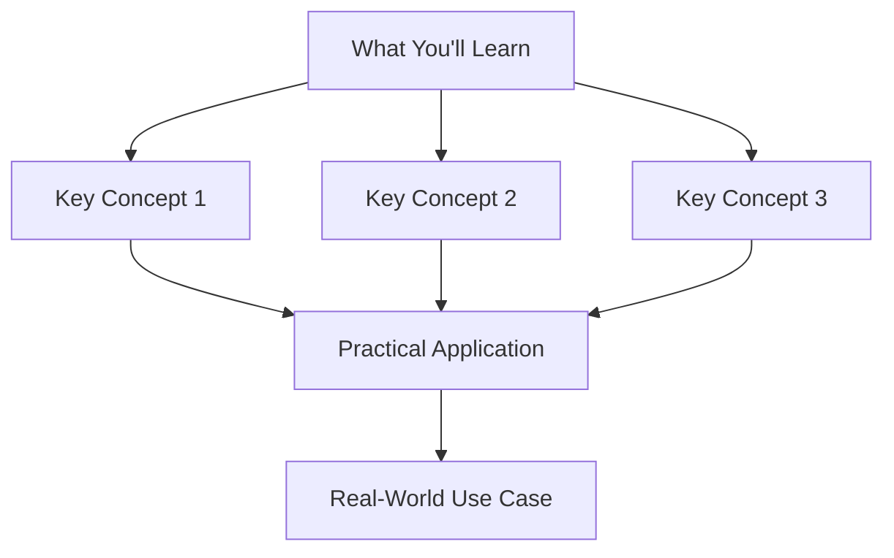
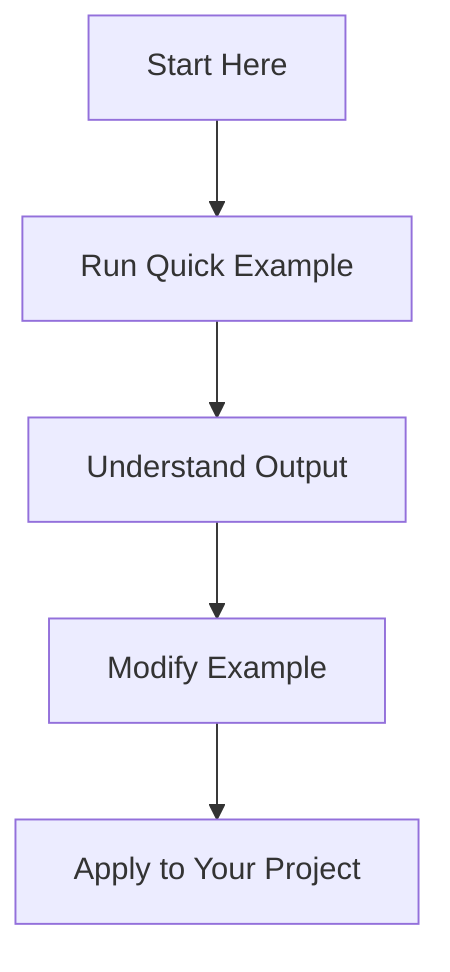
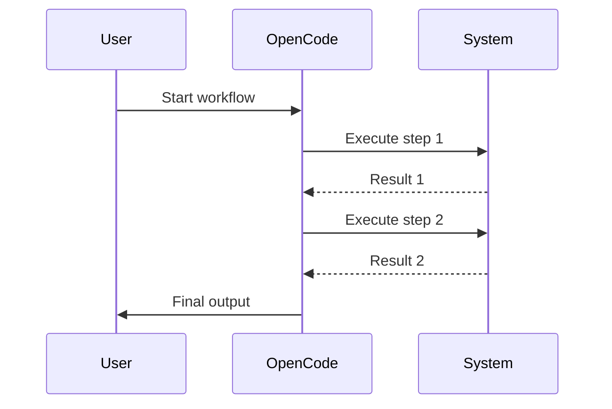

<div align="center">

# [EMOJI] Module Title

**Brief one-line description of what this module teaches**

[]()
[]()
[]()
[]()

**[Previous Module](../PREVIOUS-MODULE/)** • **[Next Module](../NEXT-MODULE/)** • **[Back to Main](../README.md)**

</div>

---

## 📋 Table of Contents

<details>
<summary>Click to expand/collapse</summary>

- [🎯 Overview](#-overview)
- [✅ Prerequisites](#-prerequisites)
- [⚡ Quick Start](#-quick-start)
- [📚 Core Concepts](#-core-concepts)
- [🔧 Examples & Patterns](#-examples--patterns)
- [🏗️ Real-World Workflows](#️-real-world-workflows)
- [🧪 Practice Exercises](#-practice-exercises)
- [❓ Common Questions](#-common-questions)
- [🐛 Troubleshooting](#-troubleshooting)
- [📈 What You've Learned](#-what-youve-learned)
- [🚶 Next Steps](#-next-steps)

</details>

---

## 🎯 Overview

<div align="center">



</div>

### 📝 What This Module Covers

| Topic | Description | Why It Matters |
|-------|-------------|----------------|
| **Topic 1** | Brief description | How it helps in real work |
| **Topic 2** | Brief description | Practical applications |
| **Topic 3** | Brief description | Integration with other tools |

### 🎓 Learning Objectives

By the end of this module, you'll be able to:

- ✅ **Objective 1** - Perform specific task
- ✅ **Objective 2** - Understand key concept
- ✅ **Objective 3** - Apply to real project
- ✅ **Objective 4** - Troubleshoot common issues

---

## ✅ Prerequisites

### 🔍 Check Your Setup

```bash
# Verify you have the required tools
opencode --version
# Should output: opencode 1.0+

# Check previous module knowledge
opencode bash "echo 'If you completed previous module, you should understand...'"
```

### 📚 Required Knowledge

- [ ] Completed [Previous Module](../PREVIOUS-MODULE/)
- [ ] Basic understanding of [Related Concept]
- [ ] Familiarity with [Tool/Technology]

### 🛠️ Required Tools

- [ ] OpenCode 1.0+
- [ ] Terminal/Command Line access
- [ ] Code editor
- [ ] Example files from `/examples/` folder

---

## ⚡ Quick Start

<div align="center">



</div>

### 🚀 Your First Command

```bash
# Copy this command and run it
opencode [command] [options]

# Example output will appear here
# This shows what you should see
```

### ✅ Verification

```bash
# Verify the command worked
echo "Checking results..."
# Your verification command here

# Expected output:
# [Expected output here]
```

---

## 📚 Core Concepts

### 🧠 Concept 1: [Name]

**What it is:**
Brief explanation of the concept.

**How it works:**
```bash
# Example showing the concept
opencode concept-example
```

**When to use it:**
- Situation 1
- Situation 2
- Situation 3

### 🧠 Concept 2: [Name]

**What it is:**
Brief explanation of the concept.

**How it works:**
```bash
# Example showing the concept
opencode concept-example
```

**When to use it:**
- Situation 1
- Situation 2
- Situation 3

---

## 🔧 Examples & Patterns

### 📖 Example 1: Basic Usage

<details>
<summary><strong>View full example with explanation</strong></summary>

**Goal:** Demonstrate basic functionality
**Time:** ~5 minutes
**Tools:** [Tool list]

```bash
#!/bin/bash
# Basic Example Script

echo "Starting example..."

# Step 1: Setup
echo "Creating test files..."
echo "test content" > example.txt

# Step 2: Execute
echo "Running command..."
opencode read example.txt

# Step 3: Verify
echo "Verifying results..."
cat example.txt

# Step 4: Cleanup
echo "Cleaning up..."
rm example.txt

echo "✅ Example complete!"
```

**Key Takeaways:**
- Takeaway 1
- Takeaway 2
- Takeaway 3

</details>

### 📖 Example 2: Intermediate Pattern

<details>
<summary><strong>View full example with explanation</strong></summary>

**Goal:** Show more advanced usage
**Time:** ~10 minutes
**Tools:** [Tool list]

```bash
#!/bin/bash
# Intermediate Example

# More complex example here
```

**Key Takeaways:**
- Takeaway 1
- Takeaway 2
- Takeaway 3

</details>

---

## 🏗️ Real-World Workflows

### 🔄 Workflow 1: [Use Case Name]

<details>
<summary><strong>View complete workflow</strong></summary>



**Implementation:**
```bash
#!/bin/bash
# Real-World Workflow Implementation

# Complete implementation here
```

**When to use this workflow:**
- Scenario 1
- Scenario 2
- Scenario 3

</details>

---

## 🧪 Practice Exercises

### 🎯 Exercise 1: Basic Practice

**Challenge:** [Brief description of challenge]

**Requirements:**
- Requirement 1
- Requirement 2
- Requirement 3

**Starter Code:**
```bash
#!/bin/bash
# Your solution here
```

<details>
<summary><strong>Solution</strong> (Try yourself first!)</summary>

```bash
#!/bin/bash
# Exercise Solution

# Solution code here
```

**Explanation:**
Explanation of solution.

</details>

---

## ❓ Common Questions

<details>
<summary><strong>FAQ for this module</strong></summary>

### 🤔 Question 1?
**Answer:** Detailed answer.

### 🤔 Question 2?
**Answer:** Detailed answer.

### 🤔 Question 3?
**Answer:** Detailed answer.

</details>

---

## 🐛 Troubleshooting

<details>
<summary><strong>Common issues and solutions</strong></summary>

### 🚫 Error: [Error message]
**Cause:** What causes this error
**Solution:** How to fix it
**Prevention:** How to avoid it

### 🚫 Error: [Error message]
**Cause:** What causes this error
**Solution:** How to fix it
**Prevention:** How to avoid it

### 🔧 Debugging Tips
- Tip 1
- Tip 2
- Tip 3

</details>

---

## 📈 What You've Learned

### 🎓 Knowledge Check

Test your understanding:

1. **Question 1?**
   - Option A
   - Option B
   - Option C ✓

2. **Question 2?**
   - Option A ✓
   - Option B
   - Option C

### ✅ Skills Acquired

| Skill | Proficiency | Evidence |
|-------|-------------|----------|
| **Skill 1** | □ Beginner<br>□ Intermediate<br>✅ Advanced | Can perform specific task |
| **Skill 2** | □ Beginner<br>□ Intermediate<br>✅ Advanced | Can apply in context |
| **Skill 3** | □ Beginner<br>□ Intermediate<br>✅ Advanced | Can troubleshoot issues |

### 🏆 Module Completion

Copy this when you complete the module:
```bash
echo "Completed [Module Name] on $(date)"
# Add to your learning log
```

---

## 🚶 Next Steps

### 📚 Continue Learning

- **Next Module:** [Next Module Name](../NEXT-MODULE/) - [Description]
- **Related Topic:** [Related Topic] - [Description]
- **Advanced Reading:** [Advanced Resource] - [Description]

### 🔧 Apply to Your Projects

**Beginner Project:** [Simple project idea]
**Intermediate Project:** [Medium project idea]
**Advanced Project:** [Complex project idea]

### 🤝 Share Your Progress

```markdown
[]()
```

---

<div align="center">

## 🎉 Congratulations!

You've completed this module. Ready for the next challenge?

**[⬅️ Previous Module](../PREVIOUS-MODULE/)** • **[🏠 Main Menu](../README.md)** • **[Next Module ➡️](../NEXT-MODULE/)**

</div>

---

## 📄 License & Attribution

This module is part of the [OpenCode Primer](../README.md).

**License:** MIT - See [LICENSE](../LICENSE) for details.

**Last Updated:** [Date]
**OpenCode Version:** 1.0+

---

<div align="center">

[](../README.md)

</div>