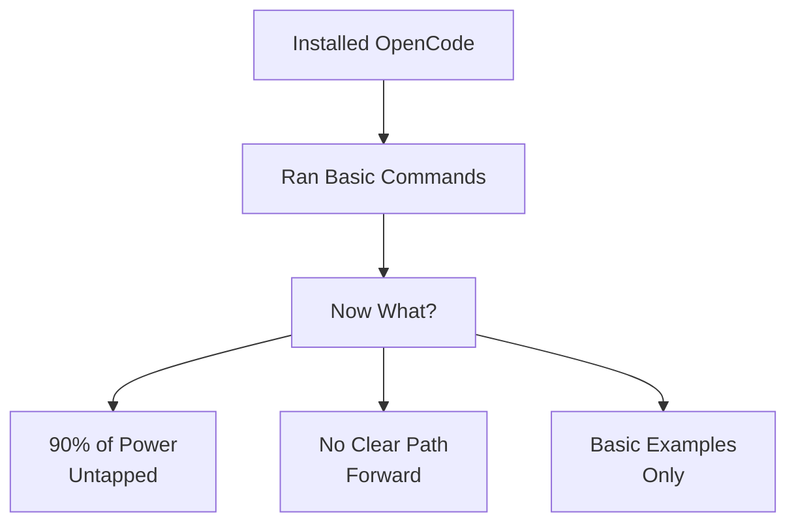
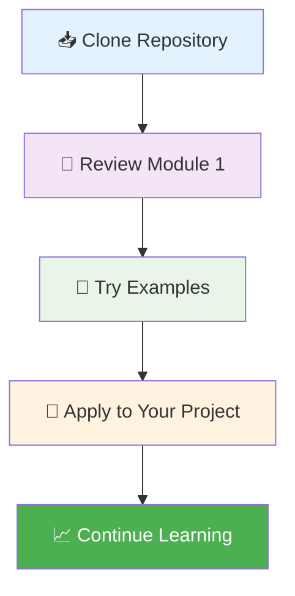
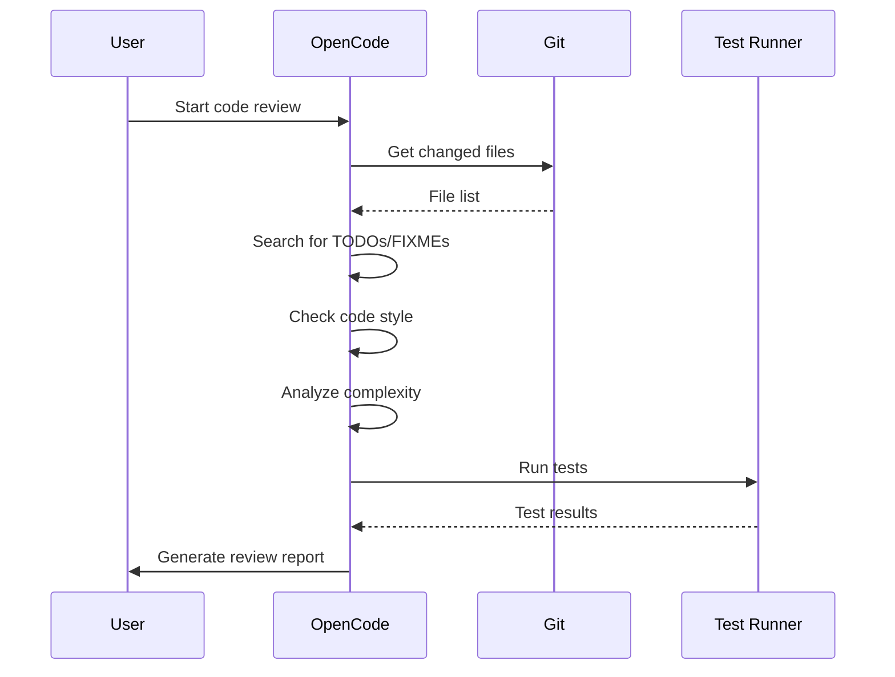

<div align="center">

# ⚡ OpenCode Primer

**Master the opencode AI coding agent with structured learning paths, real-world examples, and production-ready workflows.**

[](https://opensource.org/licenses/MIT)
[](https://opencode.ai)
[]()
[](CONTRIBUTING.md)
[]()
[]()

**[Get Started in 15 Minutes](#-get-started-in-15-minutes)** • **[Find Your Level](#-1-find-your-level)** • **[Browse Modules](#-learning-modules)** • **[Quick Reference](QUICK-REFERENCE.md)**

</div>

---

## 📋 Table of Contents

<details>
<summary>Click to expand/collapse</summary>

- [🎯 The Problem](#-the-problem)
- [✨ How This Guide Helps](#-how-this-guide-fixes-this)
- [⚙️ How It Works](#️-how-it-works)
- [⚡ Get Started in 15 Minutes](#-get-started-in-15-minutes)
- [📚 Learning Modules](#-learning-modules)
- [🏗️ What Can You Build?](#️-what-can-you-build-with-this)
- [❓ FAQ](#-faq)
- [🐛 Troubleshooting](#-troubleshooting)
- [🤝 Contributing](#-contributing)

</details>

## 🎯 The Problem

You installed opencode. You ran a few commands. Now what?

<div align="center">



</div>

### The Core Issues

| Problem                                    | Impact                                           | Solution in This Guide                                   |
| ------------------------------------------ | ------------------------------------------------ | -------------------------------------------------------- |
| **Feature descriptions without workflows** | You know tools exist but not how to combine them | **Production-ready templates** that chain tools together |
| **No structured learning path**            | You skim everything but master nothing           | **10 progressive modules** with clear prerequisites      |
| **Basic "hello world" examples**           | Can't build real automation pipelines            | **Real-world use cases** from code review to deployment  |
| **Missing troubleshooting guidance**       | Get stuck on simple issues                       | **Common pitfalls & solutions** for every module         |
| **No visual learning aids**                | Hard to grasp complex workflows                  | **Diagrams, flowcharts, and screenshots**                |

You're leaving **90% of opencode's power on the table** — and you don't know what you don't know.

---

## ✨ How This Guide Fixes This

This isn't another feature reference. It's a **structured, visual, example-driven guide** that teaches you to use every opencode feature with real-world templates you can apply immediately.

<div align="center">

### 📊 Comparison: Official Docs vs This Guide

|                    | **Official Documentation** | **This Primer**                    |
| ------------------ | -------------------------- | ---------------------------------- |
| **📚 Content Type** | Reference documentation    | Visual tutorials with examples     |
| **🎯 Focus**        | Feature descriptions       | How it works under the hood        |
| **💡 Examples**     | Basic snippets             | Production-ready workflows         |
| **🗺️ Organization** | Feature-organized          | Progressive learning path          |
| **🧭 Guidance**     | Self-directed              | Guided roadmap with time estimates |
| **📝 Assessment**   | None                       | Knowledge checks & skills checklist |
| **🖼️ Visuals**      | Minimal                    | Diagrams, flowcharts, screenshots  |
| **🔧 Templates**    | None                       | Copy-paste workflows               |

</div>

### 🎁 What You Get

<details>
<summary><strong>📦 Complete Learning Package</strong> (Click to expand)</summary>

- **🎯 10 progressive tutorial modules** covering all opencode built-in tools
- **🚀 Copy-paste workflows** — bash scripts, file editing, search patterns, automation templates
- **🏗️ Real-world examples** showing effective opencode usage in development workflows
- **🗺️ Guided learning path** from beginner to power user with time estimates
- **🤝 OpenWork integration** guidance for team collaboration workflows
- **🛡️ Troubleshooting guides** for common issues in each module
- **🧪 Knowledge checks** in every module to validate understanding
- **📊 [Skills checklist](SKILLS-CHECKLIST.md)** to track hands-on proficiency

</details>

**[🚀 Start the Learning Path ->](LEARNING-ROADMAP.md)**

---

## ⚙️ How It Works

<div align="center">


</div>

### 🎯 1. Find Your Level

Take the [self-assessment quiz](LEARNING-ROADMAP.md#-find-your-level). Get a personalized roadmap based on what you already know.

### 📚 2. Follow the Guided Path  

Work through **10 modules in order** — each builds on the last. Apply templates directly to your projects as you learn.

### ⚡ 3. Apply Templates Immediately

Copy-paste workflows into your projects. No abstract theory — just practical, working code.

### 🔄 4. Combine Features into Workflows

The real power is in **combining features**. Learn to wire bash + file operations + search + editing into automated pipelines.

### 🧪 5. Test Your Understanding

Complete the **Knowledge Check at the end of each module** to pinpoint what you missed, then track your progress on the **[Skills Checklist](SKILLS-CHECKLIST.md)**.

### 🏆 6. Master OpenCode

Become a power user who can automate complex development workflows with confidence.

**[⚡ Get Started in 15 Minutes](#-get-started-in-15-minutes)**

---

## 🤔 Not Sure Where to Start?

Take the **self-assessment** or pick your level below:

### 🎯 Quick Level Guide

| Level            | Badge | You Can...                     | Start Here                               | Time     |
| ---------------- | ----- | ------------------------------ | ---------------------------------------- | -------- |
| **Beginner**     | 🟢     | Run basic opencode commands    | [01 - Basic Commands](01-basic-commands) | ~2 hours |
| **Intermediate** | 🟡     | Use file operations and search | [03 - Search Tools](03-search-tools)     | ~3 hours |
| **Advanced**     | 🔴     | Create automation workflows    | [07 - Skills & Agents](07-skills-agents) | ~4 hours |

## 📚 Learning Modules

<div align="center">

### 🗺️ Complete Learning Path (10 Modules)

| #   | Module                                      | Level         | ⏱️ Time    | Status  |
| --- | ------------------------------------------- | ------------- | --------- | ------- |
| 1   | [🚀 Basic Commands & TUI](01-basic-commands) | Beginner      | 30 min    | ✅ Ready |
| 2   | [📁 File Operations](02-file-operations)     | Beginner+     | 45 min    | ✅ Ready |
| 3   | [🔍 Search Tools](03-search-tools)           | Beginner+     | 45 min    | ✅ Ready |
| 4   | [💻 Bash Integration](04-bash-integration)   | Intermediate  | 1 hour    | ✅ Ready |
| 5   | [❓ Question & Todo Tools](05-question-todo) | Intermediate  | 20 min    | ✅ Ready |
| 6   | [🌐 Web Tools](06-web-tools)                 | Intermediate  | 45 min    | ✅ Ready |
| 7   | [🤖 Skills & Agents](07-skills-agents)       | Intermediate+ | 1 hour    | ✅ Ready |
| 8   | [🔌 MCP Servers](08-mcp-servers)             | Intermediate+ | 1 hour    | ✅ Ready |
| 9   | [⚙️ Advanced Features](09-advanced-features) | Advanced      | 1.5 hours | ✅ Ready |
| 10  | [🤝 OpenWork Integration](10-openwork)       | Advanced      | 1 hour    | ✅ Ready |

**📊 Total Time Estimate:** ~10 hours

```mermaid
gantt
    title OpenCode Primer Learning Timeline
    dateFormat  HH:mm
    axisFormat %H:%M
    
    section Beginner (2.5 hrs)
    Module 1 - Basic Commands :m1, 00:00, 30m
    Module 2 - File Operations :m2, after m1, 45m
    Module 3 - Search Tools    :m3, after m2, 45m
    
    section Intermediate (4 hrs)
    Module 4 - Bash Integration :m4, after m3, 60m
    Module 5 - Q&A Tools        :m5, after m4, 45m
    Module 6 - Web Tools        :m6, after m5, 45m
    Module 7 - Skills & Agents  :m7, after m6, 60m
    
    section Advanced (2.5 hrs)
    Module 8 - MCP Servers     :m8, after m7, 60m
    Module 9 - Advanced Features :m9, after m8, 90m
    Module 10 - OpenWork        :m10, after m9, 60m
```

</div>

<details>
<summary><strong>📈 Learning Progression Chart</strong> (Click to expand)</summary>



</details>

**[📖 Complete Learning Roadmap ->](LEARNING-ROADMAP.md)**

---

## ⚡ Get Started in 15 Minutes

<div align="center">



</div>

### 🚀 Quick Start Script

```bash tab="Quick Start"
#!/bin/bash

# 1. Clone the primer
git clone https://github.com/your-username/opencode-primer.git
cd opencode-primer

# 2. Verify your opencode installation
opencode --version

# 3. Try your first command from Module 1
cat 01-basic-commands/examples/sample-project/hello.js

# 4. Open the quick reference
cat QUICK-REFERENCE.md | head -50
```

```bash tab="1-Hour Essential Setup"
# Basic commands (15 min)
cp -r 01-basic-commands/examples/ ~/opencode-practice/

# File operations (15 min)
cp 02-file-operations/examples/sample-app/src/main.ts ~/opencode-practice/

# Search patterns (15 min)
grep -r "function" 03-search-tools/ --include="*.md"

# Bash integration (15 min)
cd ~/opencode-practice && bash -c "echo 'Testing bash integration'"
```

### ✅ Verification Steps

<details>
<summary><strong>Check Your Setup</strong> (Click to expand)</summary>

1. **Verify OpenCode Installation:**

   ```bash
   opencode --version
   # Should output: opencode 1.0+ (or similar)
   ```

2. **Test Basic Command:**

   ```bash
   opencode
   # Should open the TUI interface
   ```

3. **Check File Operations:**

   ```bash
   ls -la 01-basic-commands/examples/
   # Should show sample files
   ```

4. **Validate Quick Reference:**

   ```bash
   head -20 QUICK-REFERENCE.md
   # Should show quick reference table
   ```

</details>

### 🎯 15-Minute Achievement

By the end of 15 minutes, you should be able to:

- ✅ Navigate the primer structure
- ✅ Run basic opencode commands
- ✅ Access the quick reference
- ✅ Understand the learning path

**Weekend Goal:** Complete modules 1-3 and start applying automation workflows to your projects.

**[📚 Continue to Module 1 ->](01-basic-commands/)**

---

## 🏗️ What Can You Build With This?

<div align="center">

### 🔧 Real-World Use Cases

| Use Case                     | 🎯 Goal                              | ⚙️ Features Combined                   | Module |
| ---------------------------- | ----------------------------------- | ------------------------------------- | ------ |
| **Code Review Automation**   | Automate code quality checks        | 🔍 Search + 📁 File Ops + 💻 Bash        | 1-4    |
| **Refactoring Workflows**    | Safe, batch code modifications      | ✏️ Edit + 🔍 Search + 🤖 Automation      | 2-3-7  |
| **CI/CD Integration**        | Streamline deployment pipelines     | 💻 Bash + 🤖 Automation + 🔄 Workflows   | 4-7-9  |
| **Documentation Generation** | Auto-generate project docs          | 📁 File Ops + 🔍 Search + 🤖 Automation  | 2-3-7  |
| **Security Audits**          | Find vulnerabilities in codebase    | 🔍 Search + 📖 File Reading + 💻 Bash    | 3-2-4  |
| **DevOps Pipelines**         | Infrastructure as code workflows    | 🤖 Automation + 💻 Bash + 🔄 Workflows   | 7-4-9  |
| **Complex Refactoring**      | Large-scale code migrations         | 🔍 Search + ✏️ Edit + 🤖 Task Automation | 3-2-7  |
| **API Client Generation**    | Auto-create API clients from docs   | 🌐 Web Tools + 📁 File Ops + 🤖 Agents   | 6-2-7  |
| **Database Migrations**      | Schema updates with data transforms | 🔌 MCP Servers + 🤖 Automation          | 8-7    |
| **Team Collaboration**       | Shared development workflows        | 🤝 OpenWork + 🔄 Workflows + 🤖 Agents   | 10-9-7 |

</div>

### 🎬 Example Workflow: Code Review Automation

<details>
<summary><strong>See the complete workflow</strong> (Click to expand)</summary>



**Implementation:**

```bash
#!/bin/bash
# Code Review Automation Script

# 1. Get changed files
changed_files=$(git diff --name-only HEAD~1 HEAD)

# 2. Search for issues
for file in $changed_files; do
    grep -n 'TODO\|FIXME\|BUG' "$file" 2>/dev/null
    grep -n 'console\.log\|print(' "$file" 2>/dev/null  # Debug statements
done

# 3. Check code style
npm run lint

# 4. Run tests
npm test

# 5. Generate report
echo "Code Review Complete" > review_report.md
```

</details>

### 🏆 Skill Progression

| Level            | Capabilities                      | Projects You Can Build              |
| ---------------- | --------------------------------- | ----------------------------------- |
| **Beginner**     | Basic commands, file reading      | Script organization, simple edits   |
| **Intermediate** | Search patterns, bash integration | Code cleanup, documentation scripts |
| **Advanced**     | Automation, MCP servers, agents   | CI/CD pipelines, refactoring tools  |
| **Expert**       | OpenWork, complex workflows       | Team automation, production systems |

**[🔧 Browse Example Workflows ->](CATALOG.md#example-workflows)**

---

## ❓ FAQ

<details>
<summary><strong>General Questions</strong></summary>

### 🤔 Is this free?

**Yes!** MIT licensed, free forever. Use it in personal projects, at work, in your team — no restrictions beyond including the license notice.

### 🔄 Is this maintained?

**Yes!** The primer is updated regularly with new opencode features and best practices. Last updated: April 2026.

### 📚 How is this different from official docs?

The official docs are a **feature reference**. This primer is a **tutorial** with examples, production-ready templates, and a progressive learning path. They complement each other — start here to learn, reference the docs when you need specifics.

</details>

<details>
<summary><strong>Learning & Usage</strong></summary>

### ⏱️ How long does it take?

- **Quick start:** 15 minutes (get value immediately)
- **Full path:** 10-12 hours (become proficient)
- **Module average:** 45-60 minutes each

### 🎯 Who is this for?

- **Developers** new to opencode
- **Teams** adopting AI coding agents
- **DevOps engineers** building automation
- **Anyone** wanting to improve coding productivity

### 💻 What do I need to start?

- OpenCode installed (version 1.0+)
- Basic terminal knowledge
- A code editor
- 15 minutes of focused time

</details>

<details>
<summary><strong>Contribution & Support</strong></summary>

### 🤝 Can I contribute?

**Absolutely!** See [CONTRIBUTING.md](CONTRIBUTING.md) for guidelines. We welcome:

- New examples and templates
- Bug fixes and improvements
- Documentation enhancements
- Community workflows

### 📖 Can I read this offline?

**Yes!** All content is available as Markdown files you can read locally. No internet required after cloning.

### 🆘 Where can I get help?

- **Issues:** GitHub Issues for bugs
- **Discussions:** Community forums (coming soon)
- **Contributing:** PRs for improvements
- **Email:** Contact through GitHub

</details>

<details>
<summary><strong>Technical Details</strong></summary>

### 🔧 What OpenCode version is required?

**OpenCode 1.0 or higher.** Some advanced features may require newer versions.

### 🖥️ What platforms are supported?

- **Linux** (primary development platform)
- **macOS** (fully compatible)
- **Windows** (WSL2 recommended for TUI; native support via Scoop/Chocolatey)
- **Desktop App (BETA):** A native desktop app is available for macOS, Windows, and Linux at [opencode.ai/download](https://opencode.ai/download)

### 📦 How do I install OpenCode?

Multiple options — pick whichever fits your environment:

- **curl:** `curl -fsSL https://opencode.ai/install | bash`
- **npm:** `npm i -g opencode-ai@latest`
- **Homebrew:** `brew install anomalyco/tap/opencode`
- **Scoop (Windows):** `scoop install opencode`
- **Chocolatey (Windows):** `choco install opencode`
- **Arch Linux:** `pacman -S opencode` or `paru -S opencode`
- **Nix:** `nix profile install nixpkgs#opencode-ai`
- **mise:** `mise use -g opencode-ai`

See [Module 01](01-basic-commands/) for the full setup guide.

### 🔄 How often is this updated?

Regularly! We track OpenCode releases and update examples and best practices accordingly.

</details>

---

[⬆ Back to top](#-opencode-primer)

---

## 🐛 Troubleshooting

| Issue                    | Quick Fix                                                        |
| ------------------------ | ---------------------------------------------------------------- |
| `command not found`      | Verify install: `which opencode` — check your `$PATH`            |
| TUI not starting         | Try `TERM=xterm opencode` — check terminal compatibility         |
| `permission denied`      | `chmod +x` the file, or check `opencode.json` permissions config |
| TUI unresponsive         | Press `Ctrl+C` to interrupt; worst case: `pkill -f opencode`     |
| MCP server won't connect | Run `opencode mcp debug` — check `opencode.json` for typos       |

**[📖 Full Troubleshooting Guide ->](TROUBLESHOOTING.md)** — covers file operations, search, debugging workflows, and emergency recovery.

[⬆ Back to top](#-opencode-primer)

---

## 🤝 Contributing

We welcome contributions! See **[CONTRIBUTING.md](CONTRIBUTING.md)** for guidelines.

Quick start: fork → branch → edit → PR. See also [CODE_OF_CONDUCT.md](CODE_OF_CONDUCT.md).

---

## 📄 License

MIT License — see [LICENSE](LICENSE). Free to use, modify, and distribute.

---

<div align="center">

**[Start Learning](LEARNING-ROADMAP.md)** • **[Quick Reference](QUICK-REFERENCE.md)** • **[Skills Checklist](SKILLS-CHECKLIST.md)** • **[Troubleshooting](TROUBLESHOOTING.md)** • **[Catalog](CATALOG.md)**

**Last Updated:** April 2026 • **OpenCode Version:** 1.0+

</div>
