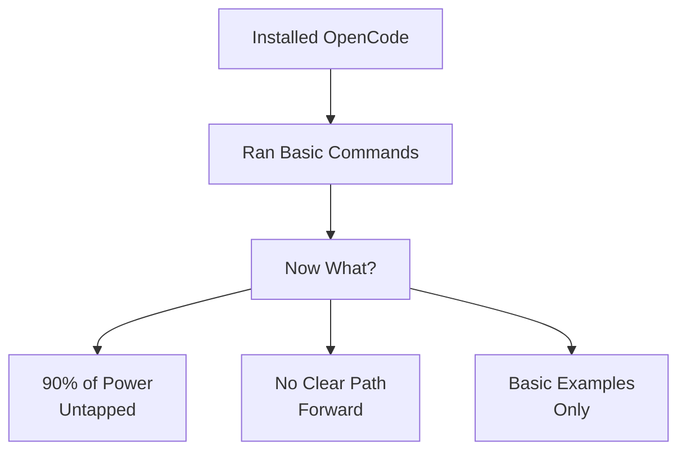
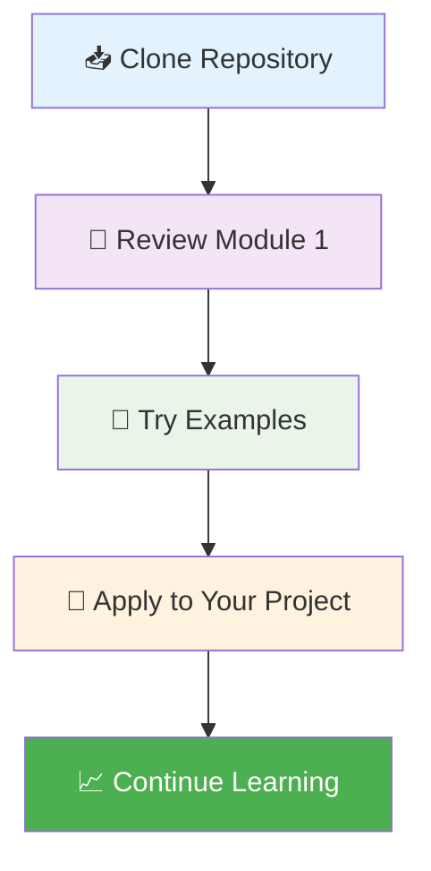
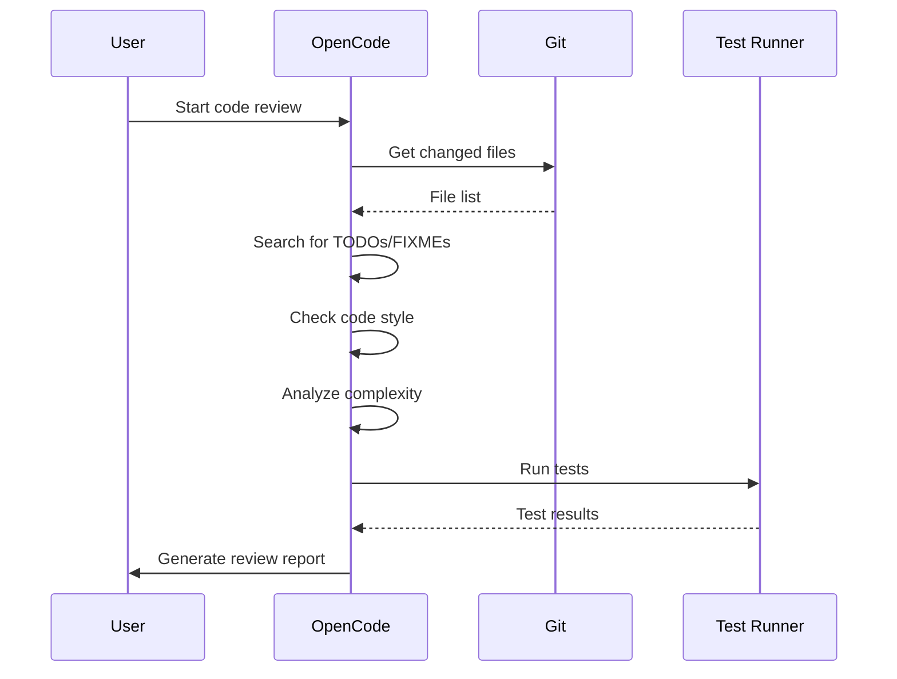

<div align="center">

# ⚡ OpenCode Primer

**Master the opencode AI coding agent with structured learning paths, real-world examples, and production-ready workflows.**

[](https://opensource.org/licenses/MIT)
[](https://opencode.ai)
[]()
[](CONTRIBUTING.md)
[]()
[]()

**[Get Started in 15 Minutes](#-get-started-in-15-minutes)** • **[Find Your Level](#-find-your-level)** • **[Browse Modules](#-learning-modules)** • **[Quick Reference](QUICK-REFERENCE.md)**


</div>

---

## 📋 Table of Contents

<details>
<summary>Click to expand/collapse</summary>

- [🚀 Overview](#-overview)
- [🎯 The Problem](#-the-problem)
- [✨ How This Guide Fixes This](#-how-this-guide-fixes-this)
- [⚙️ How It Works](#️-how-it-works)
- [🤔 Not Sure Where to Start?](#-not-sure-where-to-start)
- [⚡ Get Started in 15 Minutes](#-get-started-in-15-minutes)
- [🏗️ What Can You Build With This?](#️-what-can-you-build-with-this)
- [📚 Learning Modules](#-learning-modules)
- [❓ FAQ](#-faq)
- [🛠️ Quick Start Examples](#️-quick-start-examples)
- [🐛 Troubleshooting](#-troubleshooting)
- [🤝 Contributing](#-contributing)
- [📄 License](#-license)
- [📊 Progress Tracking](#-progress-tracking)

</details>

## 🎯 The Problem

You installed opencode. You ran a few commands. Now what?

<div align="center">



</div>

### The Core Issues:

| Problem | Impact | Solution in This Guide |
|---------|--------|------------------------|
| **Feature descriptions without workflows** | You know tools exist but not how to combine them | **Production-ready templates** that chain tools together |
| **No structured learning path** | You skim everything but master nothing | **10 progressive modules** with clear prerequisites |
| **Basic "hello world" examples** | Can't build real automation pipelines | **Real-world use cases** from code review to deployment |
| **Missing troubleshooting guidance** | Get stuck on simple issues | **Common pitfalls & solutions** for every module |
| **No visual learning aids** | Hard to grasp complex workflows | **Diagrams, flowcharts, and screenshots** |

You're leaving **90% of opencode's power on the table** — and you don't know what you don't know.

---

## ✨ How This Guide Fixes This

This isn't another feature reference. It's a **structured, visual, example-driven guide** that teaches you to use every opencode feature with real-world templates you can apply immediately.

<div align="center">

### 📊 Comparison: Official Docs vs This Guide

| | **Official Documentation** | **This Primer** |
|-|----------------------------|-----------------|
| **📚 Content Type** | Reference documentation | Visual tutorials with examples |
| **🎯 Focus** | Feature descriptions | How it works under the hood |
| **💡 Examples** | Basic snippets | Production-ready workflows |
| **🗺️ Organization** | Feature-organized | Progressive learning path |
| **🧭 Guidance** | Self-directed | Guided roadmap with time estimates |
| **📝 Assessment** | None | Interactive quizzes to find gaps |
| **🖼️ Visuals** | Minimal | Diagrams, flowcharts, screenshots |
| **🔧 Templates** | None | Copy-paste workflows |

</div>

### 🎁 What You Get:

<details>
<summary><strong>📦 Complete Learning Package</strong> (Click to expand)</summary>

- **🎯 10 progressive tutorial modules** covering all opencode built-in tools
- **🚀 Copy-paste workflows** — bash scripts, file editing, search patterns, automation templates
- **🏗️ Real-world examples** showing effective opencode usage in development workflows
- **🗺️ Guided learning path** from beginner to power user with time estimates
- **🤝 OpenWork integration** guidance for team collaboration workflows
- **🛡️ Troubleshooting guides** for common issues in each module
- **🧪 Knowledge checks & quizzes** to validate understanding
- **📊 Progress tracking** to monitor your learning journey

</details>

**[🚀 Start the Learning Path ->](LEARNING-ROADMAP.md)**

---

## ⚙️ How It Works

<div align="center">


</div>

### 🎯 1. Find Your Level
Take the [self-assessment quiz](LEARNING-ROADMAP.md#-find-your-level). Get a personalized roadmap based on what you already know.

### 📚 2. Follow the Guided Path  
Work through **10 modules in order** — each builds on the last. Apply templates directly to your projects as you learn.

### ⚡ 3. Apply Templates Immediately
Copy-paste workflows into your projects. No abstract theory — just practical, working code.

### 🔄 4. Combine Features into Workflows
The real power is in **combining features**. Learn to wire bash + file operations + search + editing into automated pipelines.

### 🧪 5. Test Your Understanding
Take **quizzes after each module** to pinpoint what you missed and fill gaps fast.

### 🏆 6. Master OpenCode
Become a power user who can automate complex development workflows with confidence.

**[⚡ Get Started in 15 Minutes](#-get-started-in-15-minutes)**

---

## 🤔 Not Sure Where to Start?

Take the **self-assessment** or pick your level below:

### 🎯 Quick Level Guide

| Level | Badge | You Can... | Start Here | Time |
|-------|-------|------------|------------|------|
| **Beginner** | 🟢 | Run basic opencode commands | [01 - Basic Commands](01-basic-commands) | ~2 hours |
| **Intermediate** | 🟡 | Use file operations and search | [03 - Search Tools](03-search-tools) | ~3 hours |
| **Advanced** | 🔴 | Create automation workflows | [07 - Skills & Agents](07-skills-agents) | ~4 hours |

## 📚 Learning Modules

<div align="center">

### 🗺️ Complete Learning Path (10 Modules)

| # | Module | Level | ⏱️ Time | Status |
|---|--------|-------|---------|--------|
| 1 | [🚀 Basic Commands & TUI](01-basic-commands) | Beginner | 30 min | ✅ Ready |
| 2 | [📁 File Operations](02-file-operations) | Beginner+ | 45 min | ✅ Ready |
| 3 | [🔍 Search Tools](03-search-tools) | Beginner+ | 45 min | ✅ Ready |
| 4 | [💻 Bash Integration](04-bash-integration) | Intermediate | 1 hour | ✅ Ready |
| 5 | [❓ Question & Todo Tools](05-question-todo) | Intermediate | 45 min | ✅ Ready |
| 6 | [🌐 Web Tools](06-web-tools) | Intermediate | 45 min | ✅ Ready |
| 7 | [🤖 Skills & Agents](07-skills-agents) | Intermediate+ | 1 hour | ✅ Ready |
| 8 | [🔌 MCP Servers](08-mcp-servers) | Intermediate+ | 1 hour | ✅ Ready |
| 9 | [⚙️ Advanced Features](09-advanced-features) | Advanced | 1.5 hours | ✅ Ready |
| 10 | [🤝 OpenWork Integration](10-openwork) | Advanced | 1 hour | ✅ Ready |

**📊 Total Time Estimate:** ~10 hours

```mermaid
gantt
    title OpenCode Primer Learning Timeline
    dateFormat  HH:mm
    axisFormat %H:%M
    
    section Beginner (2.5 hrs)
    Module 1 - Basic Commands :m1, 00:00, 30m
    Module 2 - File Operations :m2, after m1, 45m
    Module 3 - Search Tools    :m3, after m2, 45m
    
    section Intermediate (4 hrs)
    Module 4 - Bash Integration :m4, after m3, 60m
    Module 5 - Q&A Tools        :m5, after m4, 45m
    Module 6 - Web Tools        :m6, after m5, 45m
    Module 7 - Skills & Agents  :m7, after m6, 60m
    
    section Advanced (2.5 hrs)
    Module 8 - MCP Servers     :m8, after m7, 60m
    Module 9 - Advanced Features :m9, after m8, 90m
    Module 10 - OpenWork        :m10, after m9, 60m
```

</div>

<details>
<summary><strong>📈 Learning Progression Chart</strong> (Click to expand)</summary>



</details>

**[📖 Complete Learning Roadmap ->](LEARNING-ROADMAP.md)**

---

## ⚡ Get Started in 15 Minutes

<div align="center">



</div>

### 🚀 Quick Start Script

```bash tab="Quick Start"
#!/bin/bash

# 1. Clone the primer
git clone https://github.com/your-username/opencode-primer.git
cd opencode-primer

# 2. Verify your opencode installation
opencode --version

# 3. Try your first command from Module 1
cat 01-basic-commands/examples/sample-project/hello.js

# 4. Open the quick reference
cat QUICK-REFERENCE.md | head -50
```

```bash tab="1-Hour Essential Setup"
# Basic commands (15 min)
cp -r 01-basic-commands/examples/ ~/opencode-practice/

# File operations (15 min)
cp 02-file-operations/examples/sample-app/src/main.ts ~/opencode-practice/

# Search patterns (15 min)
grep -r "function" 03-search-tools/ --include="*.md"

# Bash integration (15 min)
cd ~/opencode-practice && bash -c "echo 'Testing bash integration'"
```

### ✅ Verification Steps

<details>
<summary><strong>Check Your Setup</strong> (Click to expand)</summary>

1. **Verify OpenCode Installation:**
   ```bash
   opencode --version
   # Should output: opencode 1.0+ (or similar)
   ```

2. **Test Basic Command:**
   ```bash
   opencode
   # Should open the TUI interface
   ```

3. **Check File Operations:**
   ```bash
   ls -la 01-basic-commands/examples/
   # Should show sample files
   ```

4. **Validate Quick Reference:**
   ```bash
   head -20 QUICK-REFERENCE.md
   # Should show quick reference table
   ```

</details>

### 🎯 15-Minute Achievement

By the end of 15 minutes, you should be able to:
- ✅ Navigate the primer structure
- ✅ Run basic opencode commands
- ✅ Access the quick reference
- ✅ Understand the learning path

**Weekend Goal:** Complete modules 1-3 and start applying automation workflows to your projects.

**[📚 Continue to Module 1 ->](01-basic-commands/)**

---

## 🏗️ What Can You Build With This?

<div align="center">

### 🔧 Real-World Use Cases

| Use Case | 🎯 Goal | ⚙️ Features Combined | Module |
|----------|---------|----------------------|--------|
| **Code Review Automation** | Automate code quality checks | 🔍 Search + 📁 File Ops + 💻 Bash | 1-4 |
| **Refactoring Workflows** | Safe, batch code modifications | ✏️ Edit + 🔍 Search + 🤖 Automation | 2-3-7 |
| **CI/CD Integration** | Streamline deployment pipelines | 💻 Bash + 🤖 Automation + 🔄 Workflows | 4-7-9 |
| **Documentation Generation** | Auto-generate project docs | 📁 File Ops + 🔍 Search + 🤖 Automation | 2-3-7 |
| **Security Audits** | Find vulnerabilities in codebase | 🔍 Search + 📖 File Reading + 💻 Bash | 3-2-4 |
| **DevOps Pipelines** | Infrastructure as code workflows | 🤖 Automation + 💻 Bash + 🔄 Workflows | 7-4-9 |
| **Complex Refactoring** | Large-scale code migrations | 🔍 Search + ✏️ Edit + 🤖 Task Automation | 3-2-7 |
| **API Client Generation** | Auto-create API clients from docs | 🌐 Web Tools + 📁 File Ops + 🤖 Agents | 6-2-7 |
| **Database Migrations** | Schema updates with data transforms | 🔌 MCP Servers + 🤖 Automation | 8-7 |
| **Team Collaboration** | Shared development workflows | 🤝 OpenWork + 🔄 Workflows + 🤖 Agents | 10-9-7 |

</div>

### 🎬 Example Workflow: Code Review Automation

<details>
<summary><strong>See the complete workflow</strong> (Click to expand)</summary>



**Implementation:**
```bash
#!/bin/bash
# Code Review Automation Script

# 1. Get changed files
changed_files=$(git diff --name-only HEAD~1 HEAD)

# 2. Search for issues
for file in $changed_files; do
    opencode grep "TODO\|FIXME\|BUG" "$file"
    opencode grep "console\.log\|print\(" "$file"  # Debug statements
done

# 3. Check code style
opencode bash "npm run lint"

# 4. Run tests
opencode bash "npm test"

# 5. Generate report
echo "Code Review Complete" > review_report.md
```

</details>

### 🏆 Skill Progression

| Level | Capabilities | Projects You Can Build |
|-------|--------------|------------------------|
| **Beginner** | Basic commands, file reading | Script organization, simple edits |
| **Intermediate** | Search patterns, bash integration | Code cleanup, documentation scripts |
| **Advanced** | Automation, MCP servers, agents | CI/CD pipelines, refactoring tools |
| **Expert** | OpenWork, complex workflows | Team automation, production systems |

**[🔧 Browse Example Workflows ->](CATALOG.md#example-workflows)**

---

## ❓ FAQ

<details>
<summary><strong>General Questions</strong></summary>

### 🤔 Is this free?
**Yes!** MIT licensed, free forever. Use it in personal projects, at work, in your team — no restrictions beyond including the license notice.

### 🔄 Is this maintained?
**Yes!** The primer is updated regularly with new opencode features and best practices. Last updated: April 2026.

### 📚 How is this different from official docs?
The official docs are a **feature reference**. This primer is a **tutorial** with examples, production-ready templates, and a progressive learning path. They complement each other — start here to learn, reference the docs when you need specifics.

</details>

<details>
<summary><strong>Learning & Usage</strong></summary>

### ⏱️ How long does it take?
- **Quick start:** 15 minutes (get value immediately)
- **Full path:** 10-12 hours (become proficient)
- **Module average:** 45-60 minutes each

### 🎯 Who is this for?
- **Developers** new to opencode
- **Teams** adopting AI coding agents
- **DevOps engineers** building automation
- **Anyone** wanting to improve coding productivity

### 💻 What do I need to start?
- OpenCode installed (version 1.0+)
- Basic terminal knowledge
- A code editor
- 15 minutes of focused time

</details>

<details>
<summary><strong>Contribution & Support</strong></summary>

### 🤝 Can I contribute?
**Absolutely!** See [CONTRIBUTING.md](CONTRIBUTING.md) for guidelines. We welcome:
- New examples and templates
- Bug fixes and improvements
- Documentation enhancements
- Community workflows

### 📖 Can I read this offline?
**Yes!** All content is available as Markdown files you can read locally. No internet required after cloning.

### 🆘 Where can I get help?
- **Issues:** GitHub Issues for bugs
- **Discussions:** Community forums (coming soon)
- **Contributing:** PRs for improvements
- **Email:** Contact through GitHub

</details>

<details>
<summary><strong>Technical Details</strong></summary>

### 🔧 What OpenCode version is required?
**OpenCode 1.0 or higher.** Some advanced features may require newer versions.

### 🖥️ What platforms are supported?
- **Linux** (primary development platform)
- **macOS** (fully compatible)
- **Windows** (WSL2 recommended)

### 📦 Is there a package/docker version?
Not currently, but you can clone and use immediately. Docker support is planned for future releases.

### 🔄 How often is this updated?
Regularly! We track OpenCode releases and update examples and best practices accordingly.

</details>

---

## 📊 Progress Tracking

<details>
<summary><strong>Track Your Learning Journey</strong></summary>

### 🎯 Module Completion Checklist

| Module | Status | Completed On | Notes |
|--------|--------|--------------|-------|
| [01 - Basic Commands](01-basic-commands) | □ Not Started<br>□ In Progress<br>✅ Completed | | |
| [02 - File Operations](02-file-operations) | □ Not Started<br>□ In Progress<br>✅ Completed | | |
| [03 - Search Tools](03-search-tools) | □ Not Started<br>□ In Progress<br>✅ Completed | | |
| [04 - Bash Integration](04-bash-integration) | □ Not Started<br>□ In Progress<br>✅ Completed | | |
| [05 - Question & Todo Tools](05-question-todo) | □ Not Started<br>□ In Progress<br>✅ Completed | | |
| [06 - Web Tools](06-web-tools) | □ Not Started<br>□ In Progress<br>✅ Completed | | |
| [07 - Skills & Agents](07-skills-agents) | □ Not Started<br>□ In Progress<br>✅ Completed | | |
| [08 - MCP Servers](08-mcp-servers) | □ Not Started<br>□ In Progress<br>✅ Completed | | |
| [09 - Advanced Features](09-advanced-features) | □ Not Started<br>□ In Progress<br>✅ Completed | | |
| [10 - OpenWork Integration](10-openwork) | □ Not Started<br>□ In Progress<br>✅ Completed | | |

### 🏆 Skills Acquired

| Skill | Level | Evidence |
|-------|-------|----------|
| **Basic OpenCode Commands** | □ Beginner<br>□ Intermediate<br>✅ Advanced | Can navigate TUI, use @ references |
| **File Operations** | □ Beginner<br>□ Intermediate<br>✅ Advanced | Can read, edit, write files efficiently |
| **Search Patterns** | □ Beginner<br>□ Intermediate<br>✅ Advanced | Can find files and content effectively |
| **Bash Integration** | □ Beginner<br>□ Intermediate<br>✅ Advanced | Can execute shell commands |
| **Automation Workflows** | □ Beginner<br>□ Intermediate<br>✅ Advanced | Can create multi-step automations |
| **MCP Server Integration** | □ Beginner<br>□ Intermediate<br>✅ Advanced | Can connect to external tools |
| **Team Collaboration** | □ Beginner<br>□ Intermediate<br>✅ Advanced | Can use OpenWork effectively |

### 🎓 Certification (Self-Assessed)

Copy this badge when you complete all modules:

```markdown
[](https://github.com/your-username/opencode-primer)
```

</details>

## 🚀 Start Mastering OpenCode Today

You already have opencode installed. The only thing between you and **10x productivity** is knowing how to use it effectively. This primer gives you the structured path, the practical explanations, and the real-world templates to get there.

**MIT licensed. Free forever. Clone it, fork it, make it yours.**

<div align="center">

### 📚 Quick Links

[](LEARNING-ROADMAP.md)
[](CATALOG.md)
[](QUICK-REFERENCE.md)
[](TROUBLESHOOTING.md)

</div>

---

---

## Quick Navigation — All Features

| Feature | Description | Folder |
|---------|-------------|--------|
| **Feature Catalog** | Complete reference with installation commands | [CATALOG.md](CATALOG.md) |
| **Basic Commands** | Core opencode usage | [01-basic-commands/](01-basic-commands) |
| **File Reading** | Read files and directories | [02-file-reading/](02-file-reading) |
| **File Operations** | Edit and write files | [03-file-operations/](03-file-operations) |
| **Search Tools** | Find files and content | [04-search-tools/](04-search-tools) |
| **Bash Integration** | Execute shell commands | [05-bash-integration/](05-bash-integration) |
| **Task Automation** | Automate repetitive tasks | [06-task-automation/](06-task-automation) |
| **Automation** | Advanced automation workflows | [07-automation/](07-automation) |
| **Advanced Features** | Power user features | [08-advanced-features/](08-advanced-features) |
| **Workflows** | Complete workflow examples | [09-workflows/](09-workflows) |
| **OpenWork Integration** | OpenWork platform features | [10-openwork/](10-openwork) |

## Feature Comparison

| Feature | Primary Use | Best For |
|---------|-------------|----------|
| **Basic Commands** | Core operations | Getting started |
| **File Reading** | Read files and dirs | Understanding codebases |
| **File Operations** | Edit and write files | Making changes |
| **Search Tools** | Find files/content | Navigation and discovery |
| **Bash Integration** | Execute shell commands | System operations |
| **Task Automation** | Automate tasks | Repetitive work |
| **Automation** | Complex workflows | Multi-step processes |
| **Advanced Features** | Power user tools | Expert usage |
| **Workflows** | Complete solutions | Real-world projects |
| **OpenWork Integration** | Platform features | Team collaboration |

## 🛠️ Quick Start Examples

### 🎯 Example 1: Complete Code Review Workflow

<details>
<summary><strong>View full workflow with explanation</strong></summary>

**Goal:** Automate code quality checks
**Tools:** 🔍 Search + 📁 File Operations + 💻 Bash
**Time:** ~5 minutes

```bash
#!/bin/bash
# Complete Code Review Automation

echo "🔍 Starting code review..."

# 1. Search for potential issues
echo "Searching for TODOs, FIXMEs, and BUGs..."
opencode search "TODO|FIXME|BUG" --include="*.{js,ts,py}"

# 2. Read files with issues (first 3 files)
echo "Reading files with issues..."
files=$(opencode search -l "TODO|FIXME|BUG" --include="*.{js,ts,py}" | head -3)
for file in $files; do
    echo "📄 Reviewing: $file"
    opencode read "$file" | head -20  # First 20 lines
done

# 3. Edit files to fix issues (example)
echo "Ready to fix issues..."
# opencode edit /path/to/file.js --old="TODO: fix this" --new="Fixed: implemented solution"

# 4. Run tests
echo "Running tests..."
opencode bash "npm test 2>&1 | tail -20"  # Last 20 lines of output

echo "✅ Code review complete!"
```

**What this teaches:**
- Combining multiple opencode tools
- Pipeline automation
- Error handling with output filtering
- Progress feedback to user

</details>

### 🔄 Example 2: Automated Refactoring

<details>
<summary><strong>View full workflow with explanation</strong></summary>

**Goal:** Safe, batch code modifications  
**Tools:** ✏️ Edit + 🔍 Search + 🤖 Automation
**Time:** ~10 minutes

```bash
#!/bin/bash
# Automated Function Renaming

OLD_NAME="oldFunctionName"
NEW_NAME="newFunctionName"

echo "🔄 Starting refactoring: $OLD_NAME → $NEW_NAME"

# 1. Find all occurrences
echo "Searching for '$OLD_NAME'..."
matches=$(opencode search -l "$OLD_NAME" --include="*.js")
count=$(echo "$matches" | wc -l)
echo "Found $count occurrences"

# 2. Preview changes
echo "Previewing changes..."
for file in $matches; do
    echo "📝 File: $file"
    opencode grep "$OLD_NAME" "$file" | head -3
done

# 3. Confirm before proceeding
read -p "Proceed with refactoring? (y/n): " -n 1 -r
echo
if [[ $REPLY =~ ^[Yy]$ ]]; then
    # 4. Batch rename
    echo "Renaming..."
    for file in $matches; do
        echo "Updating: $file"
        opencode edit "$file" --old="$OLD_NAME" --new="$NEW_NAME" --replaceAll
    done
    
    # 5. Verify changes
    echo "Verifying..."
    remaining=$(opencode search -l "$OLD_NAME" --include="*.js" | wc -l)
    echo "✅ Renamed $count functions. $remaining remaining."
    
    # 6. Run tests
    echo "Running tests..."
    opencode bash "npm run lint && npm test"
else
    echo "❌ Refactoring cancelled"
fi
```

**What this teaches:**
- Safe batch operations
- User confirmation patterns
- Progress tracking
- Verification steps

</details>

### 🚀 Example 3: DevOps Deployment Pipeline

<details>
<summary><strong>View full workflow with explanation</strong></summary>

**Goal:** Streamline deployment process
**Tools:** 💻 Bash + 🤖 Automation + 🔄 Workflows
**Time:** ~15 minutes

```bash
#!/bin/bash
# DevOps Deployment Pipeline

echo "🚀 Starting deployment pipeline..."

# 1. Environment check
echo "🔧 Checking environment..."
opencode bash """
    echo 'Node: ' && node --version
    echo 'NPM: ' && npm --version
    echo 'Docker: ' && docker --version 2>/dev/null || echo 'Docker not installed'
"""

# 2. Install dependencies
echo "📦 Installing dependencies..."
opencode bash "npm ci --silent"  # Clean install

# 3. Run tests
echo "🧪 Running tests..."
if opencode bash "npm test 2>&1"; then
    echo "✅ Tests passed"
else
    echo "❌ Tests failed - aborting deployment"
    exit 1
fi

# 4. Build project
echo "🏗️ Building project..."
opencode bash "npm run build"

# 5. Deploy (example - customize for your platform)
echo "🚀 Deploying..."
# For AWS:
# opencode bash "aws s3 sync dist/ s3://your-bucket/"

# For Docker:
# opencode bash "docker build -t your-app ."
# opencode bash "docker push your-registry/your-app"

# 6. Verify deployment
echo "🔍 Verifying deployment..."
opencode bash """
    sleep 10  # Wait for deployment
    curl -s -o /dev/null -w '%{http_code}' https://your-app.com/health
"""

echo "🎉 Deployment complete!"
```

**What this teaches:**
- Environment validation
- Error handling and abort conditions
- Multi-step deployment workflows
- Platform-agnostic patterns

</details>

### 🎓 Try It Yourself

<details>
<summary><strong>Interactive Exercise</strong></summary>

**Challenge:** Create a script that:
1. Finds all JavaScript files in a directory
2. Counts the number of functions in each file
3. Creates a summary report

**Starter Code:**
```bash
#!/bin/bash
# Function Counter Challenge

DIRECTORY="./src"  # Change this to your directory

echo "📊 Function Counter"
echo "Directory: $DIRECTORY"

# Your code here...
# Hint: Use opencode search and bash commands

echo "✅ Challenge complete!"
```

**Solution:** (Try yourself first!)
<details>
<summary>Click to reveal solution</summary>

```bash
#!/bin/bash
# Function Counter Solution

DIRECTORY="./src"
REPORT="function_report.md"

echo "# Function Count Report" > "$REPORT"
echo "Generated: $(date)" >> "$REPORT"
echo "" >> "$REPORT"

for file in $(find "$DIRECTORY" -name "*.js" -o -name "*.ts"); do
    count=$(opencode grep -c "function\\s+\\w+" "$file")
    echo "- **$file**: $count functions" >> "$REPORT"
    echo "  - $file: $count functions"
done

echo "" >> "$REPORT"
echo "Total files: $(find "$DIRECTORY" -name "*.js" -o -name "*.ts" | wc -l)" >> "$REPORT"

echo "📄 Report saved to: $REPORT"
```

</details>

</details>

---

## Directory Structure

```
├── 01-basic-commands/
│   ├── examples/
│   ├── patterns.md
│   └── README.md
├── 02-file-reading/
│   ├── examples/
│   ├── patterns.md
│   └── README.md
├── 03-file-operations/
│   ├── examples/
│   ├── patterns.md
│   └── README.md
├── 04-search-tools/
│   ├── examples/
│   ├── patterns.md
│   └── README.md
├── 05-bash-integration/
│   ├── examples/
│   ├── patterns.md
│   └── README.md
├── 06-task-automation/
│   ├── examples/
│   ├── patterns.md
│   └── README.md
├── 07-automation/
│   ├── templates/
│   ├── workflows/
│   └── README.md
├── 08-advanced-features/
│   ├── examples/
│   └── README.md
├── 09-workflows/
│   ├── code-review/
│   ├── refactoring/
│   ├── deployment/
│   └── README.md
├── 10-openwork/
│   ├── integration/
│   ├── examples/
│   └── README.md
└── README.md (this file)
```

## Best Practices

### Do's

- Start simple with basic commands
- Add features incrementally
- Use search before editing
- Test commands in safe environment first
- Document custom workflows
- Version control your automation scripts
- Share workflows with team

### Don'ts

- Don't run destructive commands without testing
- Don't hardcode sensitive information
- Don't skip error handling
- Don't over-complicate simple tasks
- Don't ignore security best practices
- Don't commit secrets or credentials

## 🐛 Troubleshooting

<details>
<summary><strong>Common Issues & Solutions</strong></summary>

### 🚫 Command Not Working

| Symptom | Possible Cause | Solution |
|---------|---------------|----------|
| `command not found` | OpenCode not in PATH | `export PATH=$PATH:/path/to/opencode` |
| `permission denied` | Insufficient permissions | `chmod +x /path/to/file` or use `sudo` |
| `invalid option` | Wrong command syntax | Check `opencode --help` for correct usage |
| `no such file or directory` | Wrong file path | Use `pwd` and `ls` to verify path |

**Quick Fix:**
```bash
# Verify installation
which opencode

# Check version
opencode --version

# Test with simple command
opencode bash "echo 'test'"
```

### 📁 File Operations Failed

| Symptom | Possible Cause | Solution |
|---------|---------------|----------|
| `oldString not found` | Text doesn't match exactly | Check whitespace, case sensitivity |
| `multiple matches found` | Ambiguous text | Add more context to oldString |
| `permission denied` | File not writable | `chmod +w filename` |
| `file not found` | Wrong path | Use absolute paths or verify location |

**Quick Fix:**
```bash
# Verify file exists
ls -la /path/to/file

# Check file contents
head -20 /path/to/file

# Test with simple edit first
opencode edit test.txt --old="test" --new="TEST" 2>&1
```

### 🔍 Search Not Finding Results

| Symptom | Possible Cause | Solution |
|---------|---------------|----------|
| `no matches` | Wrong pattern | Use simpler pattern first |
| `wrong directory` | Search path incorrect | Specify full path |
| `file type excluded` | Wrong include pattern | Use `--include="*"` to test |
| `case sensitivity` | Pattern case mismatch | Use `-i` flag for case-insensitive |

**Quick Fix:**
```bash
# Test with simple pattern
opencode grep "test" .

# Check file list
find . -name "*.js" | head -10

# Verify search syntax
opencode grep --help
```

</details>

<details>
<summary><strong>Advanced Troubleshooting</strong></summary>

### 🔧 OpenCode TUI Issues

| Issue | Solution |
|-------|----------|
| **TUI not starting** | Check terminal compatibility, try `TERM=xterm opencode` |
| **No response to input** | Press `Ctrl+C` to interrupt, restart |
| **Display glitches** | Resize terminal, check `$TERM` variable |
| **Plan/Build mode stuck** | Press `Tab` key to toggle |

### 🐛 Common Error Messages

```bash
# Error: "Tool execution failed"
# Usually means missing dependencies or permissions
opencode bash "which git"  # Check if git exists

# Error: "Timeout exceeded"
# Increase timeout or optimize command
opencode --timeout=60 bash "long-running-command"

# Error: "Network error"
# Check internet connection
opencode bash "curl -s https://opencode.ai"  # Test connectivity
```

### 🚨 Emergency Recovery

```bash
# If opencode becomes unresponsive:
# 1. Press Ctrl+C multiple times
# 2. If still stuck, force kill:
pkill -f opencode

# Reset configuration (if corrupted):
rm -rf ~/.config/opencode/sessions
rm -rf ~/.cache/opencode

# Fresh start:
mv ~/.config/opencode ~/.config/opencode.backup
opencode  # Creates fresh config
```

</details>

<details>
<summary><strong>Debugging Workflows</strong></summary>

### 🐞 Step-by-Step Debugging

1. **Isolate the Problem:**
   ```bash
   # Test each component separately
   opencode bash "echo 'Step 1: OK'"
   opencode read test.txt
   opencode grep "pattern" test.txt
   ```

2. **Add Debug Output:**
   ```bash
   # Add echo statements
   echo "DEBUG: Starting search..."
   results=$(opencode search "pattern")
   echo "DEBUG: Found $(echo "$results" | wc -l) results"
   ```

3. **Check Exit Codes:**
   ```bash
   opencode bash "some-command"
   echo "Exit code: $?"
   # 0 = success, non-zero = error
   ```

4. **Log Everything:**
   ```bash
   # Redirect output to log file
   {
     echo "=== Starting workflow ==="
     date
     opencode bash "command1"
     opencode bash "command2"
   } > workflow.log 2>&1
   ```

### 🧪 Test Environment

Create a safe test environment:
```bash
# Create test directory
mkdir -p /tmp/opencode-test
cd /tmp/opencode-test

# Create test files
echo "test content" > test1.txt
echo "more test" > test2.txt

# Test commands safely
opcode grep "test" .
opencode edit test1.txt --old="test" --new="TEST"
```

</details>

**[📖 Complete Troubleshooting Guide ->](TROUBLESHOOTING.md)**

---

## Contributing

Found an issue or want to contribute an example? We'd love your help!

**Please read [CONTRIBUTING.md](CONTRIBUTING.md) for detailed guidelines on:**

- Types of contributions (examples, docs, features, bugs, feedback)
- How to set up your development environment
- Directory structure and how to add content
- Writing guidelines and best practices
- Commit and PR process

**Our Community Standards:**

- [CODE_OF_CONDUCT.md](CODE_OF_CONDUCT.md) - How we treat each other
- [SECURITY.md](SECURITY.md) - Security policy and vulnerability reporting

### Reporting Security Issues

If you discover a security vulnerability, please report it responsibly:

1. **Do NOT** open a public issue for security vulnerabilities
2. Report through secure channels
3. Include detailed reproduction steps

Quick start:

1. Fork and clone the repository
2. Create a descriptive branch (`add/feature-name`, `fix/bug`, `docs/improvement`)
3. Make your changes following the guidelines
4. Submit a pull request with a clear description

**Need help?** Open an issue, and we'll guide you through the process.

---

## License

MIT License - see [LICENSE](LICENSE). Free to use, modify, and distribute. The only requirement is including the license notice.

---

**Last Updated**: April 10, 2026  
**OpenCode Version**: Latest  
**OpenWork Integration**: Available

## About

A structured, example-driven guide to mastering opencode CLI and openwork platform — from basic concepts to advanced automation workflows.

### Topics

[tutorial](https://github.com/topics/tutorial) [guide](https://github.com/topics/guide) [opencode](https://github.com/topics/opencode) [openwork](https://github.com/topics/openwork) [automation](https://github.com/topics/automation)

### Resources

[Readme](README.md)

### License

[MIT license](LICENSE)

### Code of conduct

[Code of conduct](CODE_OF_CONDUCT.md)

### Contributing

[Contributing](CONTRIBUTING.md)

### Security policy

[Security policy](SECURITY.md)