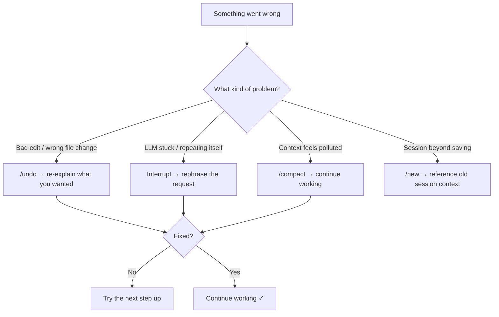

# OpenCode Troubleshooting Guide

## Common Issues and Solutions

### 1. Installation Problems

#### Issue: OpenCode not installing

```
Command not found after installation
```

**Solutions:**

```bash
# Install or reinstall
curl -fsSL https://opencode.ai/install | bash

# Verify it's on your PATH
which opencode
opencode --version
```

#### Issue: Upgrade fails

```bash
# Use the built-in upgrade
opencode upgrade

# Or reinstall from scratch
curl -fsSL https://opencode.ai/install | bash
```

### 2. Authentication Problems

#### Issue: Provider not authenticated

```
Error connecting to LLM provider
```

**Solutions:**

```bash
# Check current auth status
opencode auth list

# Log in to a provider
opencode auth login
```

If issues persist, reconfigure your provider with `opencode auth login` — this will overwrite the previous credentials.

### 3. LLM Tool Errors

> Remember: `read`, `edit`, `write`, `glob`, `grep`, `list`, `bash` are LLM-internal tools, not CLI commands you type directly.

#### Issue: Edit tool not finding text

```
oldString not found in content
```

**Solutions:**

- The LLM needs exact text to match — ask it to read the file first
- Ask: "Read the file again and try the edit with the exact text"
- Provide more context: "Edit line 42 of src/main.ts"
- Use `@` file references for precision: "Fix the bug in @src/main.ts:42"

#### Issue: Permission denied on bash tool

```
Bash tool execution denied
```

**Solutions:**

- In the **Build agent** (default), bash runs with your user permissions
- In the **Plan agent**, bash requires your approval — look for the approval prompt
- Check file permissions: ask "What are the permissions on this file?"
- The LLM cannot run `sudo` commands by default

#### Issue: File not found

```
File or path does not exist
```

**Solutions:**

- Use `@` references to help the LLM find the right file
- Ask: "List the files in this directory" to see what's available
- Check you're running `opencode` from the correct project directory

### 4. TUI Issues

#### Issue: Slash commands not working

Type `/` at the beginning of your message. Available commands:

| Command     | What it does                  |
| ----------- | ----------------------------- |
| `/help`     | Show all commands             |
| `/undo`     | Undo last file change         |
| `/redo`     | Redo last undone change       |
| `/new`      | Start fresh session           |
| `/compact`  | Compact context to free space |
| `/models`   | Switch LLM model              |
| `/sessions` | Browse previous sessions      |
| `/exit`     | Quit                          |

#### Issue: Agent not switching

- Press `Tab` to cycle between Build and Plan agents
- Press `Shift+Tab` to cycle backward
- The current agent is shown in the TUI interface

#### Issue: Context too long / running out of context

**Symptoms:** Responses getting slower, the LLM repeating itself, forgetting earlier decisions, retrying tool calls it already completed.

**Immediate fixes:**

- `/compact` — summarize and compress the conversation
- `/new` — start fresh (reference previous work: "Continue the auth work from my last session")

**Proactive strategies:**

- Compact after each major milestone (`/compact`), don’t wait for auto-compaction
- Delegate exploratory work to `@explore` or `@general` — only the summary returns to the parent, keeping your context lean
- Be specific in prompts to reduce unnecessary tool calls
- If you adjust `compaction.reserved` upward (e.g., `20000`), compaction summaries carry more detail

**Config reference:**

```json
{
  "compaction": {
    "auto": true,
    "prune": true,
    "reserved": 10000
  }
}
```

Set `OPENCODE_DISABLE_AUTOCOMPACT=true` to disable auto-compaction (not recommended for long sessions).

#### Issue: Doom loop (LLM retrying the same failing action)

**Symptoms:** The LLM calls the same tool with identical input 3+ times, getting the same error each time.

**What happens:** OpenCode triggers the `doom_loop` permission check (default: `"ask"`) after 3 identical calls.

**What to do:**

1. **Reject** the repeated attempt when prompted
2. **Interrupt and redirect:** “Stop trying that. The test fails because X — fix X first.”
3. If the LLM is confused, `/compact` to clear noise, then re-explain the goal
4. As a last resort, `/new` to start fresh

**Config:**

```json
{
  "permission": {
    "doom_loop": "ask"
  }
}
```

Set to `"deny"` to block retries immediately, or `"allow"` to let the LLM keep trying.

### 5. MCP Server Issues

#### Issue: Cannot connect to MCP server

```bash
# List configured servers
opencode mcp list

# Test the server command manually
npx -y @modelcontextprotocol/server-github --help

# Re-add the server
opencode mcp add
```

#### Issue: MCP server authentication

Most MCP servers use environment variables for auth. Set them in the server's `"env"` config in `opencode.json`, or export them before starting OpenCode:

```bash
export GITHUB_TOKEN='your-token'
opencode
```

#### Issue: MCP server not showing tools

- Use `/connect` in the TUI to connect to a configured server
- Verify the server is listed in `opencode.json` under `"mcp"`
- Check that the server process can actually start (test the command manually)

### 6. Configuration Issues

#### Issue: Configuration not taking effect

OpenCode configuration lives in:

- **Project level**: `.opencode/` directory and `opencode.json` in your project root
- **Project instructions**: `AGENTS.md` in your project root

```bash
# Initialize project config
# In the TUI, use:
/init
```

#### Issue: Permission configuration

Permissions for tools are set in `opencode.json`:

```json
{
  "permission": {
    "bash": "allow",
    "edit": "deny",
    "write": "ask"
  }
}
```

Values: `"allow"`, `"ask"` (prompt before executing), `"deny"`

### 7. Web Tools Issues

#### Issue: websearch not working

Web search requires Exa:

```bash
# Enable Exa integration
export OPENCODE_ENABLE_EXA=1
export EXA_API_KEY=your-key-here

# Then start OpenCode
opencode
```

#### Issue: webfetch timing out

- Some URLs may be slow or block automated access
- Ask the LLM to try a different URL or format
- Check your network connectivity

### 8. OpenWork Issues

#### Issue: OpenWork not starting

```bash
# Install the orchestrator
npm install -g openwork-orchestrator

# Start it
openwork start --workspace /path/to/project

# For auto-approval mode
openwork start --workspace /path/to/project --approval auto
```

See [openworklabs.com/docs](https://openworklabs.com/docs/get-started) for full setup instructions.

### 9. Session Management

```bash
# List previous sessions
opencode session list

# Export a session for sharing
opencode export

# Import a session
opencode import session-file.json
```

Inside the TUI:

- `/sessions` to browse and resume previous sessions
- `/share` to share the current session
- `/export` to export the current session

### Debugging Techniques

#### Check OpenCode version

```bash
opencode --version
```

#### Verify your environment

```bash
# Check auth status
opencode auth list

# Check configured MCP servers
opencode mcp list

# Check available models
opencode models
```

#### Start fresh

```bash
# Start a new session in the TUI
/new

# Or quit and restart
/exit
opencode
```

### Error Recovery Playbook

When something goes wrong, follow this escalation ladder — start at step 1 and only move to the next step if the previous one doesn't resolve it:



| Step | Action | Command | When to use |
| --- | --- | --- | --- |
| 1 | **Undo the bad change** | `/undo` | An edit broke something or changed the wrong file |
| 2 | **Interrupt and rephrase** | Type a new message | The LLM is going in circles or misunderstood you |
| 3 | **Compact context** | `/compact` | Responses are slow, LLM is confused by old noise |
| 4 | **Start fresh** | `/new` | Context is unsalvageable; start over with a clean slate |
| 5 | **Switch agent** | `Tab` → Plan | Let Plan agent analyze the situation read-only, then switch back to Build |

**Pro tips:**

- After `/undo`, say "Read the file again and retry the edit" — the LLM will re-read the current state before attempting another change
- After `/compact`, briefly restate what you're working on — the summary may lose nuance
- After `/new`, you can say "Continue the work from my previous session" if using `--continue`

### Known Limitations

These are well-known issues documented in the OpenCode issue tracker:

| Issue | Description | Workaround |
| --- | --- | --- |
| **Context growth** | Long sessions with many tool calls accumulate context quickly, slowing responses | Use `/compact` proactively; delegate exploration to subagents; start new sessions for unrelated tasks |
| **Doom loop** | LLM retries the same failing tool call identically | `doom_loop` permission (default `"ask"`) triggers after 3 identical calls; interrupt and rephrase |
| **Background processes** | The LLM starting a server or watcher that doesn't exit can block the session | Use `!` prefix for long-running commands; press `Ctrl+C` to interrupt |
| **Windows Terminal** | Legacy `cmd.exe` and older PowerShell have rendering and clipboard issues with the TUI | Use [Windows Terminal](https://aka.ms/terminal) |
| **Clipboard paste** | Some terminals garble pasted multi-line text in the TUI | Use `/editor` to compose long prompts in your `$EDITOR` |
| **`/undo` requires Git** | `/undo` and `/redo` use Git checkpoints under the hood | Initialize your project with `git init` first |
| **Permission bypass** | Granular bash permissions match literal command strings; the LLM could use equivalent commands to bypass a rule | Treat permissions as guidance, not a security sandbox |
| **Disabled MCP tools** | MCP servers set to `"enabled": false` still appear during startup initialization | Remove the config entry entirely to hide tools |
| **Exa required for websearch** | `websearch` silently fails without `OPENCODE_ENABLE_EXA=1` and `EXA_API_KEY` | Set both env vars before starting OpenCode |

### Getting Help

1. **Official docs**: <https://opencode.ai/docs>
2. **OpenWork docs**: <https://openworklabs.com/docs>
3. **In the TUI**: Type `/help` for available commands
4. **On the CLI**: `opencode --help` for command reference
5. **GitHub**: Report issues at the OpenCode repository

When reporting issues, include:

1. OpenCode version (`opencode --version`)
2. Operating system
3. Steps to reproduce
4. Expected vs actual behavior
5. Any error messages

Remember: Always have backups of important work and test changes in a safe environment before applying to production systems.
